## How to Edit AceyBrain Questions

1.  **Navigate** to[ACP](https://acp.brainfitstudio.com/acp).
2.  Click **Systems** in the navigation menu.

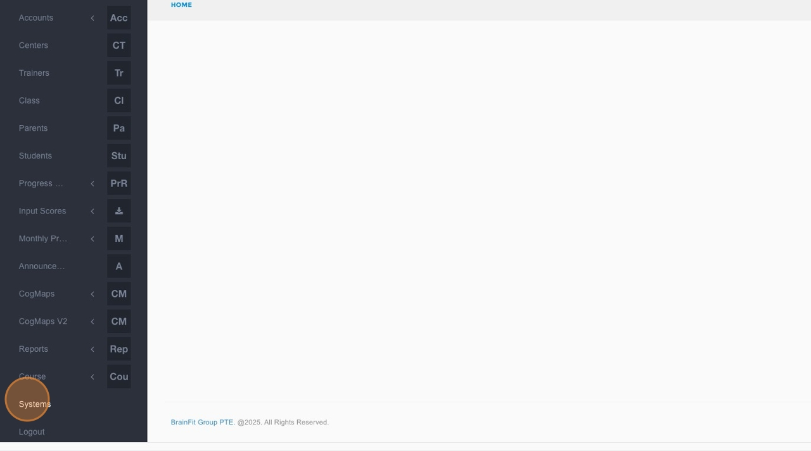

3.  Click **AceyBrain** in the submenu.

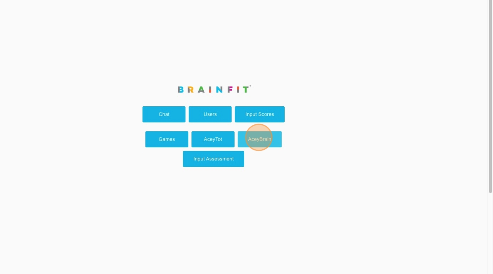

4.  Click the dropdown field to **choose the subject**.

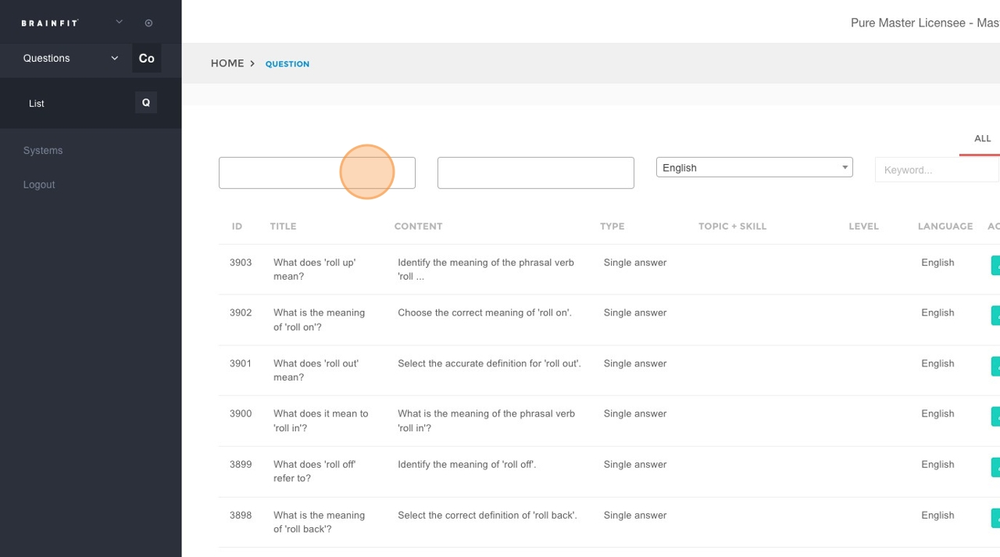

5.  Click the dropdown field to **choose the level**.

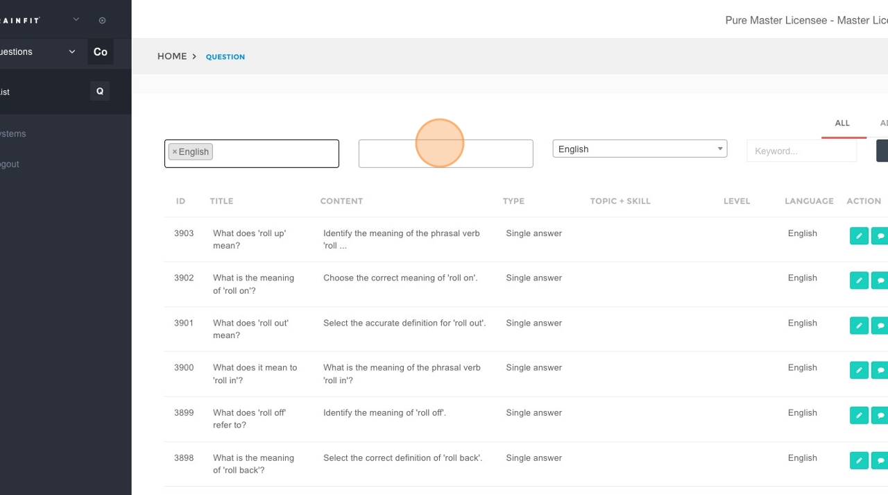

6.  In the **"Keyword..."** field, type the title or identifying code of the question (e.g., "M11-E23-1a_L5-15").

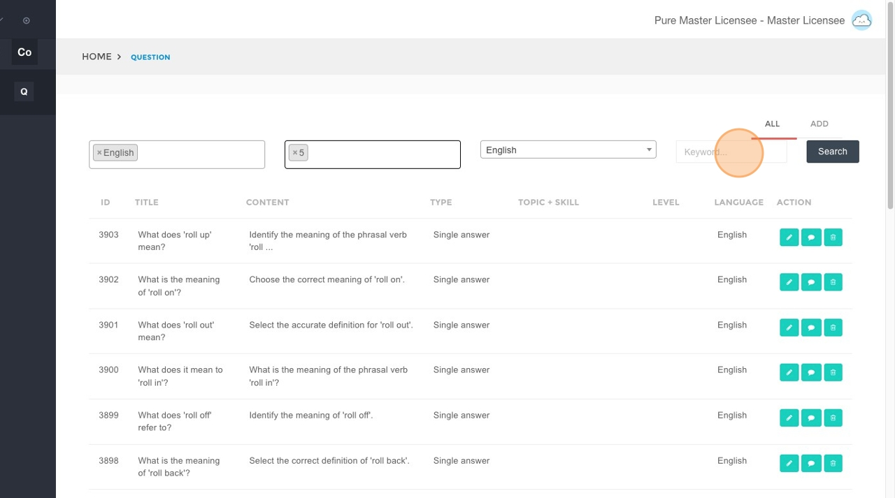

7.  Click the **Search** button.

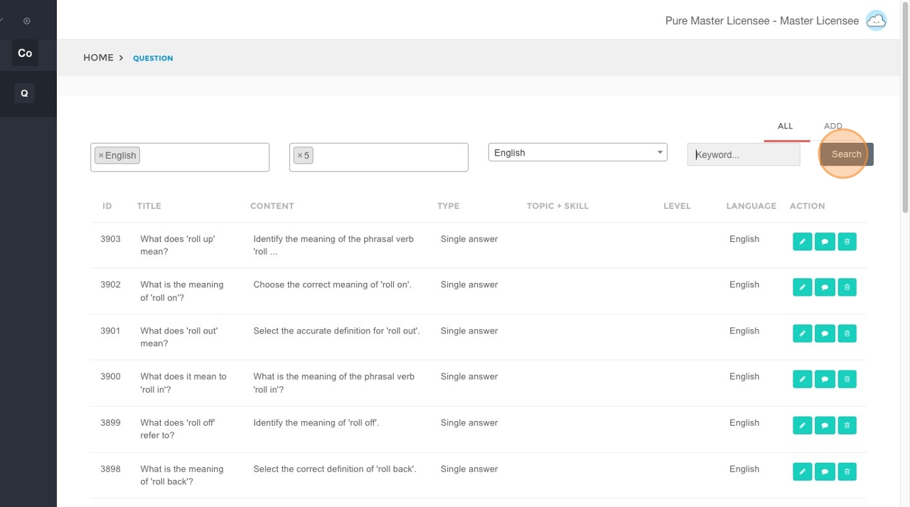

8.  Click the **Edit** button next to the question you wish to modify.

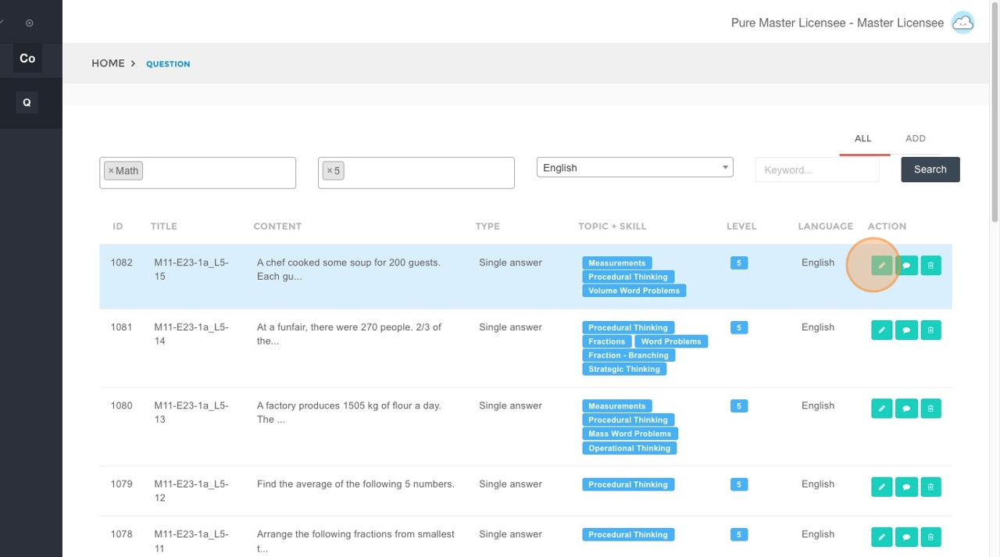

9.  Update the information in the corresponding fields:
    * **Title:** The title or unique identifier of the question.
    * **Content:** The main body of the question.

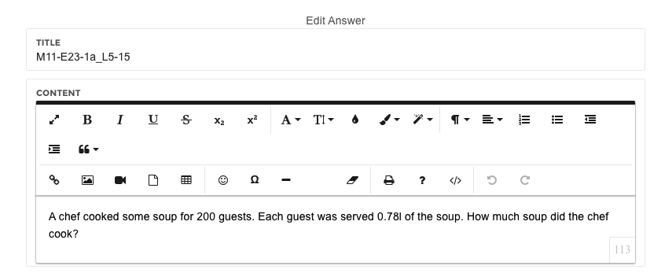

    * **Tag Group:**
        * **Tag Level 1:** The highest-level tag, representing the parent subject of the question.
        * **Tag Level 2 + 3 (Topic):** Subsequent topic tags. Level 2 is a child of Level 1, and Level 3 is a child of Level 2.
        * **Tag Level 2 + 3 (Skill):** Subsequent skill tags. Level 2 is a child of Level 1, and Level 3 is a child of Level 2.
        * **Tag Level 2 (Level):** The difficulty level of the question.

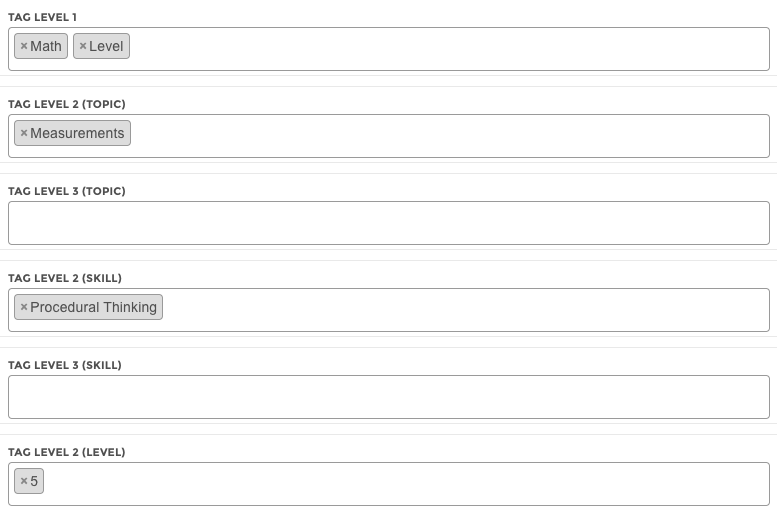

    * **Type of question:** The format of the question.
    * **Language:** The language configured for machine learning (ML) loading.
    * **Explanation:** The explanation for the correct answer.

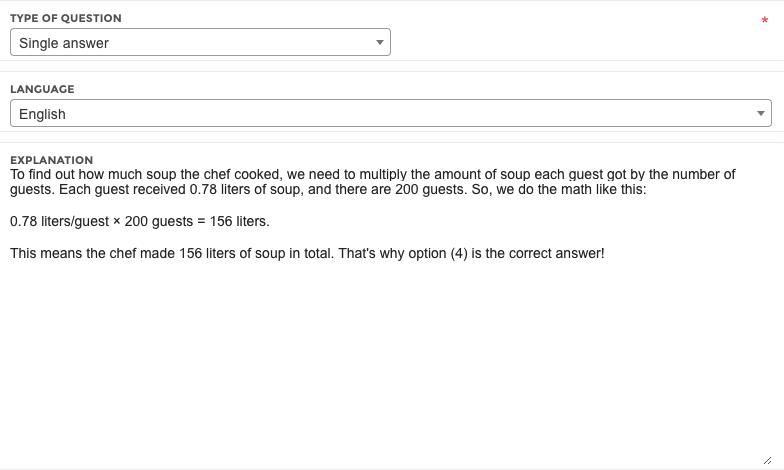

    * **Answer Group:** Click **Add answer** to add a new answer option, or click **Edit** to modify an existing answer.

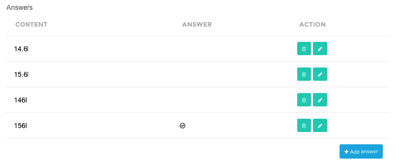

10. Click **Save** to apply your changes.

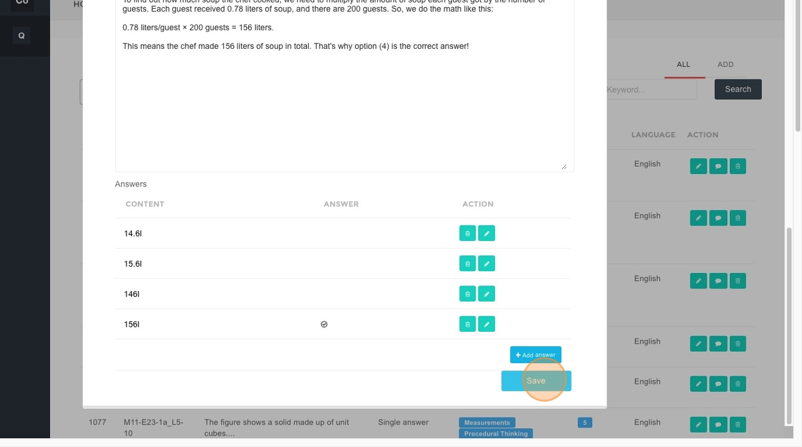

