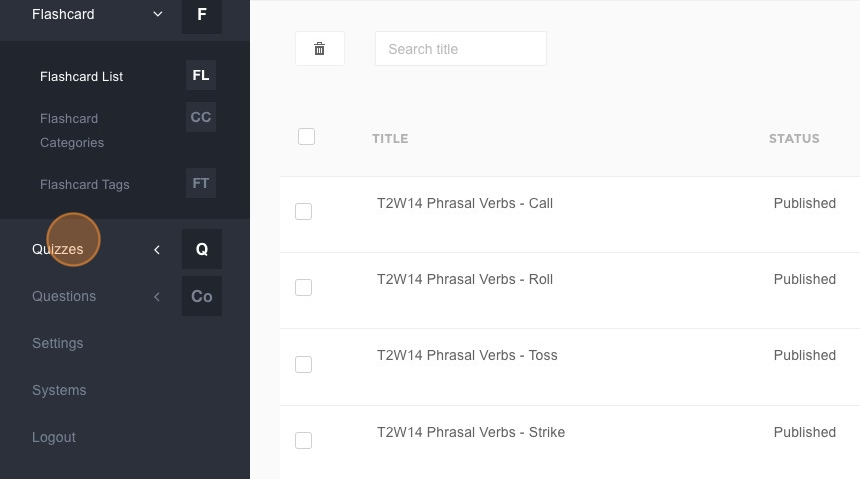
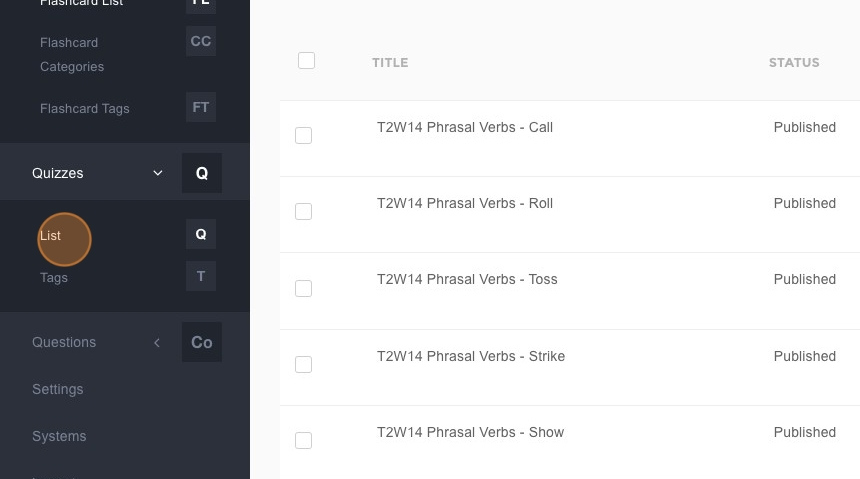
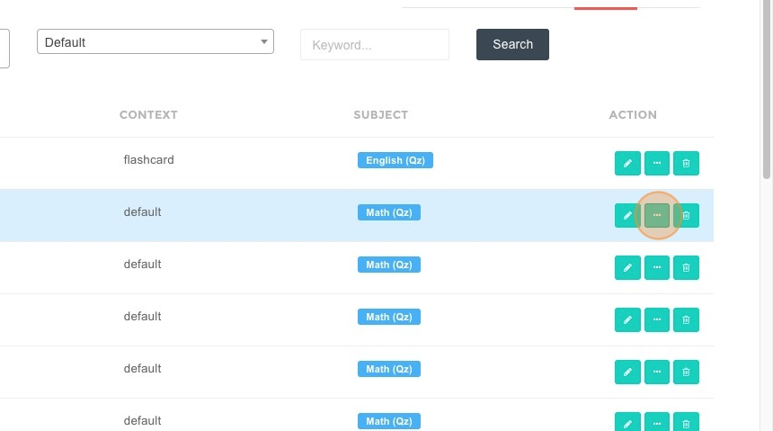
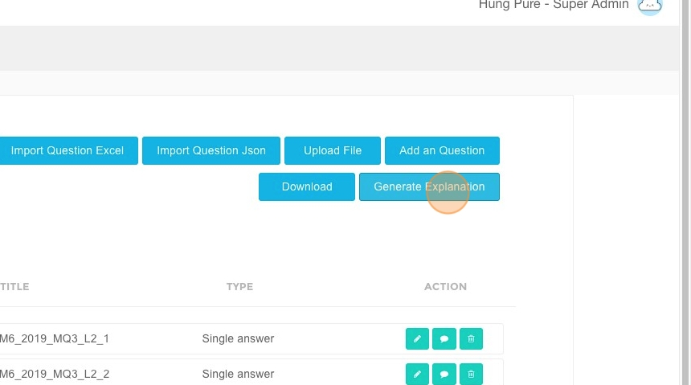
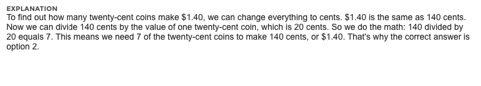
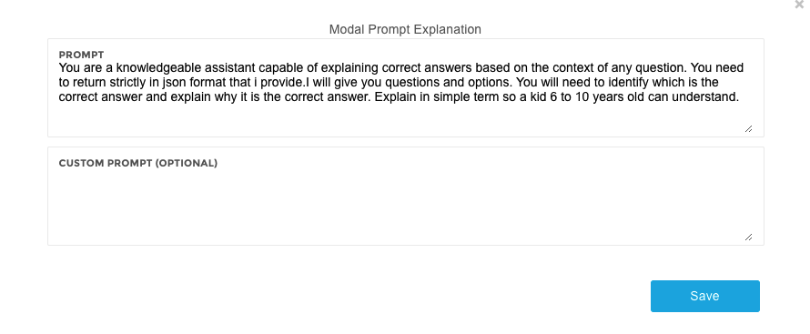
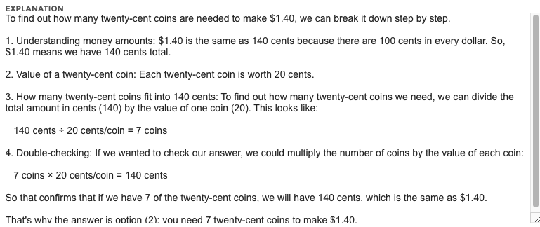
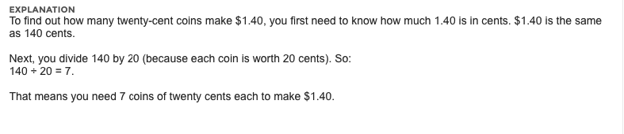
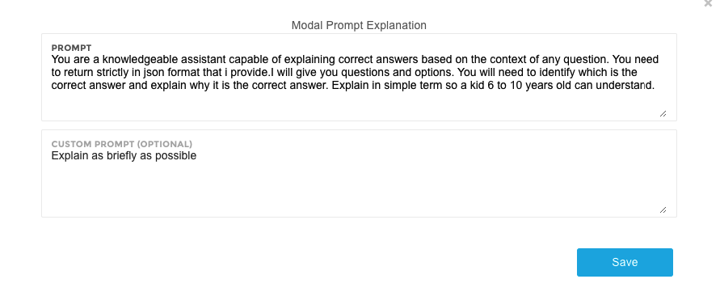
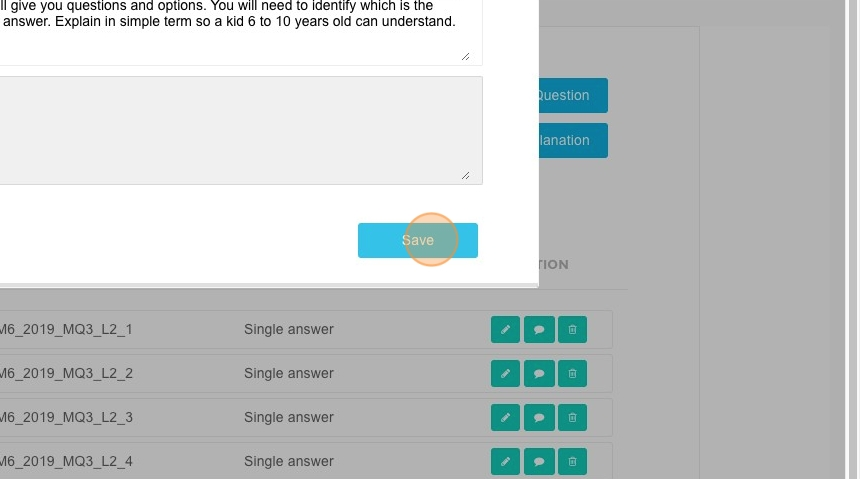

# How To Generate Explanations

## Steps to Generate an Explanation

1. Navigate to [ACP Portal](https://acp.brainfitstudio.com/acp/thinkworkout/).  
2. Click **"Quizzes"**.  

3. Click **"List"**.  

4. Click **here**.  

5. Click **"Generate Explanation"**.  

## Enter Additional Requirements  

6. Enter additional requirements in the provided field. There are three commonly used options:  
   - **Leave this field blank**: The system will generate a result at an average level.  

   
   
   
   
   - **I need a more detailed explanation**: The system will return the most detailed result possible.  

   
   
   
   
   - **Explain as briefly as possible**: The system will return the shortest possible result.  

   
   
   

7. Click **"Save"**.  

