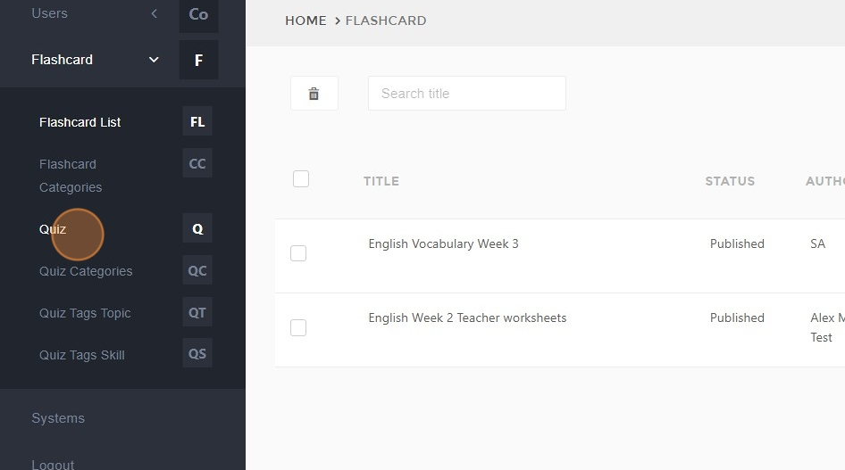
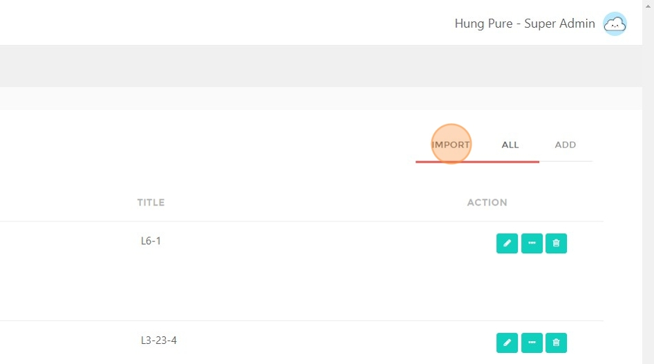
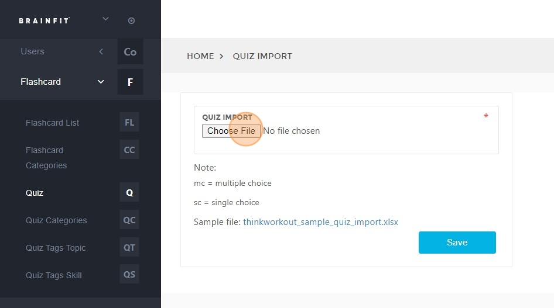
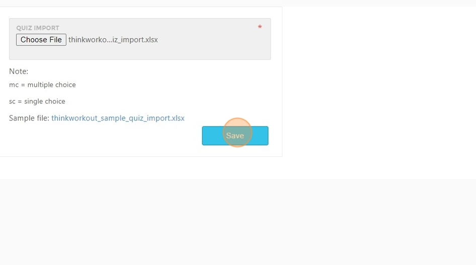
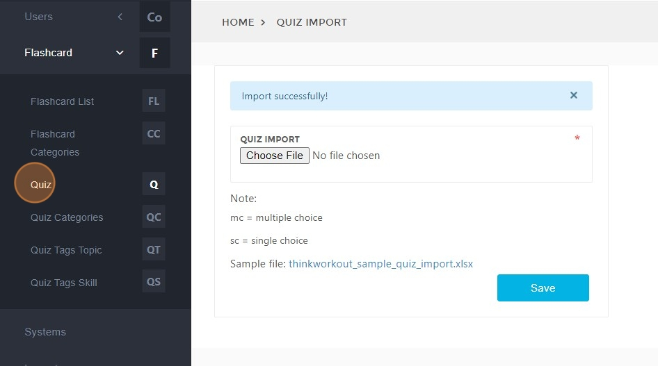
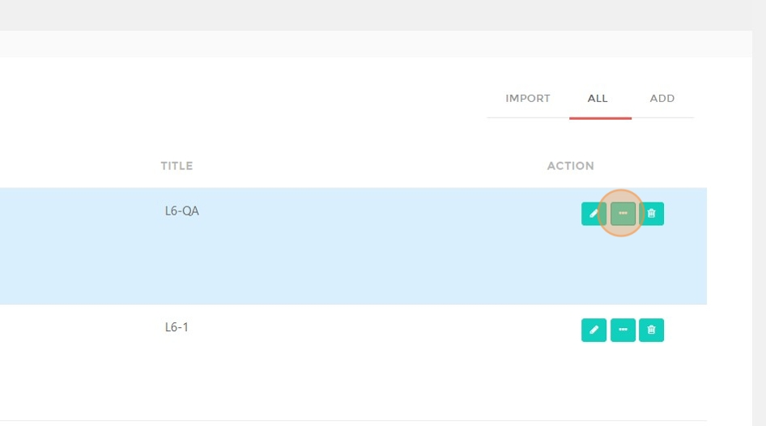
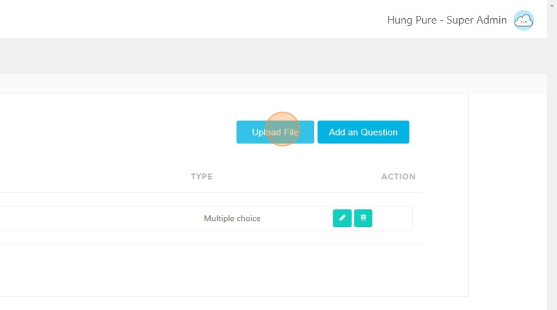
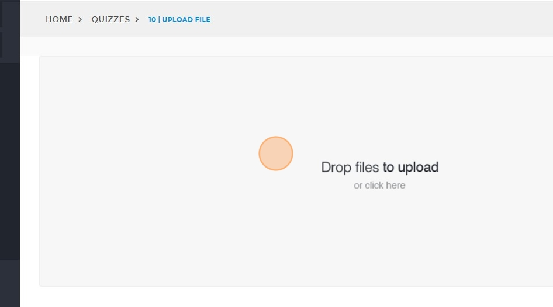
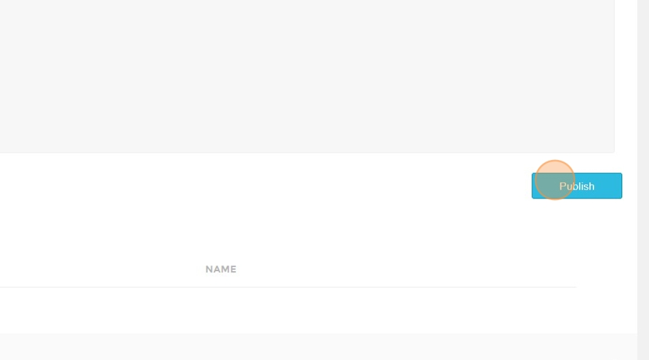
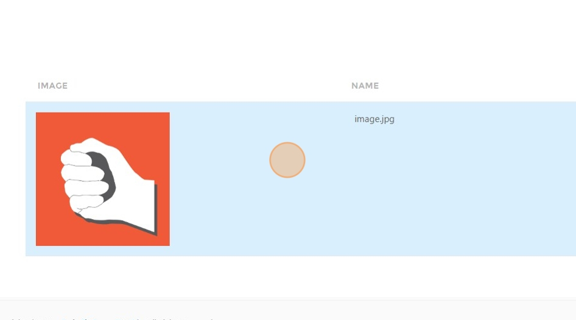

# Importing Quiz and Publishing Image on BrainFit Studio Platform
This feature is for SA

## Steps to Import a Quiz

1. Navigate to [BrainFit Studio ACP](https://acp.brainfitstudio.com/acp/thinkworkout/).  
2. Click **"Quiz"**.  

3. Click **"IMPORT"**. 

4. Click the **file field** to upload the import file.  

5. Click **"Save"**.  

## Steps to Publish an Image for a Quiz

6. Click **"Quiz"** again. 

7. Click **here**.  

8. Click **"Upload File"** to upload an image for the quiz.

9. Click **here**.  

10. Click **"Publish"**.  

11. The **upload history** will be displayed in the list below.  

