## How to Input Student Assessment Data
This feature is for SA, ML, CA

1.  **Navigate** to the [ACP](https://acp.brainfitstudio.com/acp).
2.  Click **Systems** in the navigation menu.

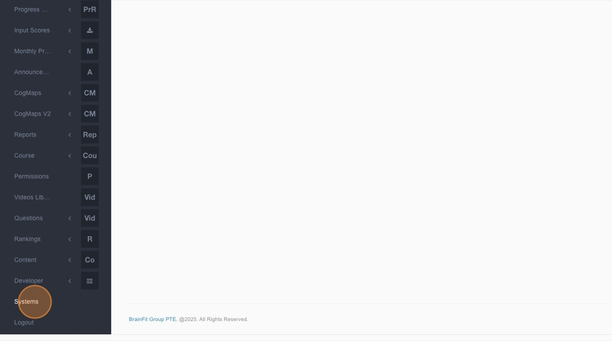

3.  Click **Input Assessment** in the submenu.

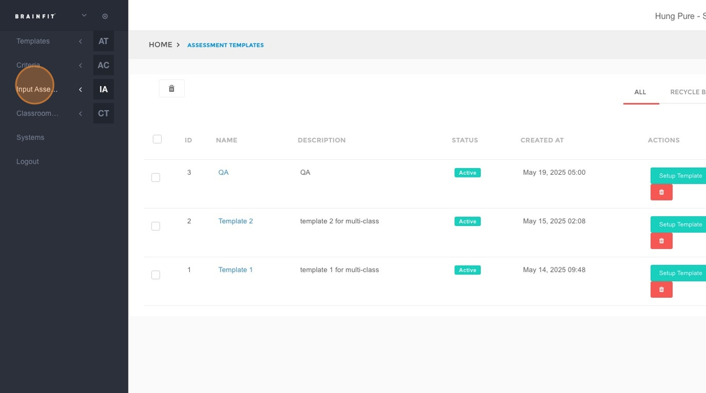

4.  Click **Classes**.

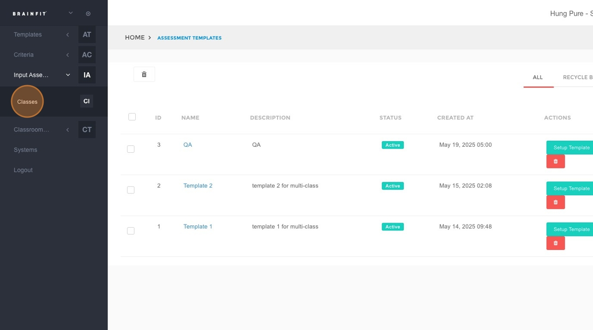

5.  Click the **Select Center** dropdown menu and choose the relevant center.

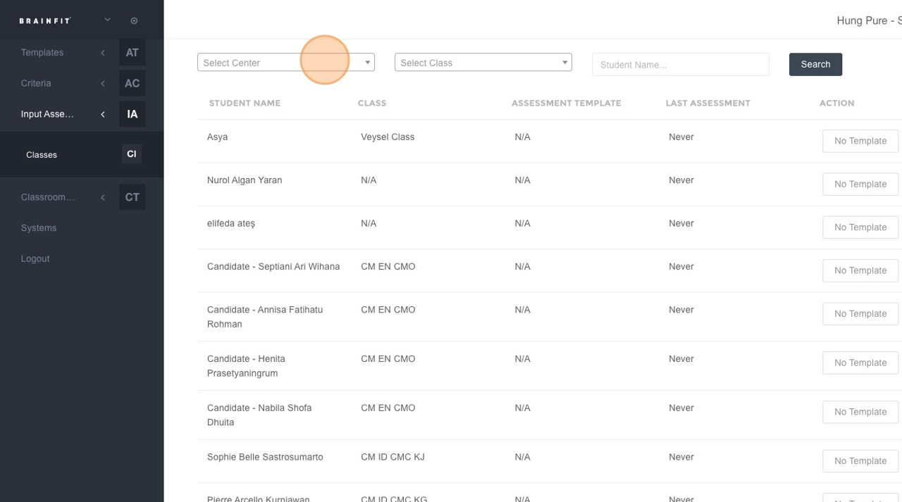

6.  Click the **Select Class** dropdown menu and choose the specific class.

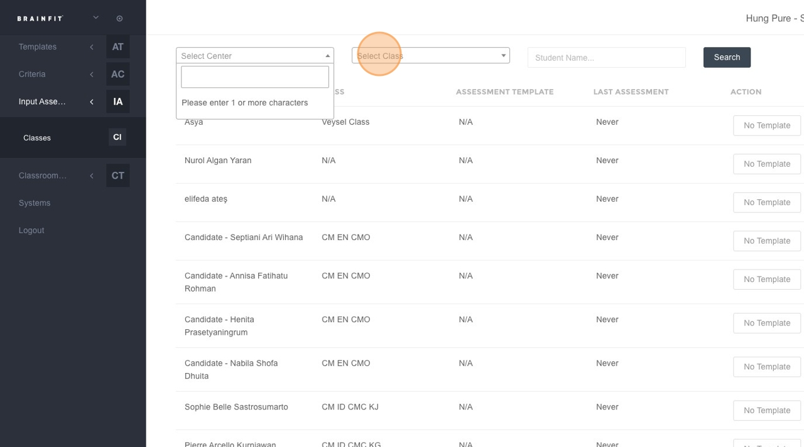

7.  Click within the **"Student Name..."** search field.

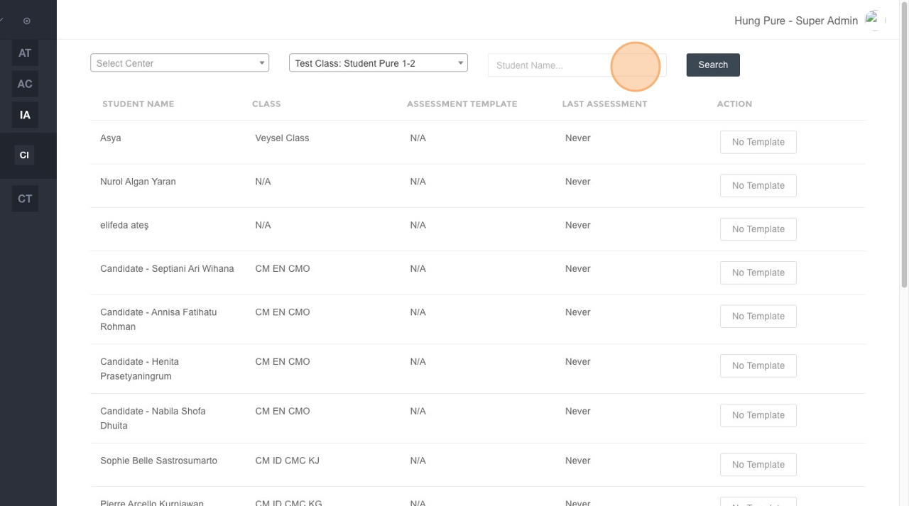

8.  Type the name of the student for whom you want to input assessment data.
9.  Click the **Search** button.

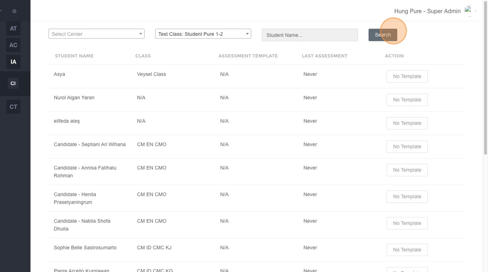

10. Click the **Input** button next to the student's name in the search results.

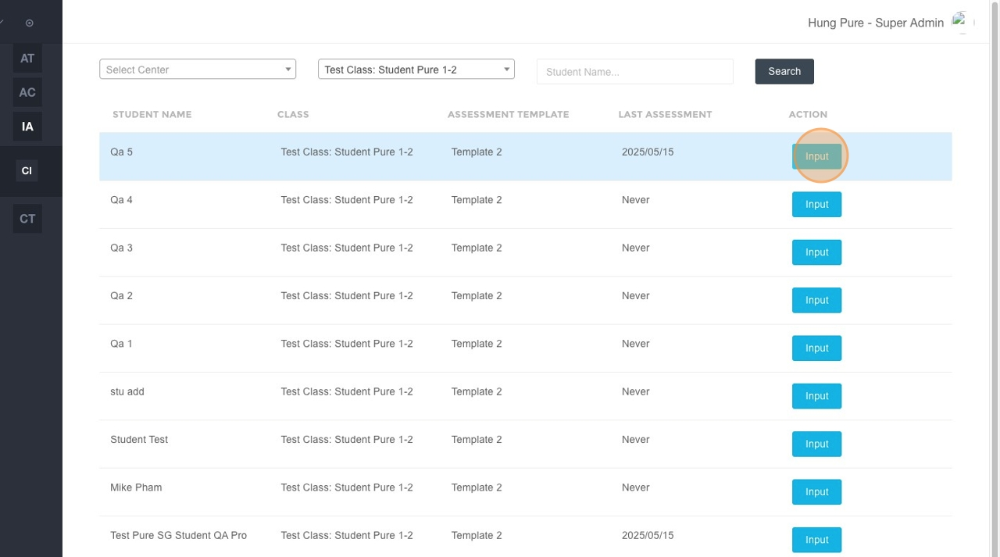

11. Click on the specific **Area Assessment** you want to input data for.

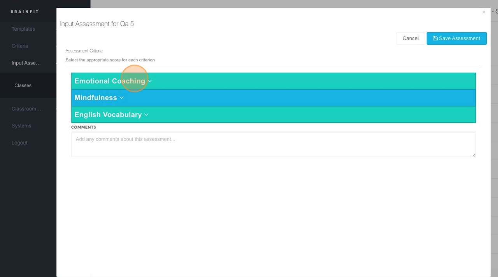

12. Click the dropdown menu within the assessment area to choose the desired option or value.

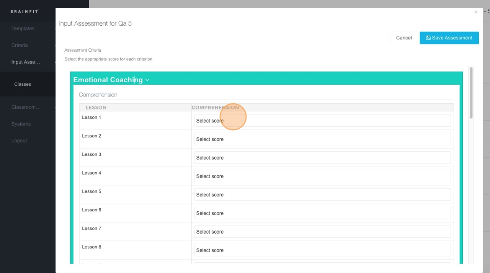

13. Click the **"Comments"** field to type any relevant comments, if necessary.

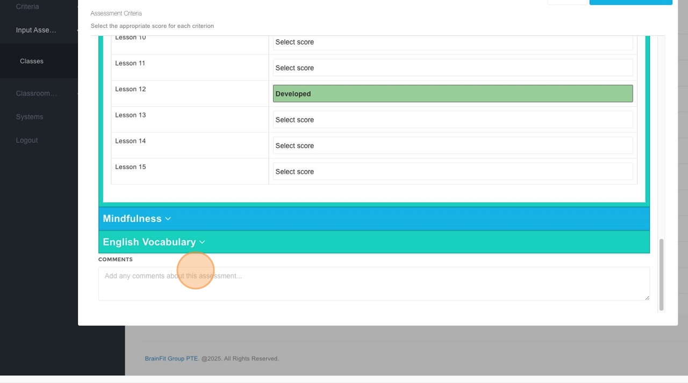

14. Click **Save Assessment** to record the entered data.

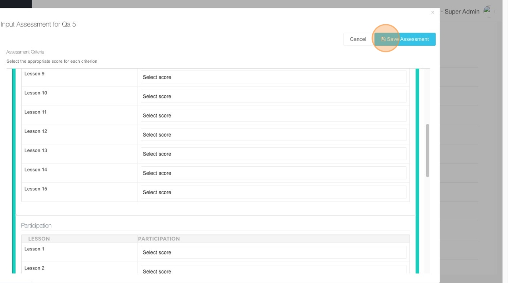