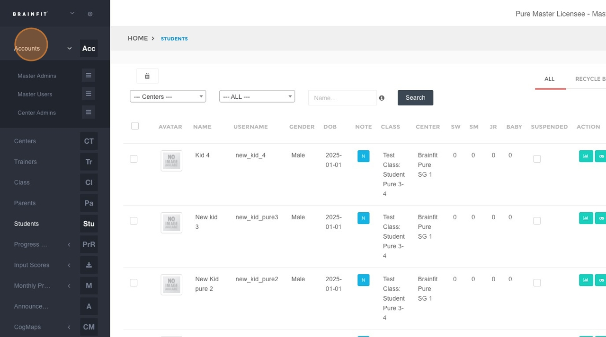
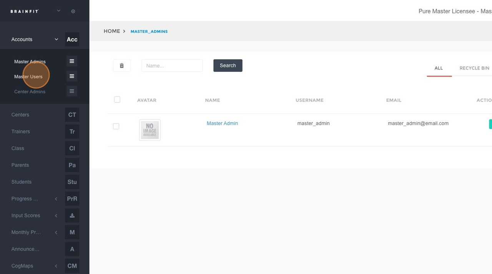
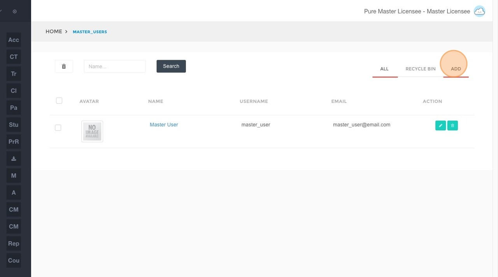
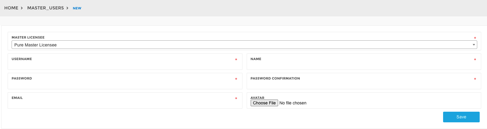
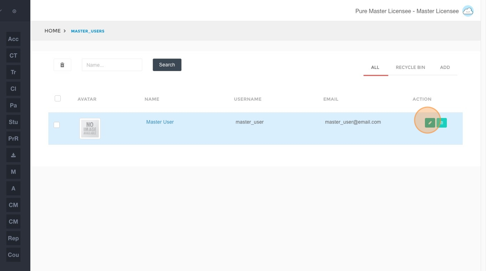
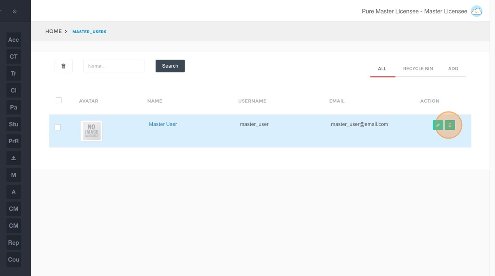

## Creating a Master User Account
This feature is for SA, ML

1. **Navigate** to [BrainFit ACP](https://acp.brainfitstudio.com/acp).
2. Click **Accounts** in the navigation menu.

3. Click **Master User** in the submenu.

4. Click the **Add** button.

5. Fill in the following fields:
   - Username  
   - Name  
   - Password  
   - Password Confirmation  
   - Email  
   - Avatar (optional)  

6. Click the **Save** button.

---

## Editing a Master User Account

1. **Navigate** to [BrainFit ACP](https://acp.brainfitstudio.com/acp).
2. Click **Accounts** in the navigation menu.

3. Click **Master User** in the submenu.

4. Click the **Edit** icon for the desired Master Admin account.

5. Modify the content in the following fields as needed:
   - Username  
   - Name  
   - Password  
   - Password Confirmation  
   - Email  
   - Avatar (optional) 
   

 
6. Click the **Save** button to apply your changes.

---

## Deleting a Master User Account

1. **Navigate** to [BrainFit ACP](https://acp.brainfitstudio.com/acp).
2. Click **Accounts** in the navigation menu.

3. Click **Master User** in the submenu.

4. Click the **Delete** icon for the Master User account you wish to remove.

5. Confirm the deletion by clicking **OK** in the confirmation dialog.
