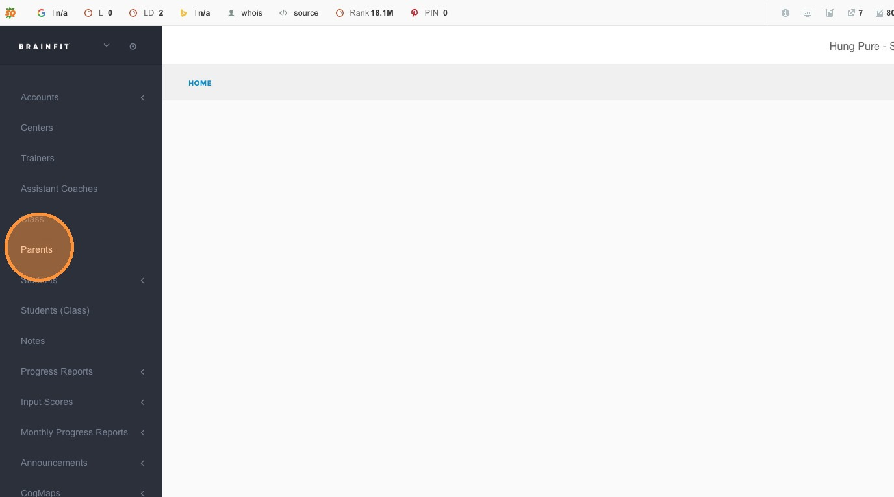
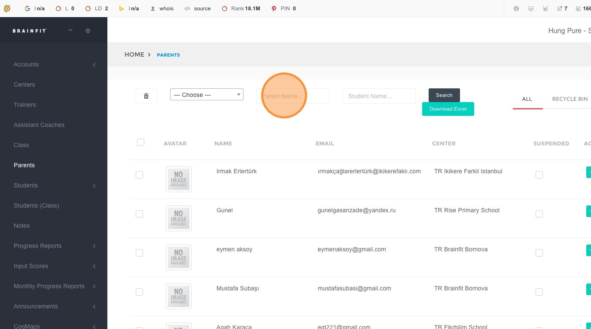
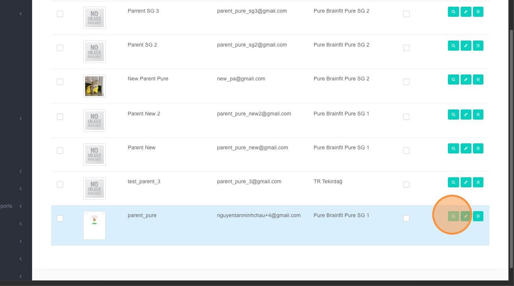
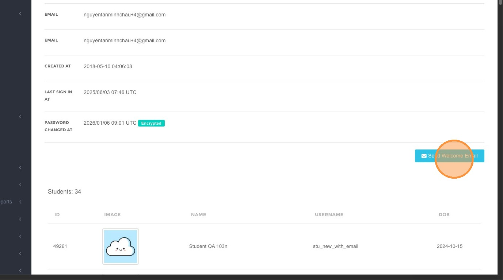
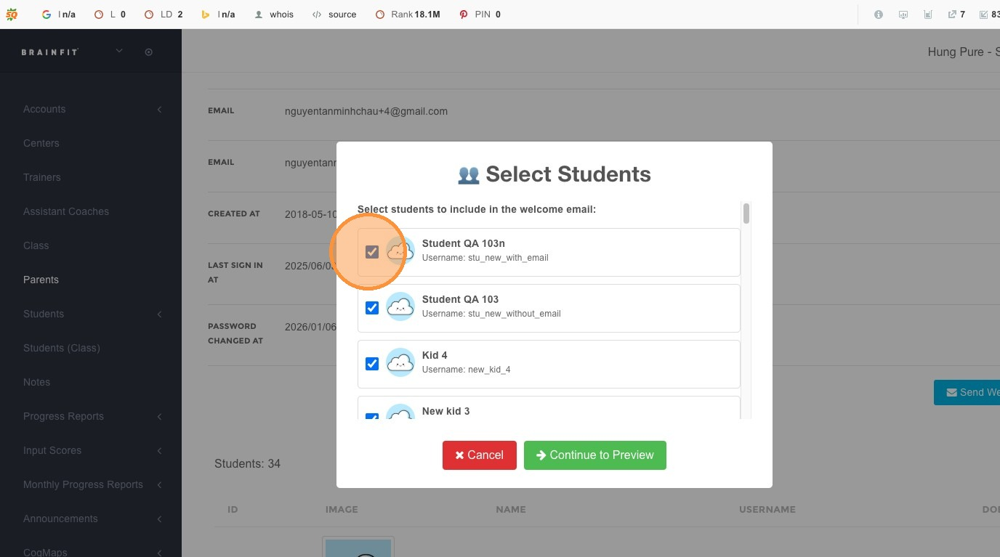
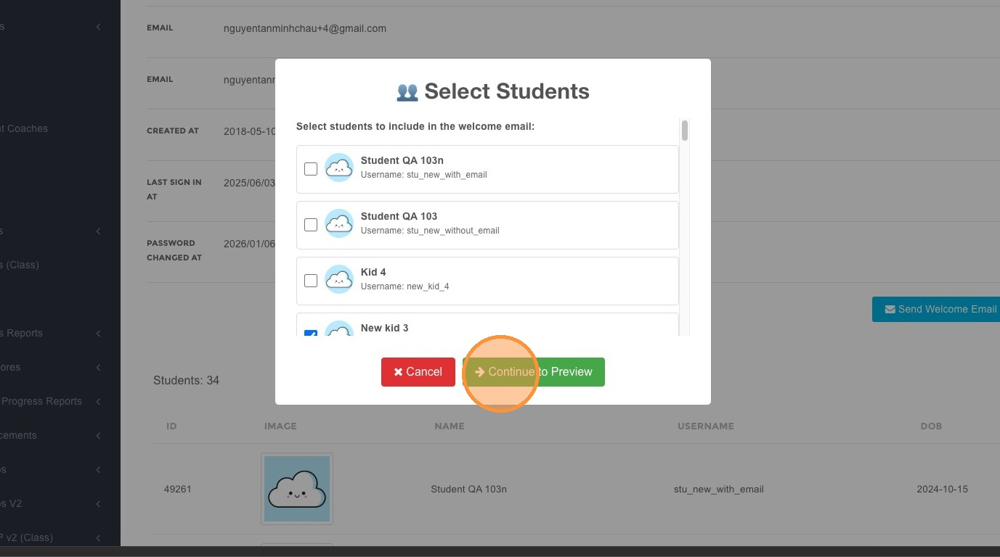
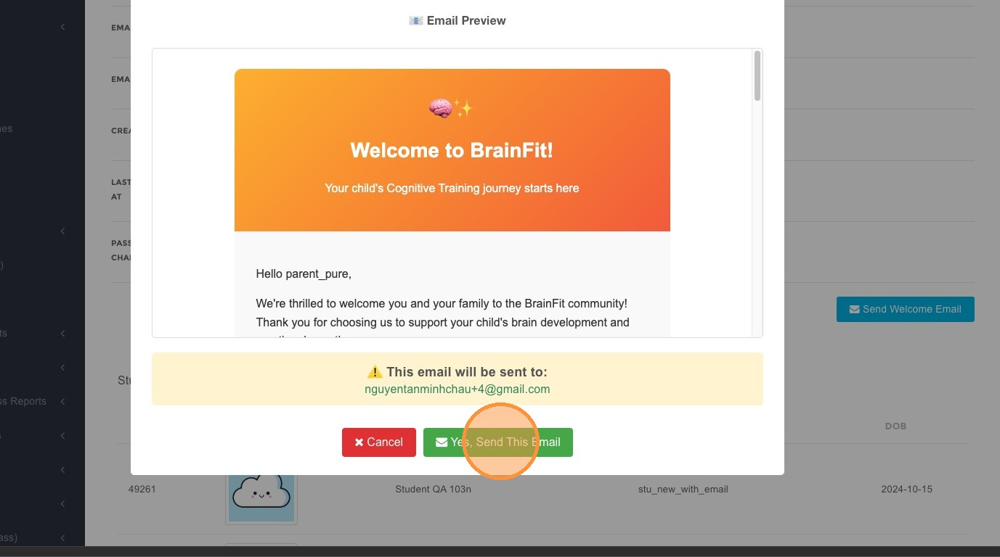
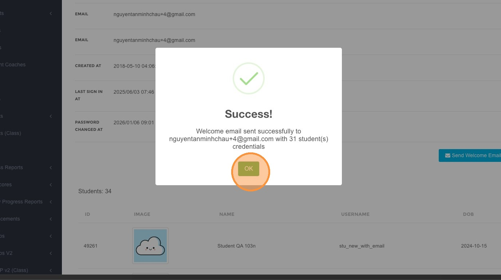
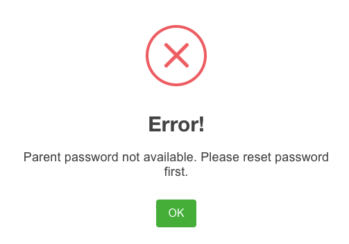

# Send Welcome Email to Parent

This guide explains how to send a welcome email to parents from BrainFit HQ (ACP). The welcome email provides parents with login credentials and access information for the PBC.

---

## Required Roles

| Action | Allowed Roles |
|--------|---------------|
| Send welcome email | Super Admin, Master Licensee, Center Admin |

> **Note:** This feature is available for Super Admin (SA), Master Licensee (ML), and Center Admin (CA) roles.

---

## Overview

The welcome email feature allows you to:
- Send login credentials to parents
- Include specific children in the email
- Preview the email before sending
- Handle password updates for existing accounts

---

## Step-by-Step Guide

### Step 1: Navigate to Parents Section

1. Log in to [BrainFit HQ (ACP)](https://acp.brainfitstudio.com/acp/)
2. Click **Parents** in the navigation menu

### Step 2: Search for Parent

1. Use the search function to find the parent you want to send the welcome email to

2. Enter the parent's name, email, or other identifying information

### Step 3: Access Parent Detail

1. Click the **detail icon** to access the parent's detail page

### Step 4: Send Welcome Email

1. On the parent detail page, click the **Send Welcome Email** button

### Step 5: Select Students

1. A modal will appear showing available children associated with this parent

2. **Select Students** you want to include in the welcome email
3. You can select multiple children if needed
4. Click **Continue to Preview** to next step

### Step 6: Preview and Confirm

1. A preview modal will appear showing the email content
2. Review the email to ensure all information is correct

3. Click **Yes, Send This Email** to confirm and send
4. Click **OK** to close the confirmation dialog

---

## Important Notes

### Password Update Requirement

> ⚠️ **Warning**: For existing accounts with old passwords, a warning modal will appear after you "Select Students".

**What to do:**
- You must **update the parent's password** before sending the welcome email
- This ensures the parent receives valid login credentials
- Update the password in the parent's account settings first, then proceed with sending the email

---
