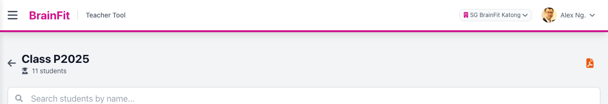
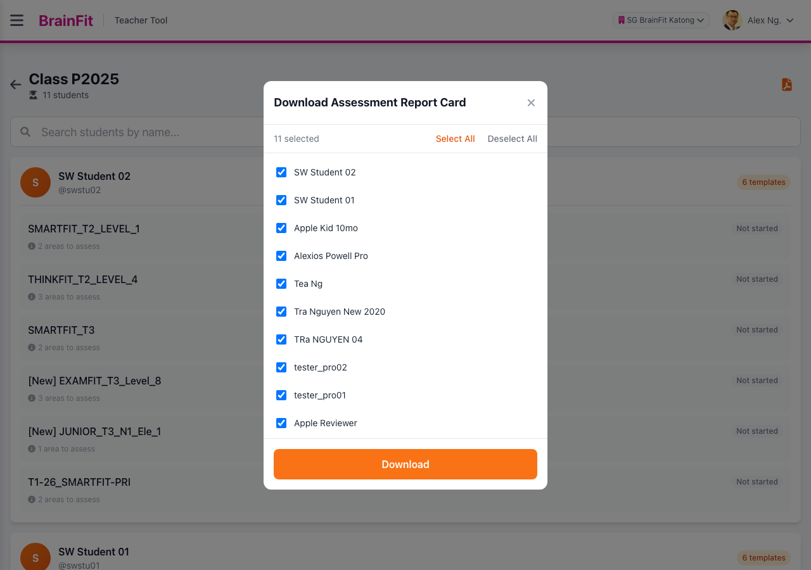
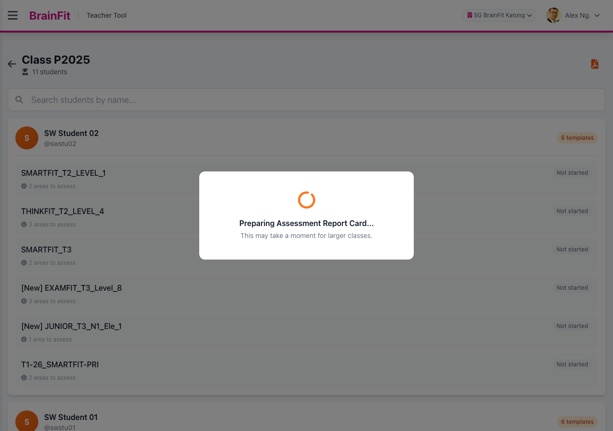
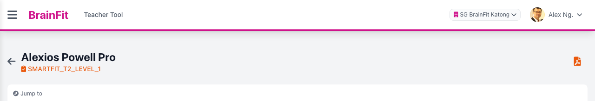

## Downloading Assessment Report Cards

This feature is for SA, ML, CA, Trainer

The Teacher Tool ([tt.brainfitstudio.com](https://tt.brainfitstudio.com)) can generate a branded PDF report
card for a student's assessment progress. You can download report cards for a whole class at once, or for a
single student from their assessment page.

### Download for a whole class

1.  **Navigate** to [Teacher Tool](https://tt.brainfitstudio.com) → **Assessment Tracker** and select a class.
2.  In the top-right corner of the class page you'll see two icons: a **print icon** and a **PDF icon**.

3.  **Print icon (Print All Students)** — one click, no extra steps. It selects every student in the
    class automatically and starts the download straight away, in batches (see below).
4.  **PDF icon (Download Assessment Report Card)** — opens a window listing every student in the class
    with a checkbox, if you want to print only some of them. All students are selected by default.
    - Use **Select All** / **Deselect All**, or tap individual checkboxes to choose specific students.

5.  Click **Download**. The window shows **"Preparing Assessment Report Card..."** while the report is
    generated. For larger classes this now shows **"Preparing batch X of Y (N students)..."** — see
    **Batched downloads for large classes** below for why.

6.  Once ready, the file(s) download automatically:
    - **One student selected** → downloads a single PDF.
    - **More than one student, but within one batch** → downloads a `.zip` file containing one PDF per
      report.
    - **More students than fit in one batch** → downloads **multiple `.zip` files**, one per batch — see
      below.

### Batched downloads for large classes

The print service renders PDFs one at a time, so a single request for a whole class of ~50+ students can
time out. To avoid that, both **Print All Students** and a multi-student selection from the **PDF icon**
window now split the download into batches of **15 students** and download each batch as its own `.zip`
file, one after another, instead of one giant request.

- You'll see the progress update in the preparing window: **"Preparing batch 2 of 4 (15 students)..."**.
- Each batch's `.zip` downloads as soon as it's ready — you don't need to wait for all batches before the
  first file appears in your downloads.
- A class of 15 students or fewer is unaffected — it still downloads as a single file, same as before.

### Download for a single student

You can also download a report from a specific student's assessment page — useful when you only need one
student's, or one template's, report.

1.  Open a student's assessment page (from the class list, tap one of the student's assessment templates).
2.  Click the **PDF icon** in the top-right corner.

The report generated here covers only the template you're currently viewing.

### A few things to know

- **One PDF per template.** If a student has more than one assessment template (e.g. Term 1 and Term 2),
  each template prints as its own separate PDF — never merged into one document. A class-wide download for a
  student with several templates will include several files for that student in the zip.
- **Not-started templates** print a report showing **"Assessment not available"** for that student/template
  — this is expected, not an error.
- Each PDF is named `{Center}_{Student Name}_Assessment_Report_{Template Name}.pdf`, so files stay
  identifiable even after unzipping a large batch.

### Program-based report header

The header text on the printed PDF depends on whether the template has a [Program](../Program/manage-program.md)
attached:

- **Template has a Program attached:** the header reads **"BrainFit `Type`"**, where `Type` is that
  Program's Type — one of **Junior**, **Scholar**, **Baby**, or **Premium** (e.g. "BrainFit Scholar").
- **Template has no Program attached** (the default for most templates, since Program assignment is manual):
  the header falls back to a generic **"BrainFit"**.

To get the branded header, attach a Program to the template first — see
[Managing Assessment Templates](../Assessment_Tracker/manage-template-assessment.md) and
[Managing Programs](../Program/manage-program.md).
