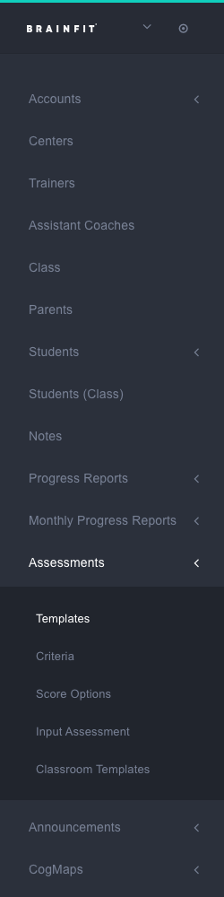
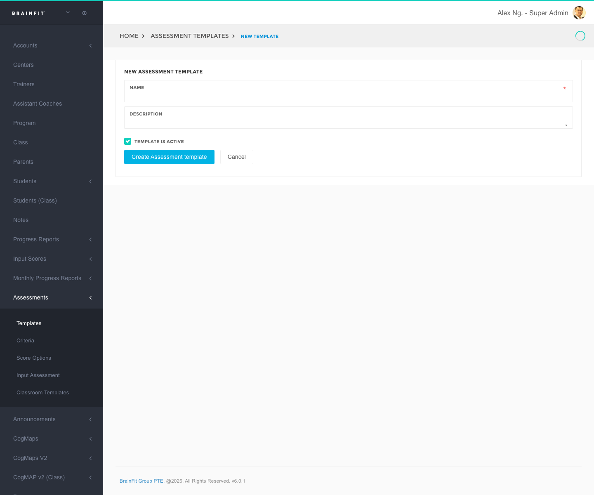
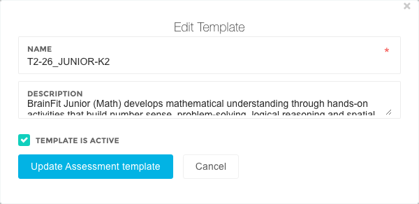
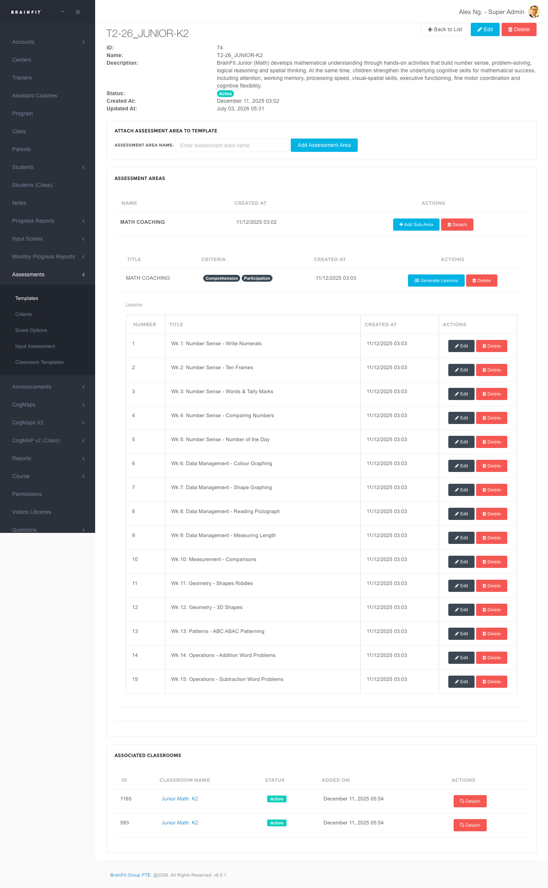
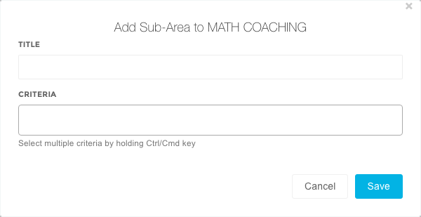
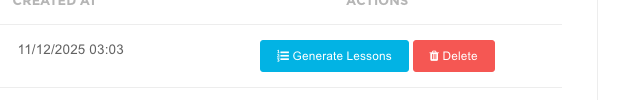
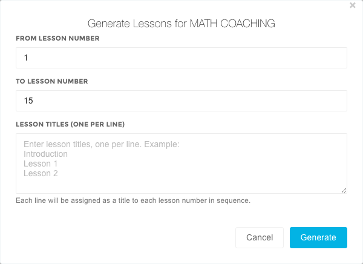
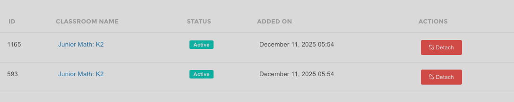
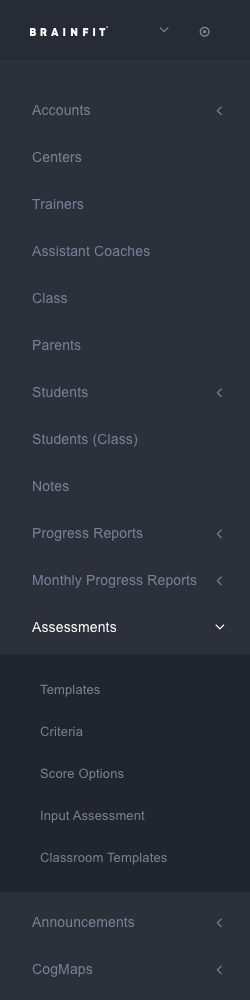
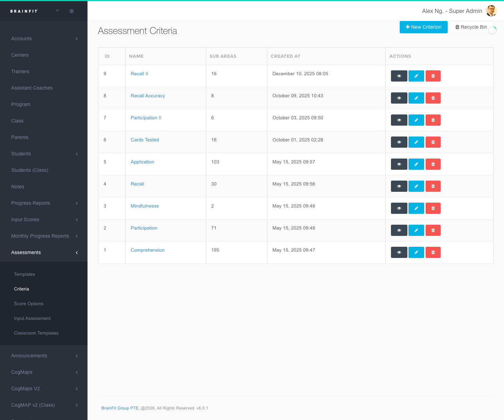

This feature is for SA
## Creating a New Assessment Template

1.  **Navigate** to the [ACP](https://acp.brainfitstudio.com/acp).
2.  Find the **Assessments** menu in the navigation menu, then click **Templates**.

3.  Click the **Add** button.

4.  Fill in the following information for each field:
    * **Name:** Enter the desired name for the template.
    * **Description:** Provide a brief description of the template.
    * **Template is active** checkbox: Check to enable the template; uncheck to disable it.

5.  Click **Create Assessment template** to save the new template.

## Editing a Assessment Template
1.  **Navigate** to the [ACP](https://acp.brainfitstudio.com/acp).
2.  Find the **Assessments** menu in the navigation menu, then click **Templates**.

3.  Click the **Edit** button.

4.  Fill in the following information for each field:
    * **Name:** Enter the desired name for the template.
    * **Description:** Provide a brief description of the template.
    * **Template is active** checkbox: Check to enable the template; uncheck to disable it.

5.  Click **Update Assessment template** to save .

## Setting Up a Template

1.  **Navigate** to the [ACP](https://acp.brainfitstudio.com/acp).
2.  Find the **Assessments** menu in the navigation menu, then click **Templates**.

3.  Click the **Setup Template** button (cog icon) for the template you want to configure.

4.  Click within the **"Assessment area name"** field.

5.  Type the desired assessment area name (e.g., "Emotion").
6.  Click **Add Assessment Area**.

7.  For each assessment area, click **Add Sub-Area**.

8.  Fill in the following information for each sub-area:
    * **Title:** Enter the name of the sub-area.
    * **Criteria:** List the criteria associated with this sub-area (one criterion per line).

9.  Click **Save** to apply the template setup.
10. Click **Generate Lessons**.

11. Fill in the following information:
    * **From Lesson Number:** Enter the starting lesson number.
    * **To Lesson Number:** Enter the ending lesson number.
    * **Lesson Titles (one per line):** Optionally enter specific titles for each lesson. If left blank, the system will use default titles (e.g., Lesson 1, Lesson 2).

12. Click **Generate**.
13. In the **Associated Classrooms** section, you can view a list of classrooms currently attached to this template, and detach any of them. To attach a new classroom, use **Classroom Templates** in the Assessments menu instead — the "Attach Classroom" panel that used to be on this page has been removed.

## Creating Criteria

1.  **Navigate** to the [ACP](https://acp.brainfitstudio.com/acp).
2.  Find the **Assessments** menu in the navigation menu, then click **Criteria**.

3.  Click **New Criterion**.

4.  Enter the name for the new criterion.

5.  Click **Save**.

<!-- ## Managing Classroom Templates

1.  Click **Classroom Templates** in the navigation menu.
2.  Click **All Templates**.

3.  The Classroom Assessment Templates will be displayed in a table format, showing complete information about the assigned templates for each classroom. -->

