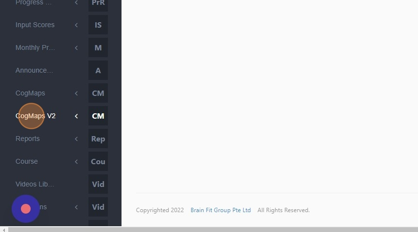
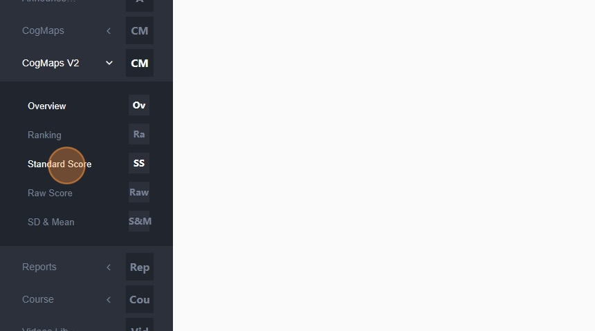
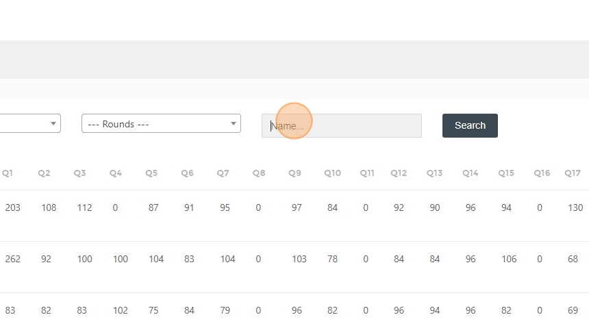
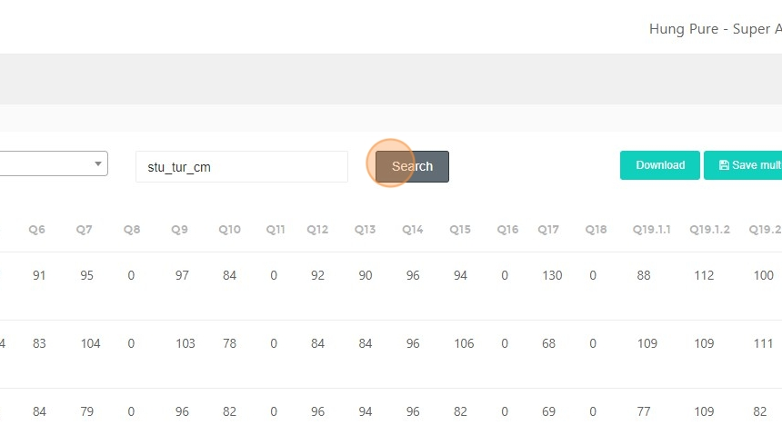
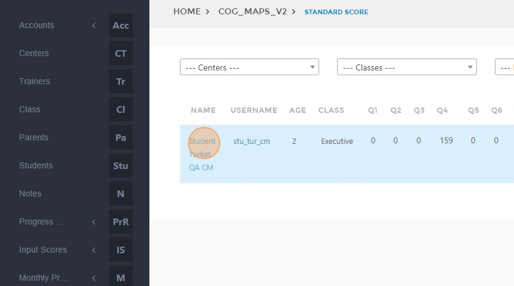
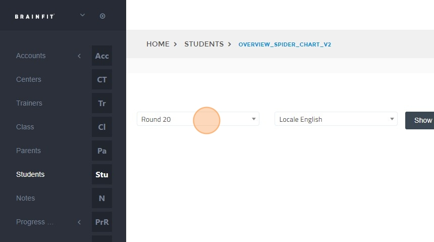
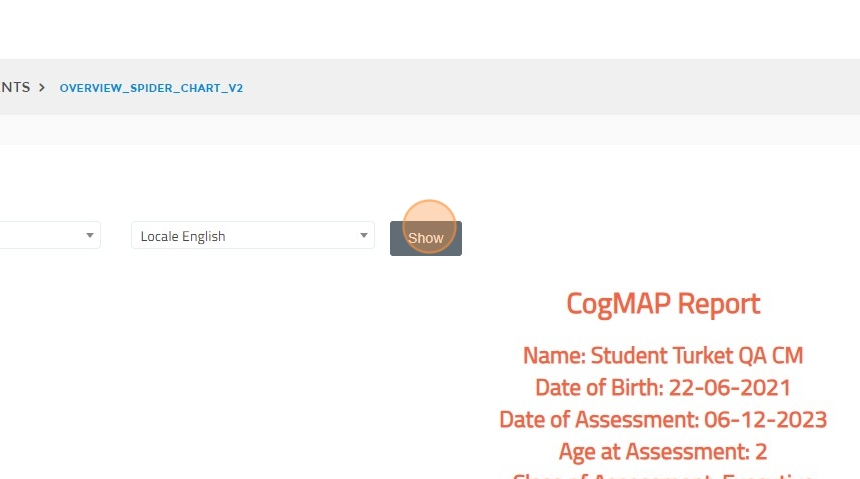
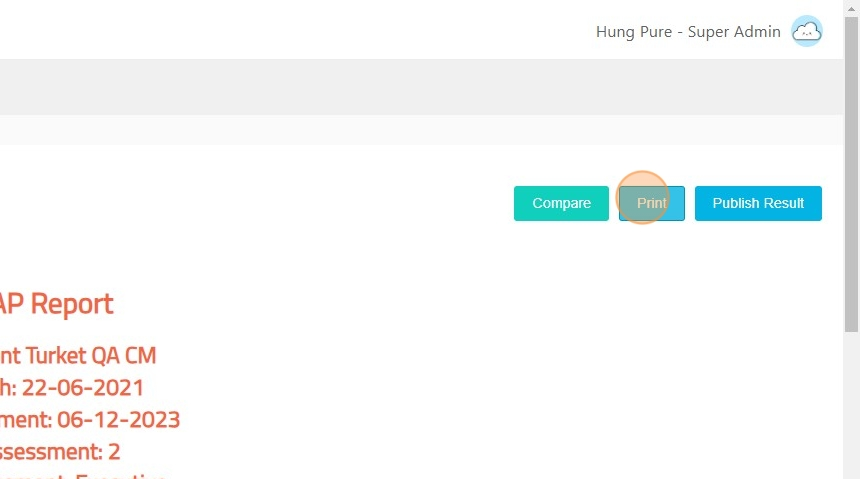

# How to Access and Print Student CMv2 Report

## Steps to Access the Report  

1. Navigate to [ACP Portal](https://acp.brainfitstudio.com/acp).  
2. Click **"CogMaps V2"**.  

3. Click **"Standard Score"**.  

4. Click the **"Name..."** field.  

5. Type the **student's name**.  
6. Click **"Search"**.  

## Steps to Print the Report  

7. Click on the **student's name** you want to print.  

8. Click the **"Round"** field.  

9. Select the **round**.  
10. Click **"Show"**.  

11. Click **"Print"**.  

12. Select the **download folder** and **save** the file.  
