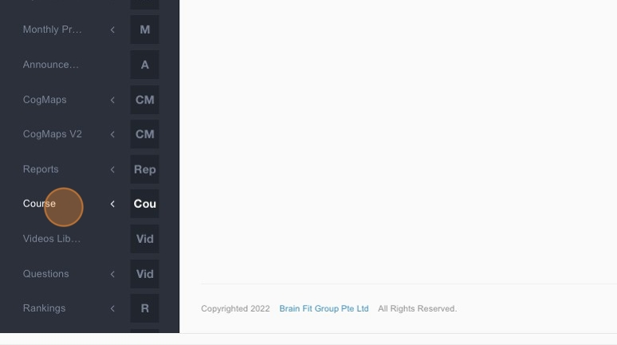
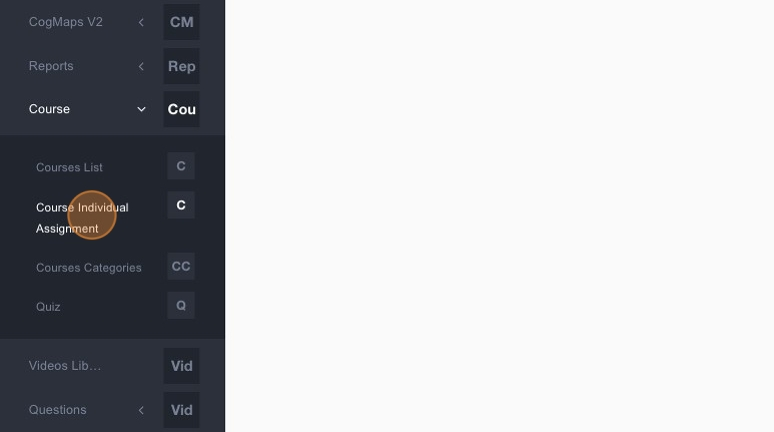
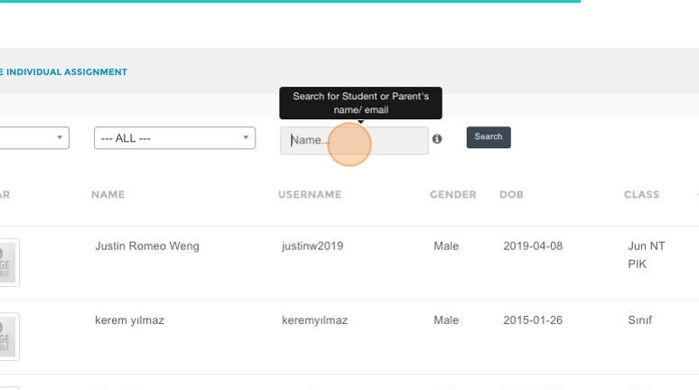
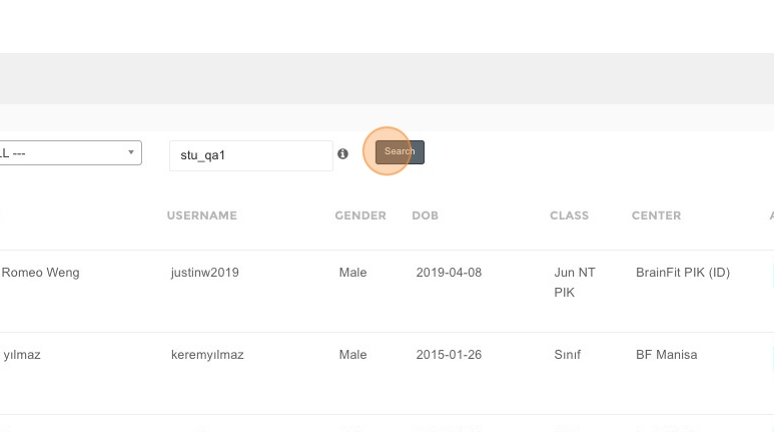
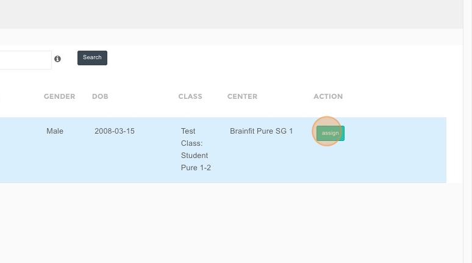
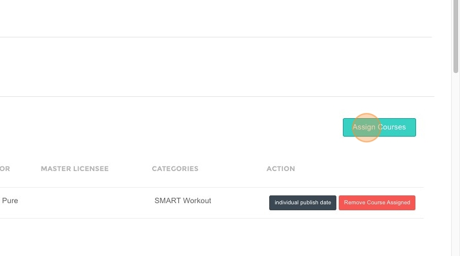
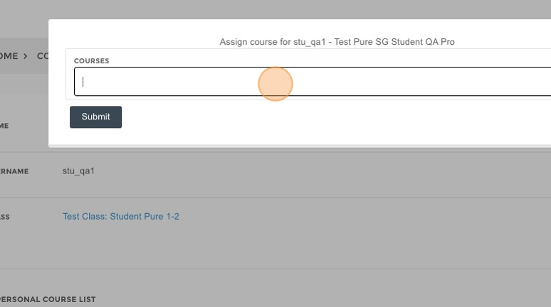
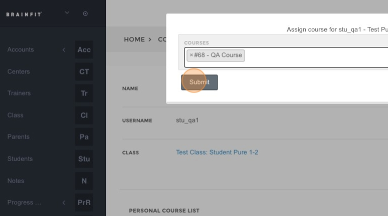
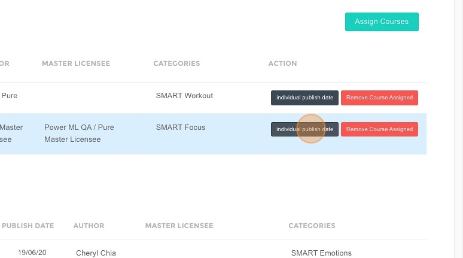

# How to Publish Individual Assignments in ACP

1. Navigate to [ACP Brainfit Studio](https://acp.brainfitstudio.com/acp/).  
2. Click **"Course"**.  

3. Click **"Course Individual Assignment"**.  

4. Type the **name of the student**.  

5. Click **"Search"**.  

6. Click **"Assign"**.  

7. Click **"Assign Courses"**.  

8. Click **here**.  

9. Select the **Course**.  
10. Click **"Submit"**.  

11. Click **"Individual Publish Date"** to schedule the publish date.  

