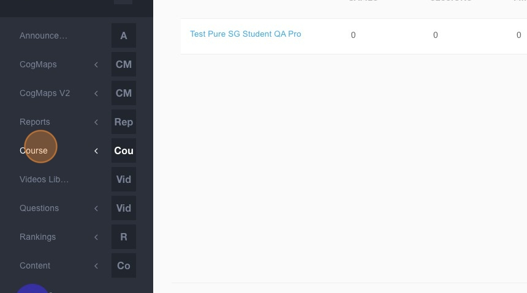
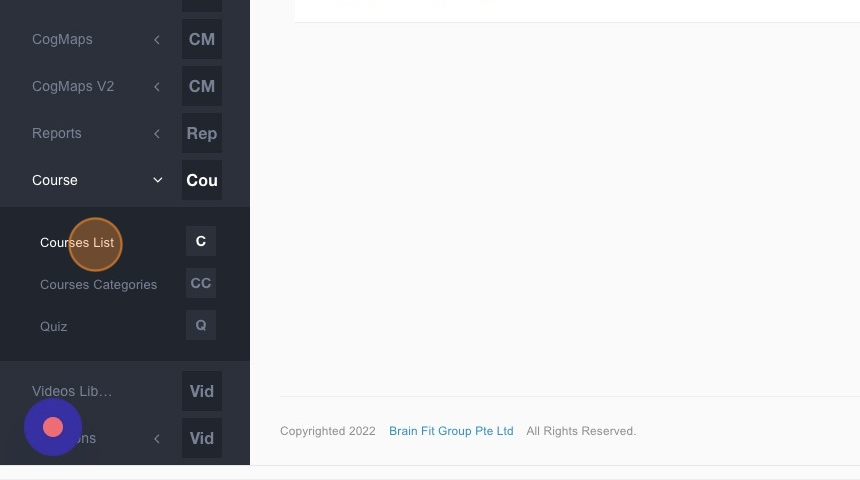
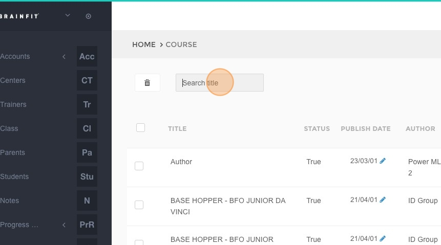
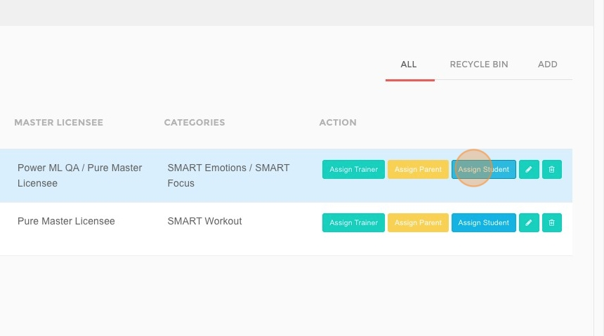
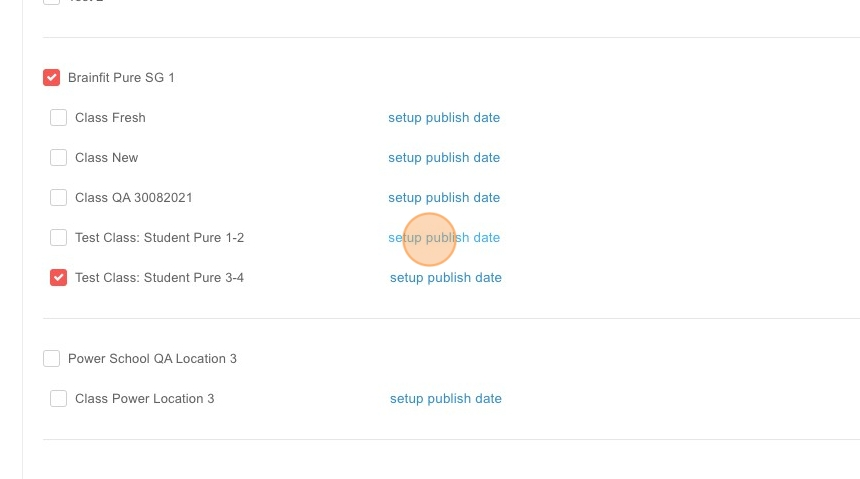
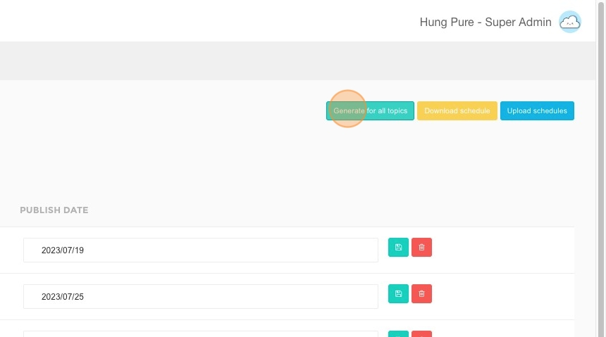
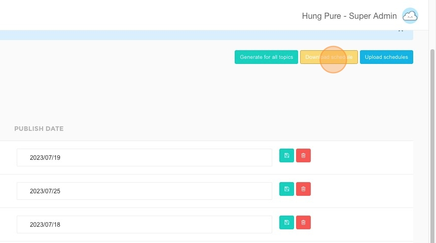
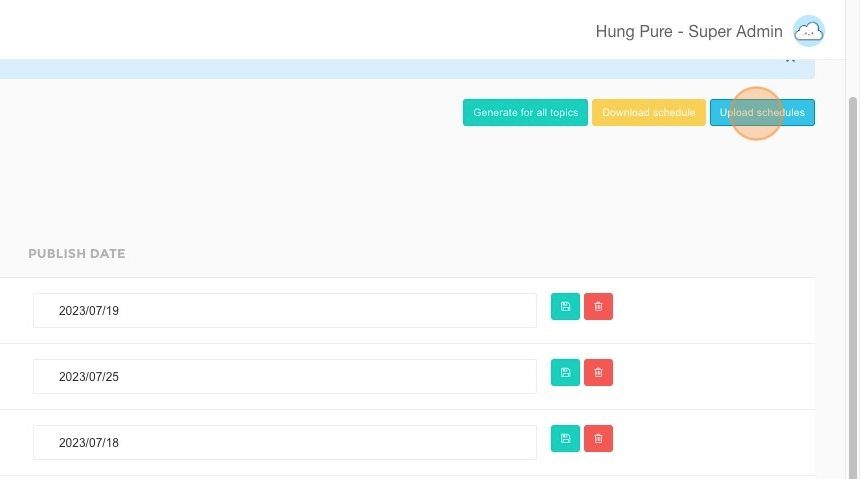
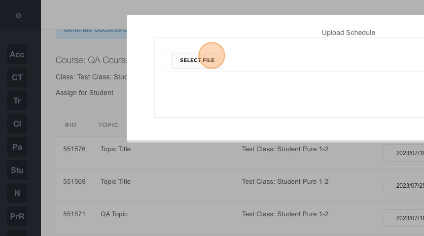
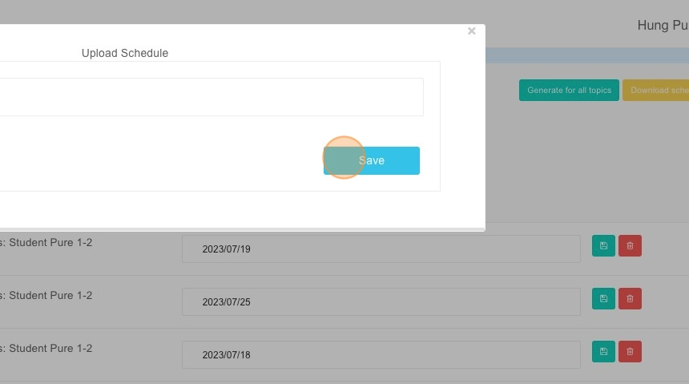

# How to Download and Upload Schedules of a Course

## Steps to Download the Schedule  

1. Navigate to [ACP Portal](https://acp.brainfitstudio.com/acp/).  
2. Click **"Course"**.  

3. Click **"Courses List"**.  

4. Click the **"Course title"** field.  

5. Type the **Course's name** and press **Enter**.  
6. Click **"Assign Student"**.  

7. Click **"Setup publish date"**.  

8. Click **"Generate for all topics"**.  

9. Click **"Download schedule"**.  

## Steps to Upload the Schedule  

10. Click **"Upload schedules"**.  
    - Ensure the **number of topics** matches the correct **topic ID**, which was included when downloading the Excel file in Step 8.  

11. Click **"SELECT FILE"** and choose the file. 

12. Click **"Save"**.  

**Note:**  
- Ensure the **PUBLISH DATE** column is formatted correctly:  
  - **Date format:** `yyyy/mm/dd`  
  - **Text format:** `"Text"`  
