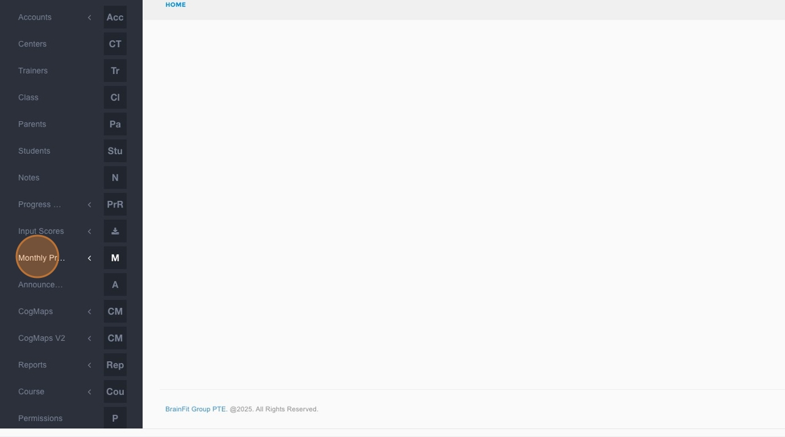
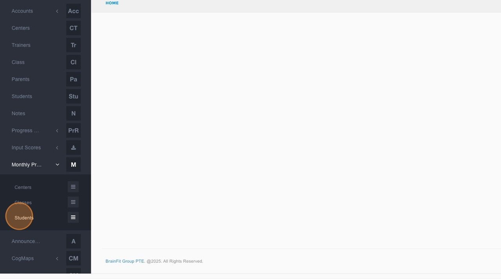
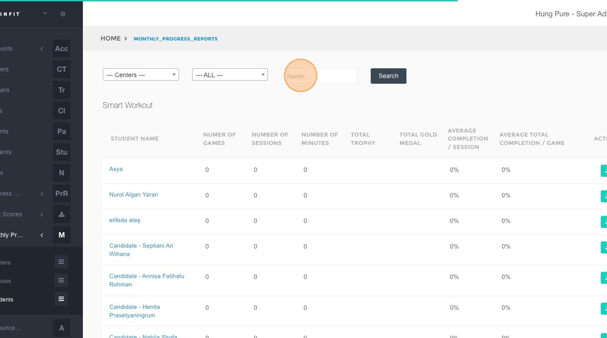
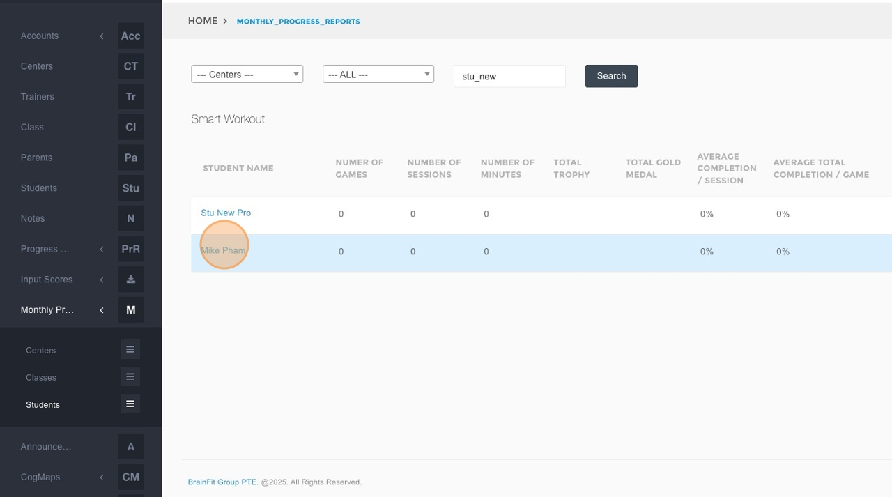
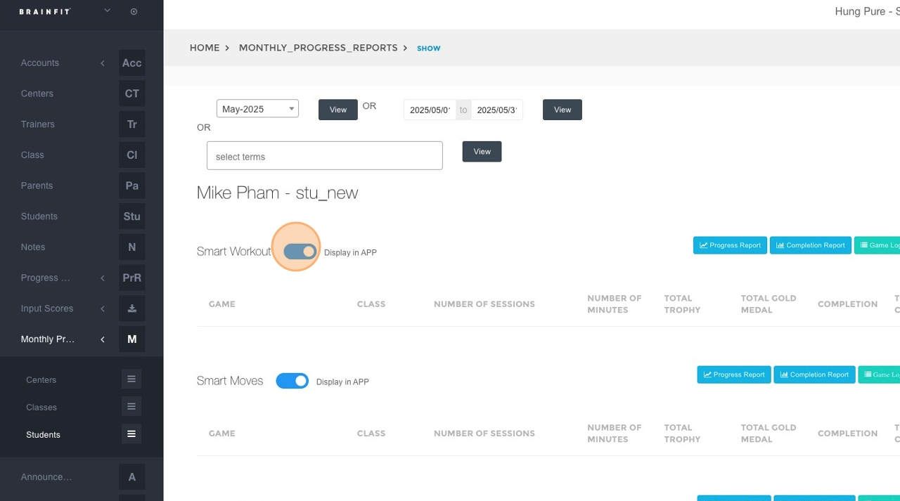

This feature is for SA, ML, CA, Trainer.
1.  **Navigate** to [ACP](https://acp.brainfitstudio.com/acp).
2.  Click **Monthly Progress Reports** in the navigation menu.

3.  Click **Students** in the submenu.

4.  Click within the **"Name..."** search field.

5.  Type the name of the student whose game summary you want to manage.
6.  Click the **Search** button.
7.  Click on the specific student's name from the search results.

8.  Locate the game summary you wish to publish or unpublish and click the corresponding toggle button.

9.  Repeat step 8 for any other games for this student that you want to publish or unpublish.