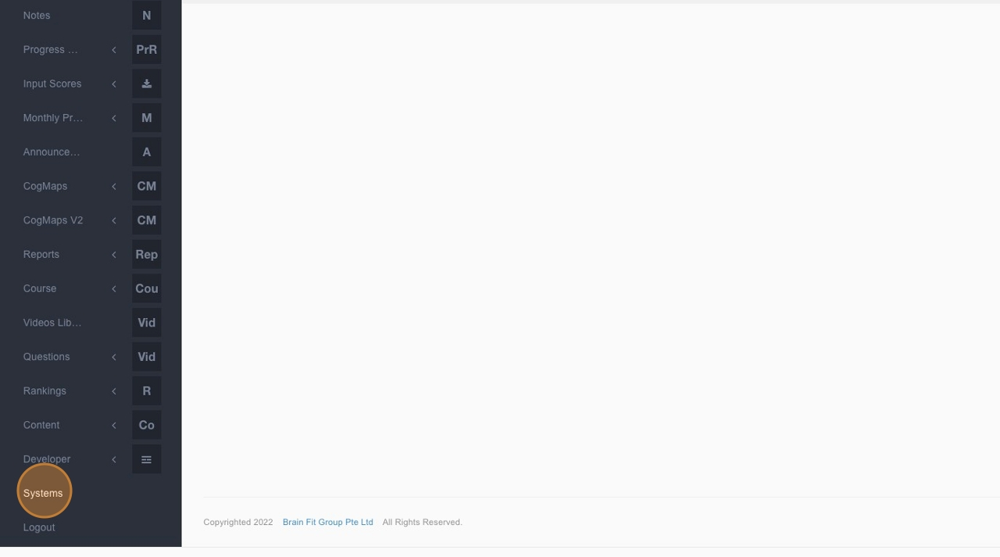
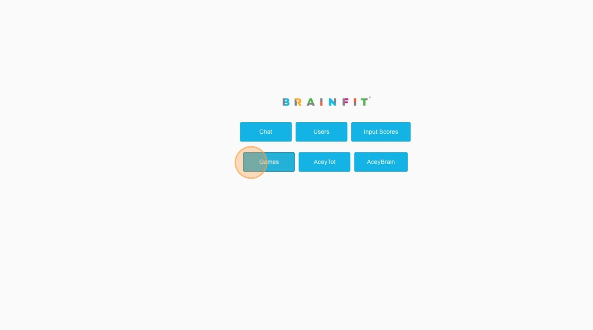
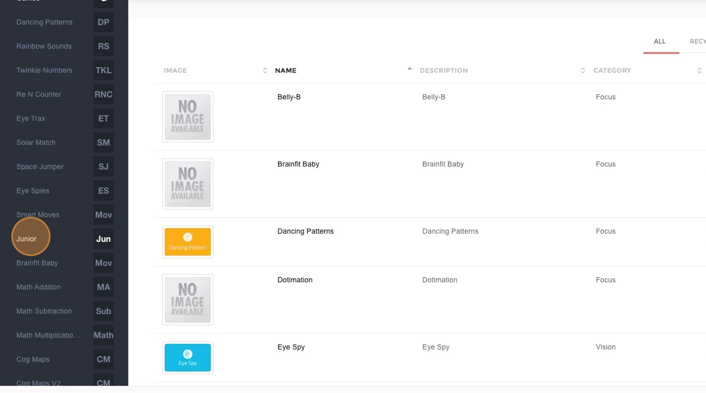
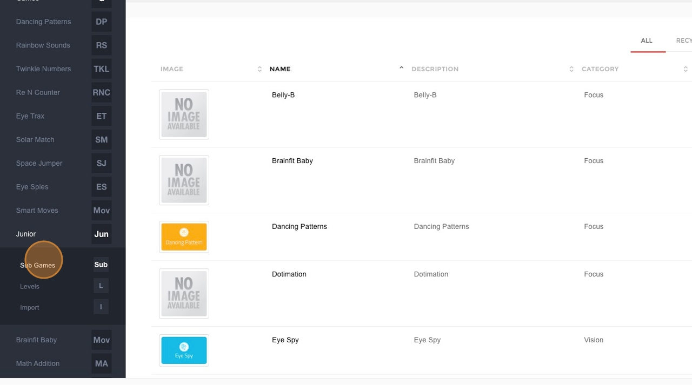
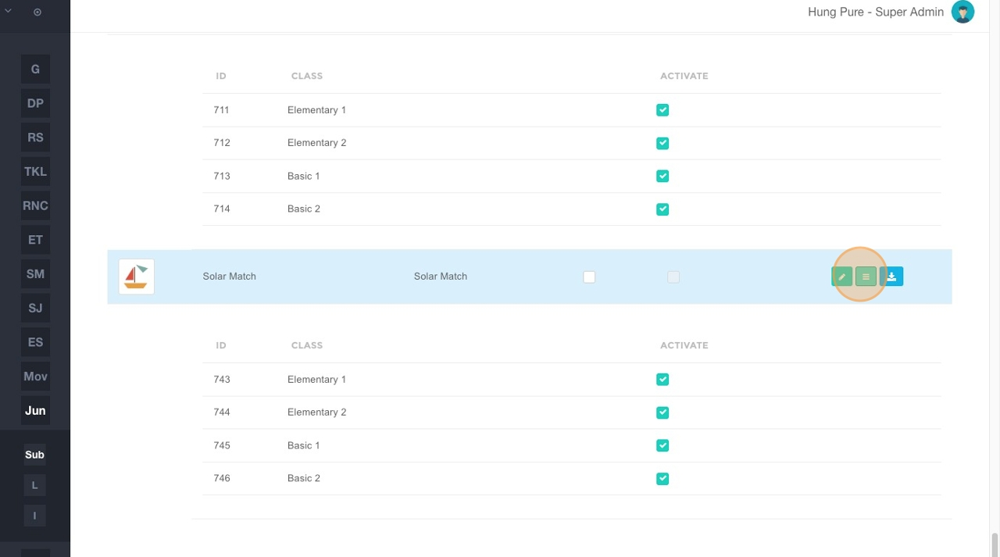
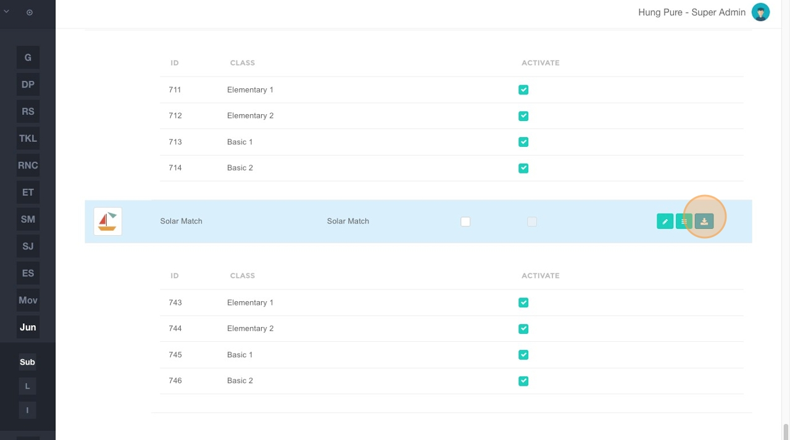

# Accessing Junior/Smart Moves/Brainfit Baby Sub Games Management on ACP
This feature is for SA

## Steps to Access  

1. **Navigate** to [BrainFit ACP](https://acp.brainfitstudio.com/acp).  
2. Click **"Systems"**.  

3. Click **"Games"**.  

4. Click **"Junior"** or **"Smart Moves"** or **"Brainfit Baby"**.  

5. Click **"Sub Games"**.  

6. Click **here** to redirect to the level detail view.  

## Managing Sub Games  

7. In this view, you can see the **exact status of attachments** for each level.  
   - Click **"Edit"** in the **Action** column to view the details of a specific level.  

   

8. Click the **download button** to get the Excel file of the sub-game.  
   - This file contains the **complete content and configuration** of each level.  

   
