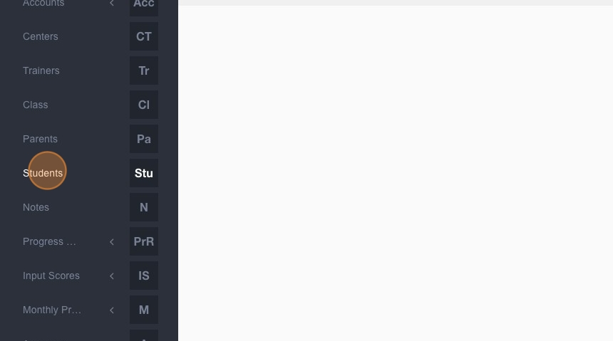
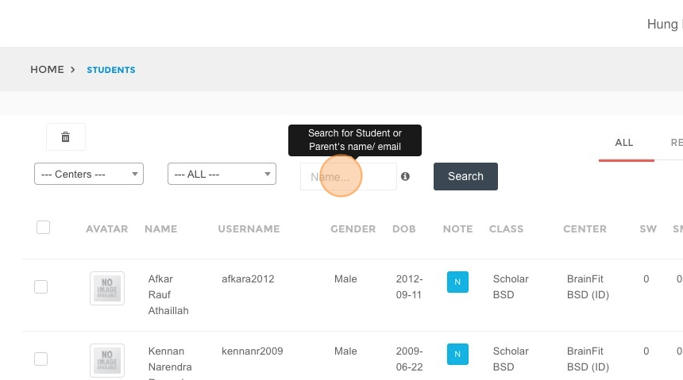
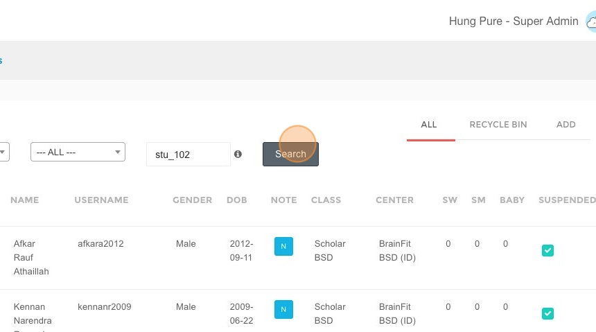
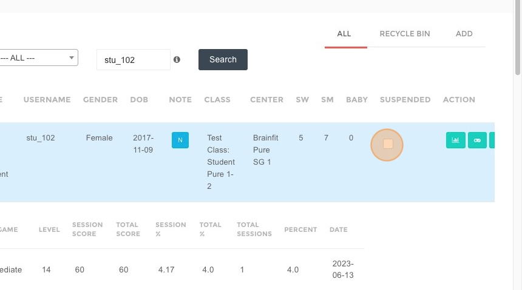
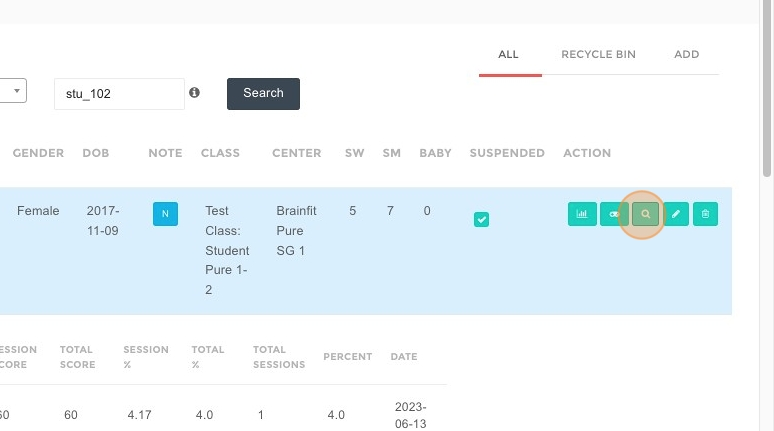
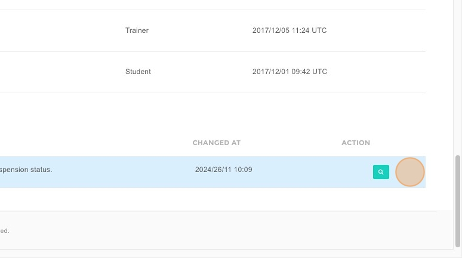
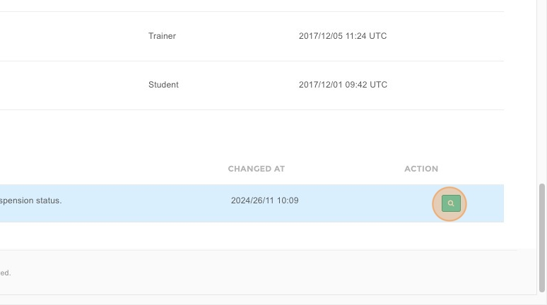
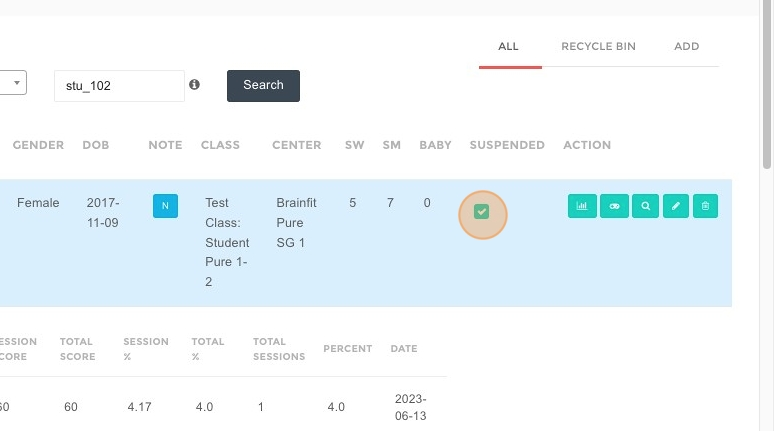
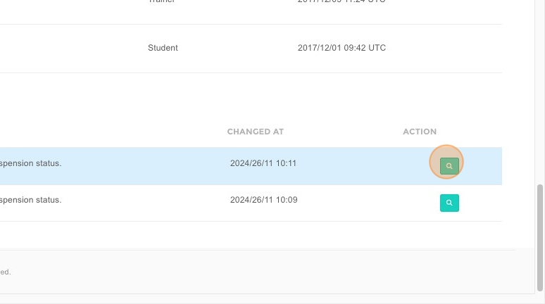
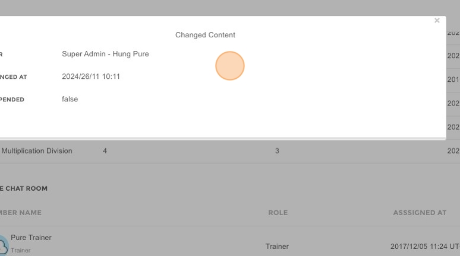

# Suspend Student
1. Navigate to [ACP Brainfit Studio](https://acp.brainfitstudio.com/acp/)
2. Click **"Students"**

3. Type the name of the student you want to suspend

4. Click **"Search"**

5. Click **here** to suspend

6. Click **OK** to confirm

7. Click **here** to watch change logs

8. Change logs will be listed **here**

9. Click this button to view **details**

10. Click **here** to unsuspend

11. Change logs will be **saved**

