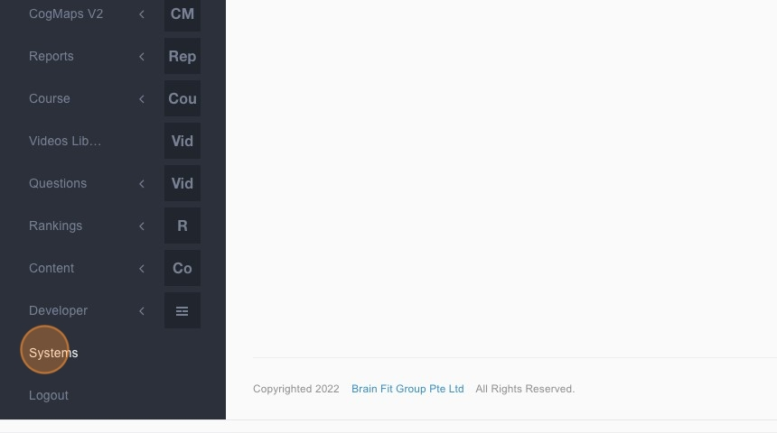
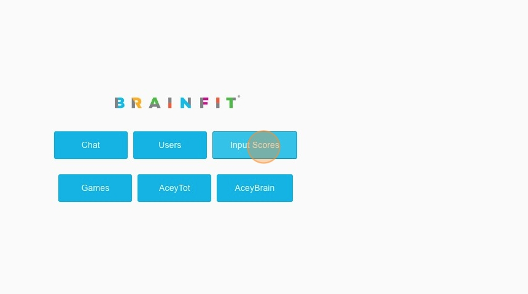
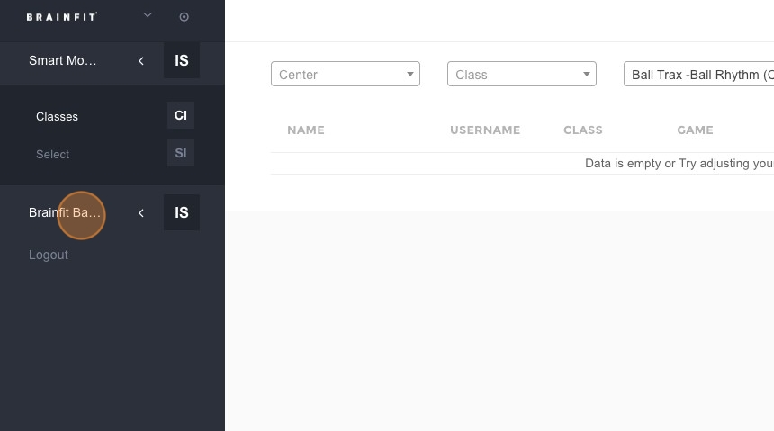
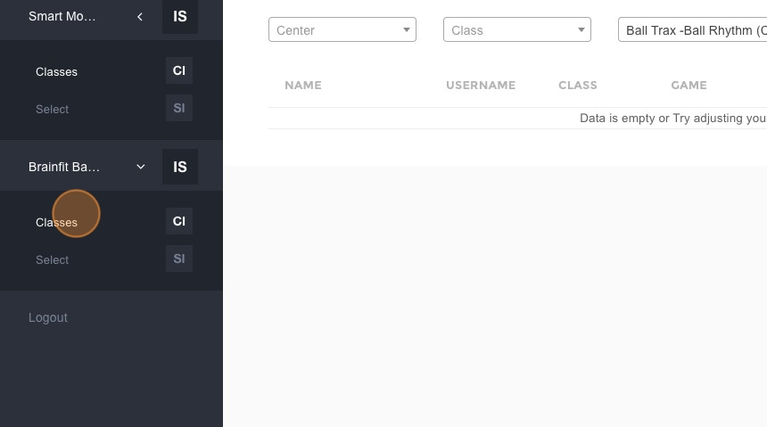
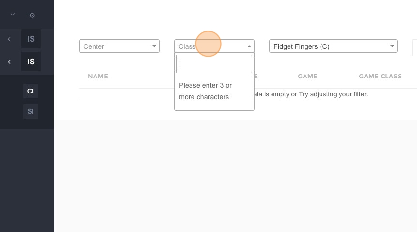
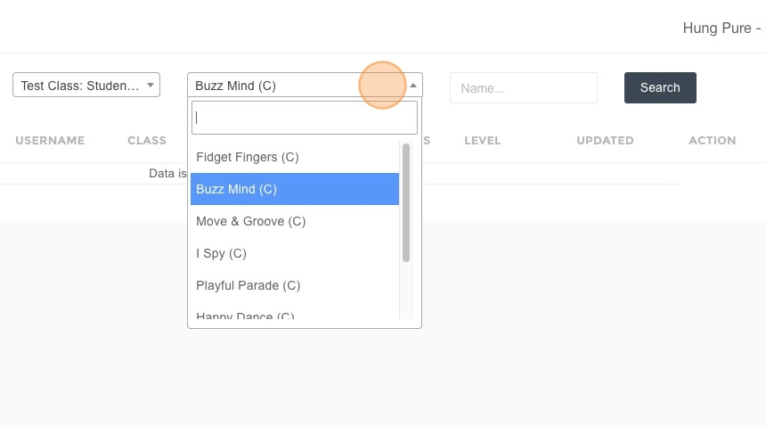
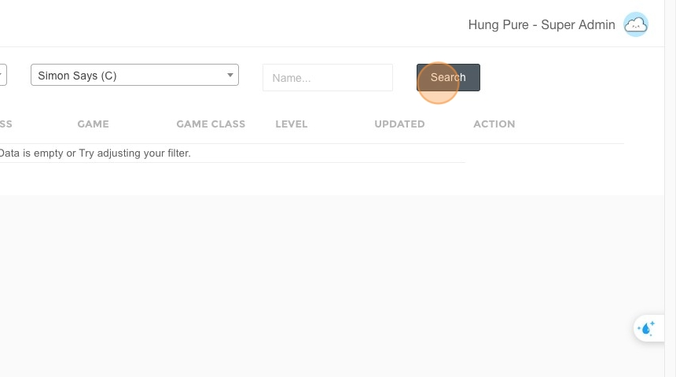
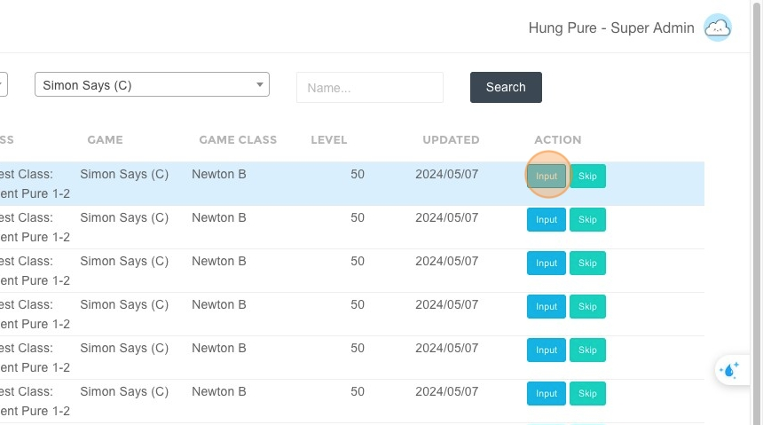

# Input Scores for Brainfit Baby Game

1. Navigate to [ACP Brainfit Studio](https://acp.brainfitstudio.com/acp).  
2. Click **"Systems"**.  

3. Click **"Input Scores"**.  

4. Click **"Brainfit Babies"**. 

5. Click **"Classes"**.  

6. Click the **"Class"** field to choose a class.  

7. Click the **"Game"** field to choose a subgame.  

8. Click **"Search"**.  

9. Click **"Input"**. 

