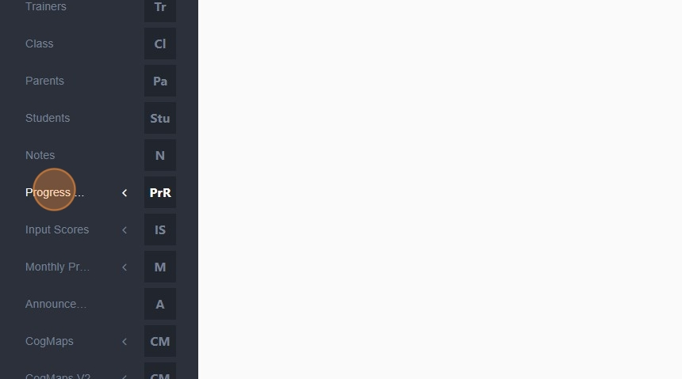
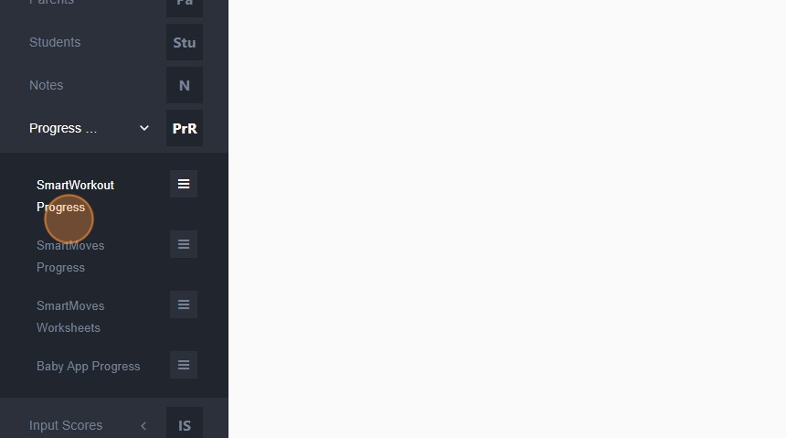
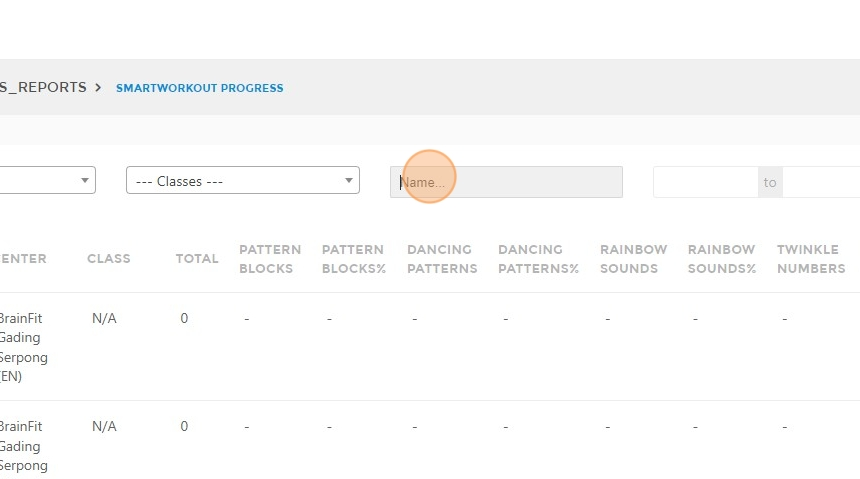
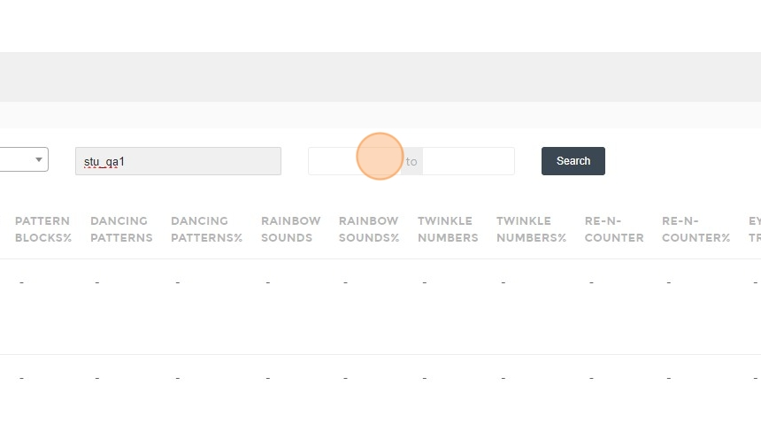
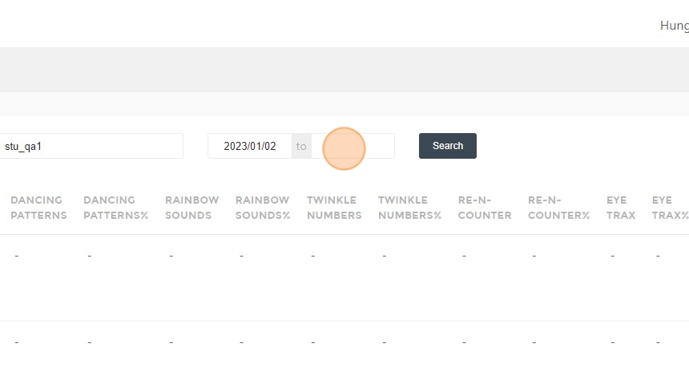
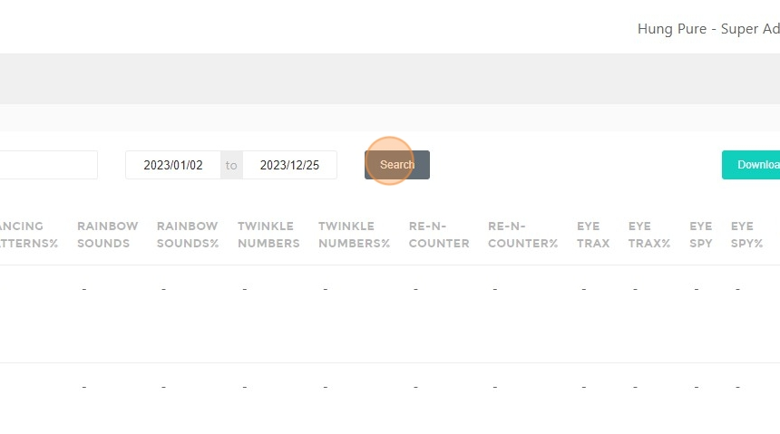
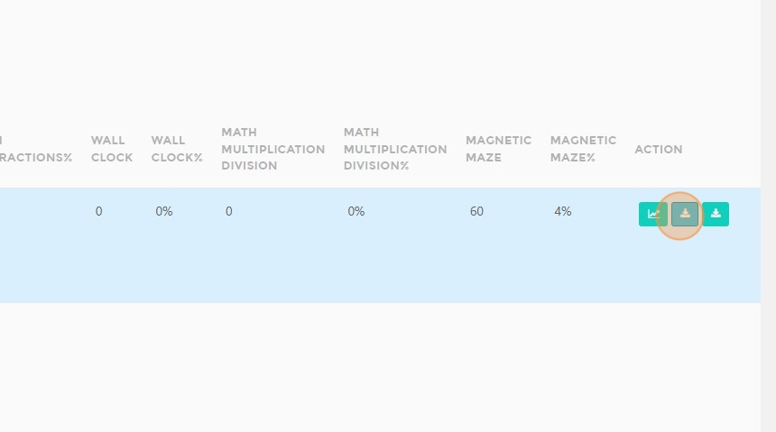

# How to Access and Print Progress Reports

## Steps to Access a Progress Report

1. Navigate to [ACP Portal](https://acp.brainfitstudio.com/acp/).  
2. Click **"Progress Reports"**.  

3. Click **"SmartWorkout Progress"** or **"SmartMoves Progress"**.  

4. Click the **"Name..."** field.  

5. Type the **student's name**.  
6. Click the **date field**.  

7. Select the **start date**.  
8. Select the **end date**.  

9. Click **"Search"**.  

## Steps to Print or Save the Report  

10. Click **here**. 

11. Select a **download folder** and **save** the report.  
