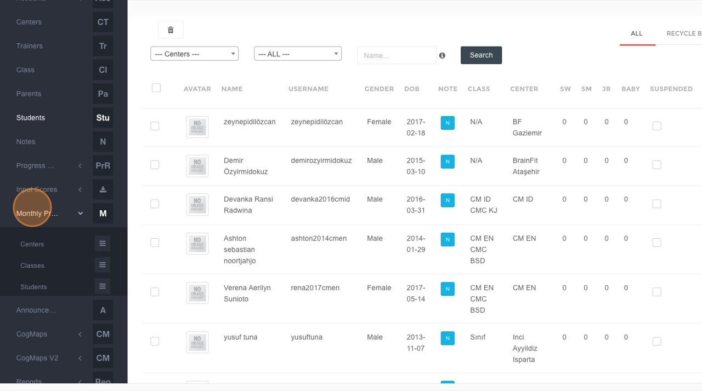
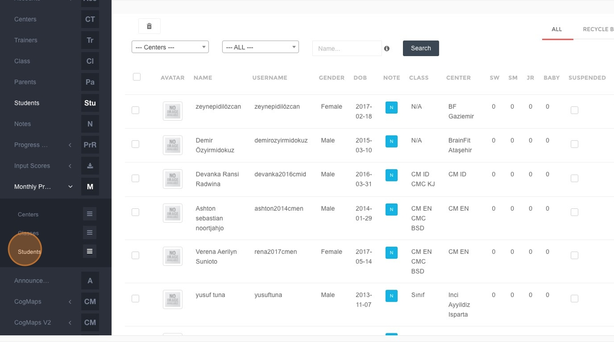
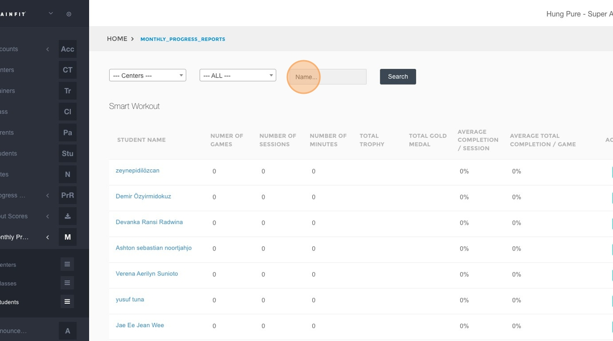
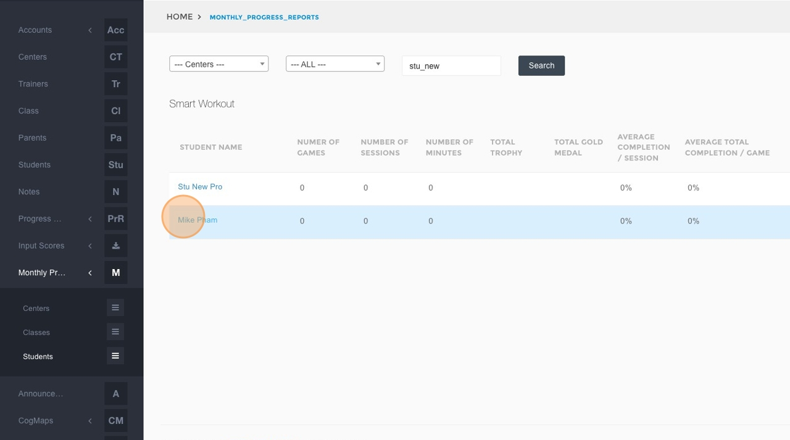
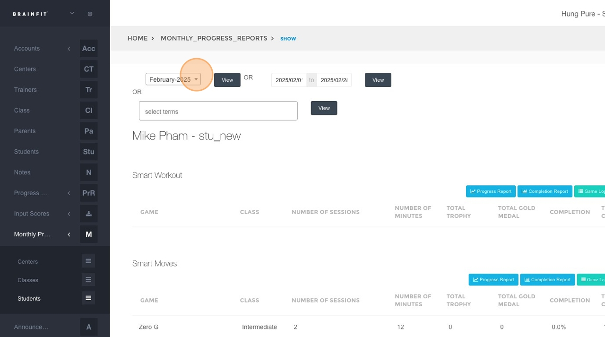
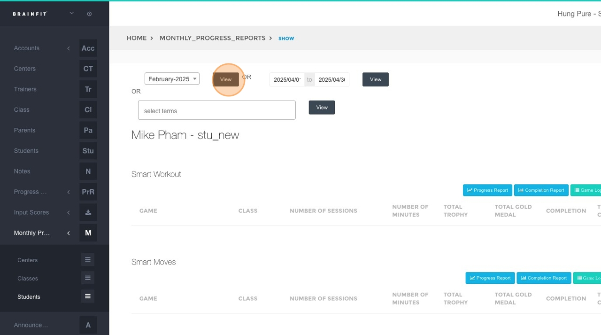
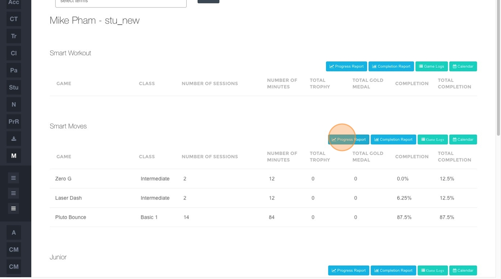
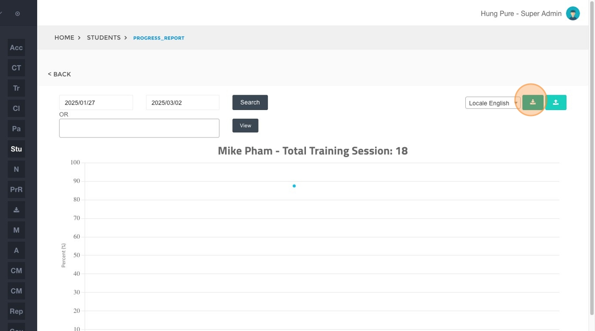

## Accessing and Printing Progress/Completion Reports
This feature is for SA, ML, CA, Trainer

1.  **Navigate** to [BrainFit ACP](https://acp.brainfitstudio.com/acp).
2.  Click **Monthly Progress Reports**.

3.  Click **Students** in the submenu.

4.  Click the **"Name"** field.

5.  Type the name of the student you wish to find and click **Search**.
6.  Click on the student's name (e.g., **"Mike Pham"**) from the search results.

7.  Select the desired date or time range for the report.

8.  Click the **View** button to generate the report based on the selected criteria.

9.  Click on either **Progress Report** or **Completion Report** to select the type of report you want to print.

10. Click here to **download** the report.

11. Click **Save** in the download dialog to save the report to your computer.

12. Select the desired folder on your computer where you want to save the report. Once saved, open the file and use your computer's print function (File > Print or Ctrl+P/Cmd+P) to print the report.
