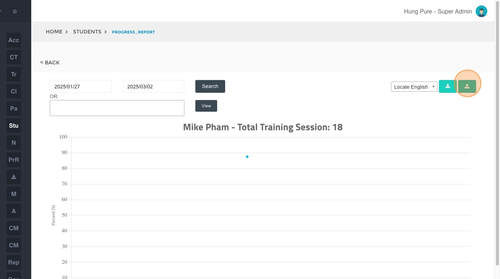
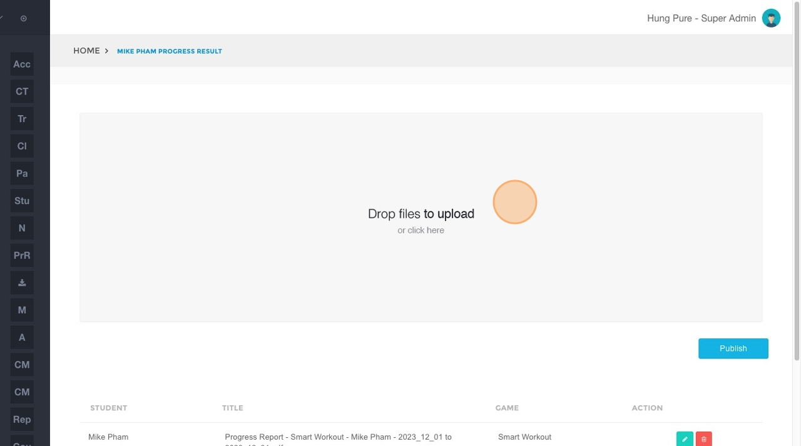
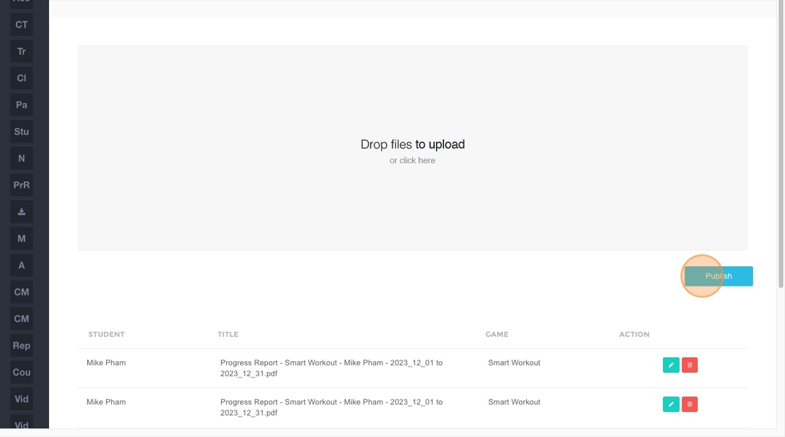

# How to Publish SmartWorkout/SmartMoves Progress Reports

1.  **Navigate** to [BrainFit ACP](https://acp.brainfitstudio.com/acp).
2.  Click **Monthly Progress Reports**.

3.  Click **Students** in the submenu.

4.  Click the **"Name"** field.

5.  Type the name of the student you wish to find and click **Search**.
6.  Click on the student's name (e.g., **"Mike Pham"**) from the search results.

7.  Select the desired date or time range for the report.

8.  Click the **View** button to generate the report based on the selected criteria.

9.  Click on either **Progress Report** or **Completion Report** to select the type of report you want to publish.

## Steps to Upload and Publish Reports  

9. Click **here**.  

10. Click **Save** in the download dialog to save the report to your computer if you don’t already have the file. Or click **Cancel** to skip the download if you already have the file.

11. Click **"Drop files here to upload"** and choose the file.  

12. Click **"Publish"**.  

