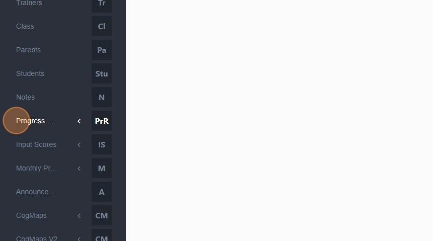
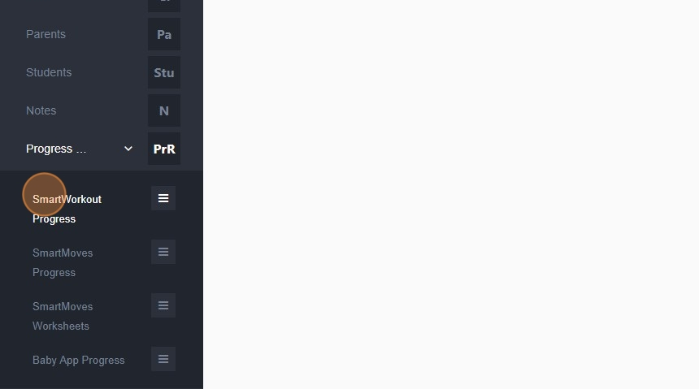
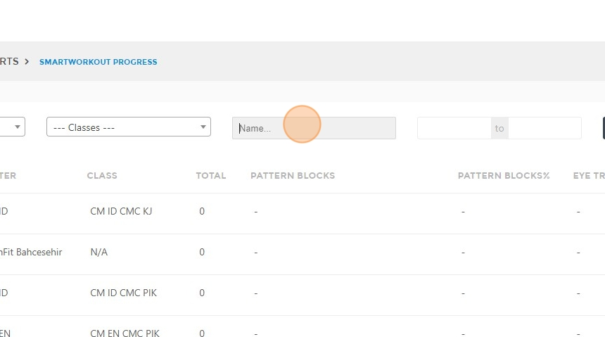
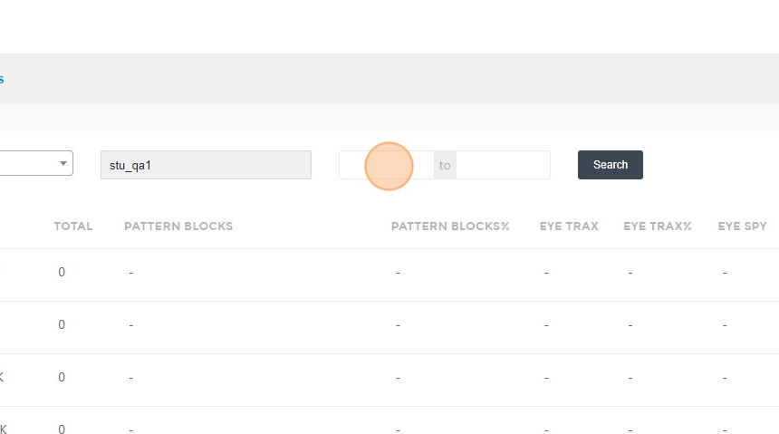
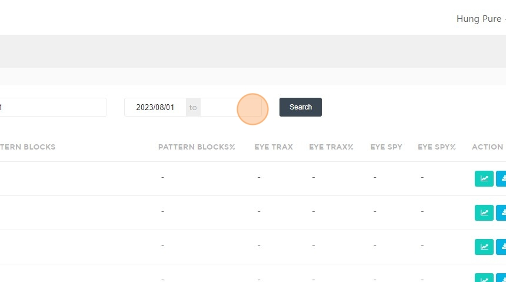
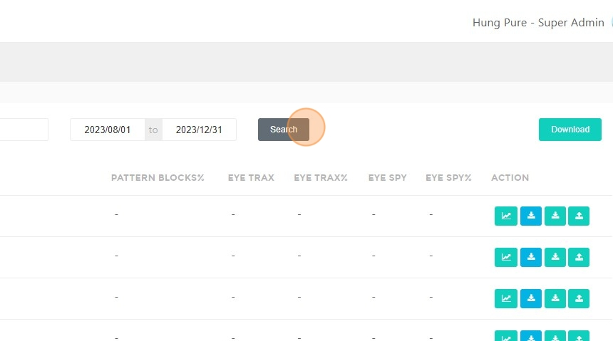
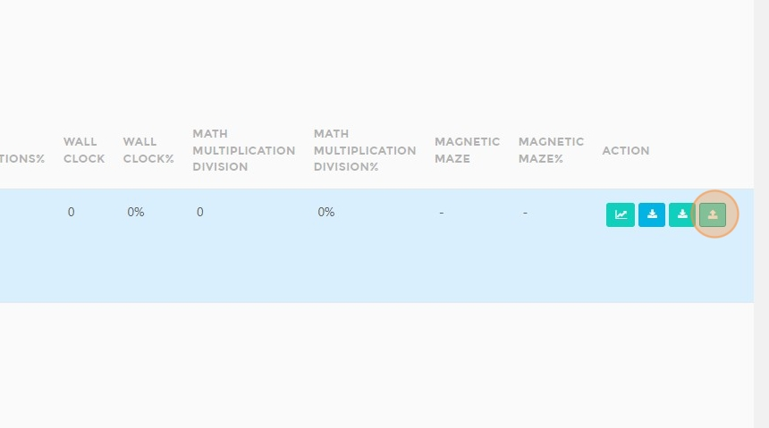
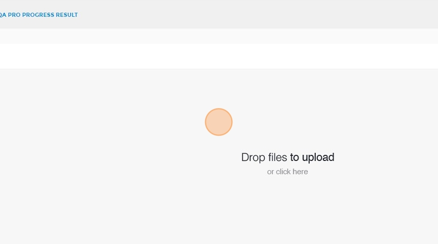
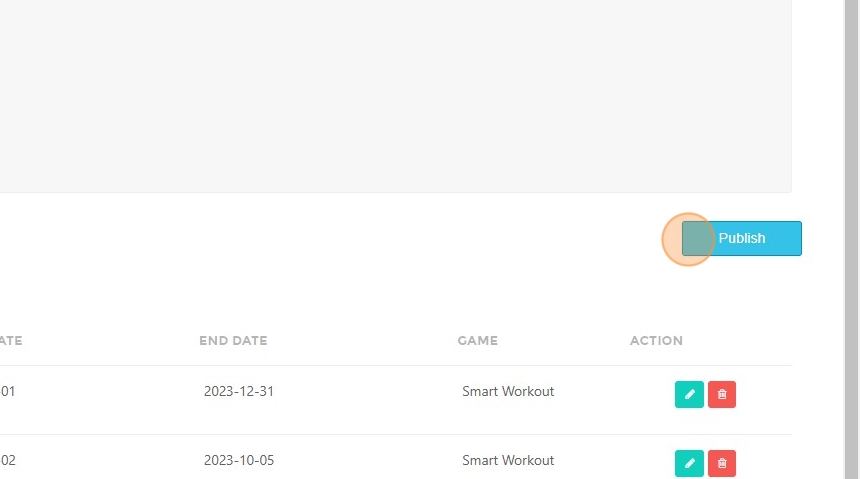

# How to Access and Publish SmartWorkout/SmartMoves Progress Reports

## Steps to Access Reports  

1. Navigate to [ACP Portal](https://acp.brainfitstudio.com/acp/).  
2. Click **"Progress Reports"**.  

3. Click **"SmartWorkout Progress"** or **"SmartMoves Progress"**.  

4. Click the **"Name..."** field.  

5. Type the **student's name**.  
6. Click the **text field** to set the **start date**. 

7. Click the **text field** to set the **end date**.  

8. Click **"Search"**.  

## Steps to Upload and Publish Reports  

9. Click **here**.  

10. Click **"Drop files here to upload"** and choose the file.  

11. Click **"Publish"**.  

