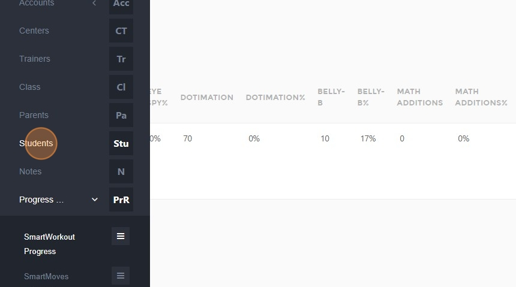
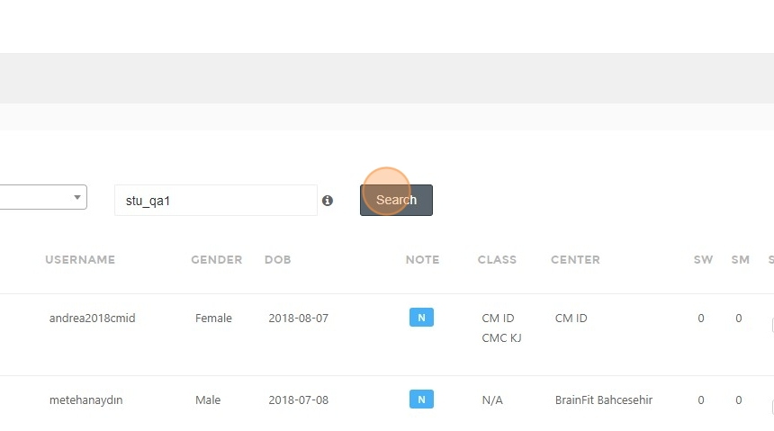
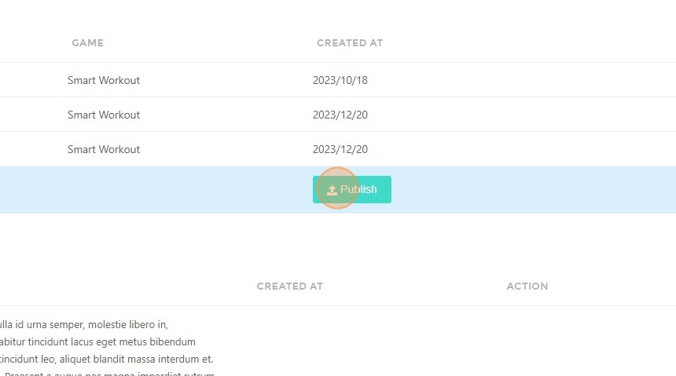
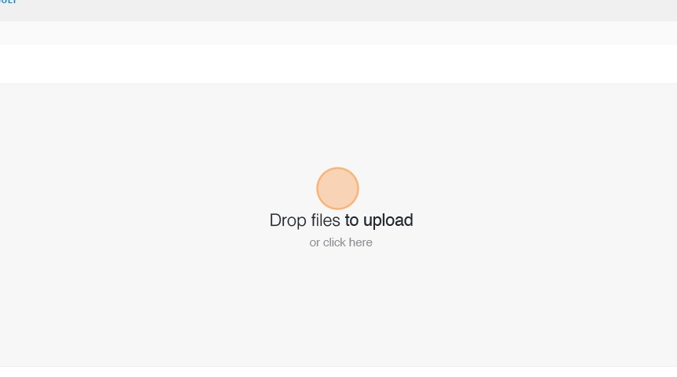
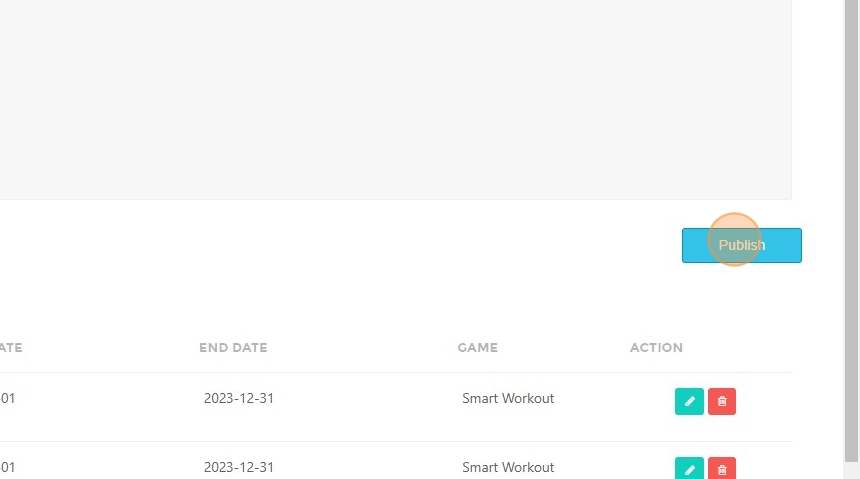

# How to Publish Progress Reports in Student Detail View

## Steps to Search for a Student's Progress Report

1. Navigate to [BrainFit ACP](https://acp.brainfitstudio.com/acp/).  
2. Click **"Students"**.  

3. Click the **"Name..."** field.  

4. Type the **student's name**.  
5. Click **"Search"**.  

6. Click **here**.  

## Steps to Publish a Progress Report  

7. Click **"Publish"**.  

8. Click **here** and choose a file.  

9. Click **"Publish"** again.  

