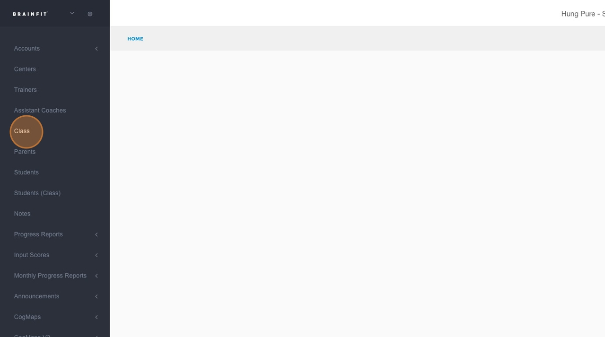
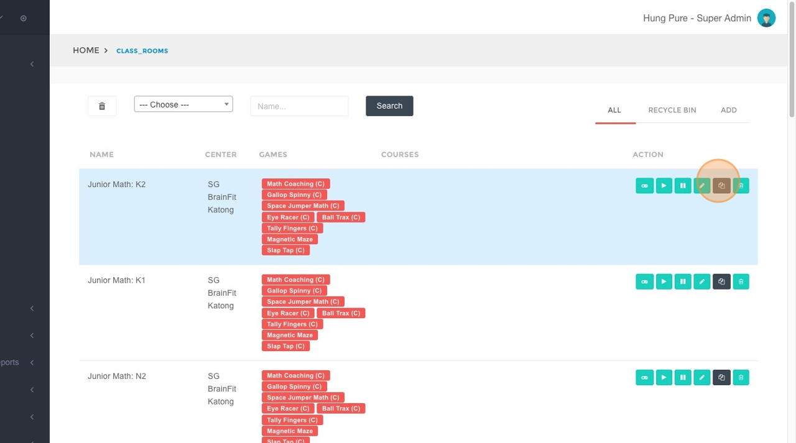
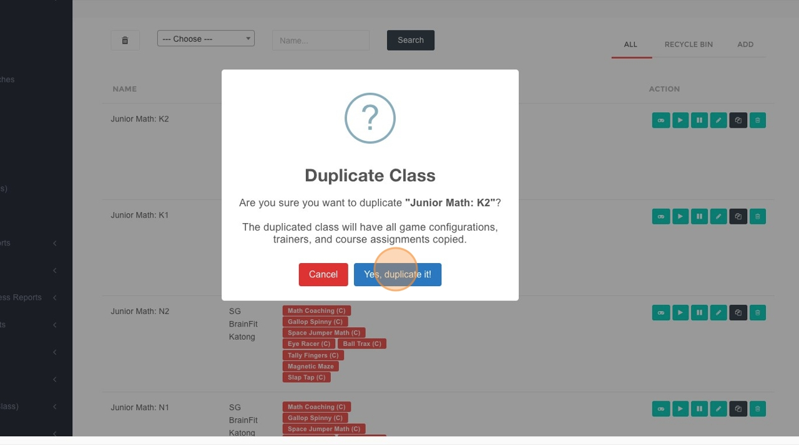
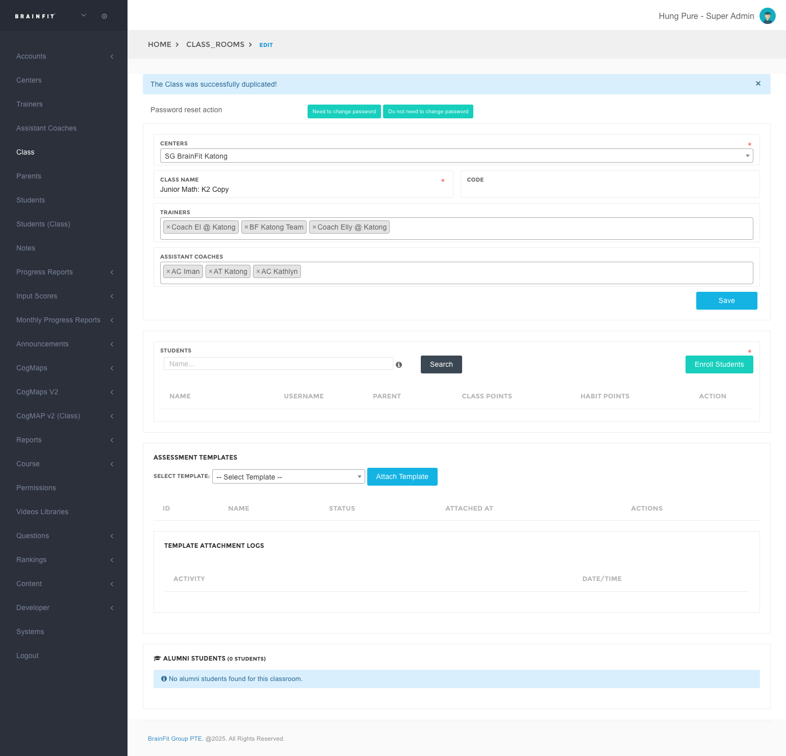

# Clone a Class in BrainFit ACP
This feature is for SA, ML

## Steps to Clone a Class

1. **Navigate** to [BrainFit ACP](https://acp.brainfitstudio.com/acp).
2. Click **"Class"** in the left navigation.

3. Locate the class you want to duplicate and click the **"Clone (Duplicate)"** button.

4. Confirm by selecting **"Yes, duplicate it!"**.

5. Update the **class details or enrollment** information for the duplicated class as needed.

## After Cloning

- Review the duplicated class schedule to ensure dates, times, and trainers are correct.
- Make any final adjustments (capacity, enrolled students, notes) before publishing or sharing the schedule.
