# Manage Class Group Guide

This guide covers how to manage an existing Class Group, including creating session templates, generating sessions for the term, editing settings, and deleting class groups.

---

## Required Roles

| Action | Allowed Roles |
|--------|---------------|
| View class group | All roles (including Trainers) |
| Edit settings, create templates, generate sessions | Super Admin, Master Licensee, Center Admin |
| Delete class group | **Super Admin, Master Licensee only** |

> **Note:** Trainers have view-only access. They can view class group details and take attendance, but cannot make changes.

---

## Accessing Class Group Detail

1. Navigate to **Class Groups** from the sidebar

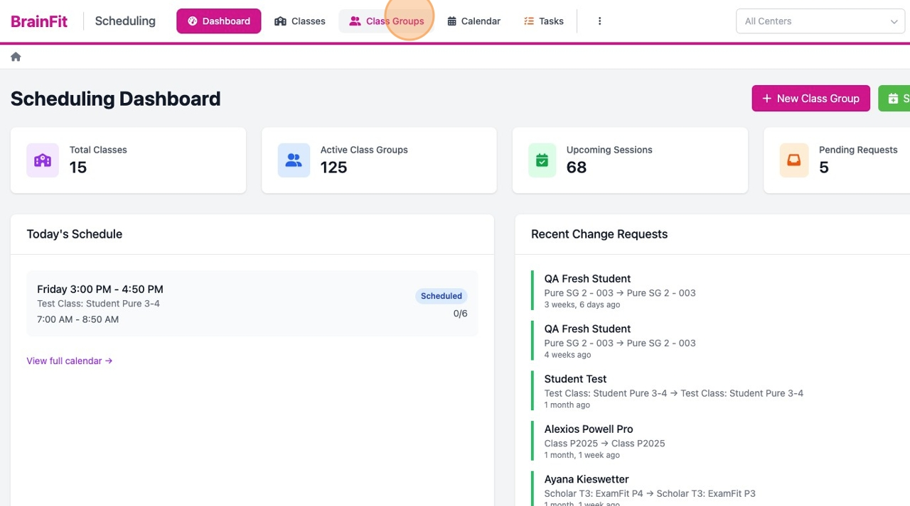

2. Find your class group in the list
3. Click the **eye icon** or the group name to open the detail view

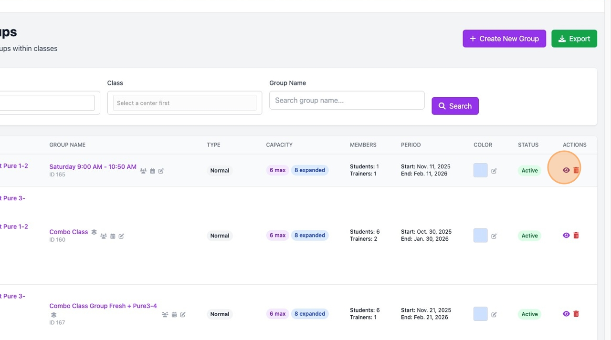

---

## Class Group Detail Overview

The Class Group Detail page has several sections:

| Section | Description |
|---------|-------------|
| **Header** | Group name, associated classes, publish status |
| **Info Cards** | Capacity, teachers count, upcoming sessions, templates count |
| **Session Templates** | Recurring session patterns |
| **Sessions** | List of upcoming and recent sessions |
| **Group Details** | Editable settings (right sidebar) |
| **Assigned Teachers** | Teachers assigned to this group |
| **Students** | Students assigned to this group |
| **Quick Actions** | Generate sessions, sync students |

---

## Editing Class Group Settings

Click the **pencil icon** next to any editable field to modify it:

### Editable Fields

| Field | Description | How to Edit |
|-------|-------------|-------------|
| **Group Name** | Name displayed in lists and calendars | Click pencil icon next to name |
| **Group Type** | Normal or Premium | Click pencil in Group Details |
| **Color** | Calendar display color | Click pencil, select from palette |
| **Term Period** | Start and end dates | Click pencil, select new dates |
| **Description** | Optional notes | Click pencil, enter text |
| **Capacity** | Max participants / Expanded capacity | Click pencil (updates all templates and sessions) |
| **Location** | Default room/location | Click pencil, enter location |

### Changing Capacity (Important!)

When you change capacity settings:
- The change **cascades** to ALL session templates
- The change **cascades** to ALL existing sessions
- This ensures consistency across the entire group

---

## Session Templates

Session templates define your recurring weekly schedule. Each template specifies:
- Day of the week (Monday - Sunday)
- Start and end time
- Capacity settings

### Creating a Session Template

1. Click **Add Template** button (top right or in templates section)
2. Fill in the template form:
   - **Name**: Descriptive name (e.g., "Saturday Morning 9AM")
   - **Day of Week**: Select the day
   - **Start Time**: Session start time
   - **End Time**: Session end time
   - **Location**: Optional room/location
3. Click **Create Template**

### Editing a Session Template

1. Find the template in the Session Templates section
2. Click the **pencil icon**

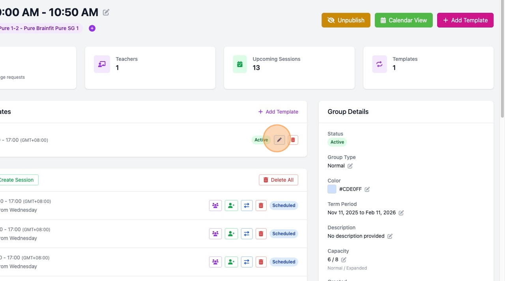

3. Modify the fields:
   - Name
   - Day of week
   - Start time
   - End time
4. Click **Save**

> **Important:** Editing a template's schedule (day/time) will automatically update ALL sessions that were generated from this template!

### Deleting a Session Template

1. Click the **trash icon** next to the template

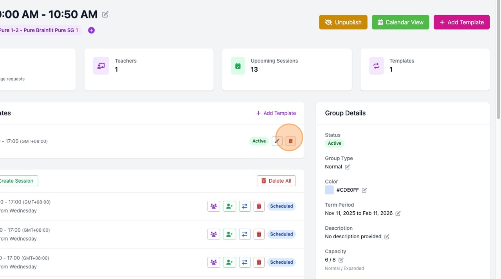

2. Confirm the deletion

> **Warning:** Deleting a template will also delete ALL sessions generated from it!

---

## Generating Sessions

After creating templates, you need to generate actual session instances for your term.

### Step-by-Step: Generate Sessions

1. Click **Generate Sessions** in Quick Actions (or the link in empty sessions area)

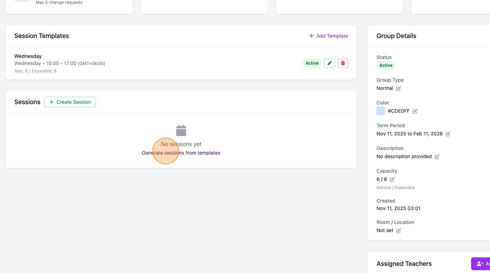

2. In the modal, configure:

   | Option | Description |
   |--------|-------------|
   | **Start Date** | When to begin generating sessions |
   | **End Date** | When to stop generating sessions |
   | **Select Templates** | Check which templates to use |
   | **Skip existing** | Don't create duplicates for dates with sessions |
   | **Auto-assign students** | Automatically add all group students to sessions |

3. Click **Generate Sessions**

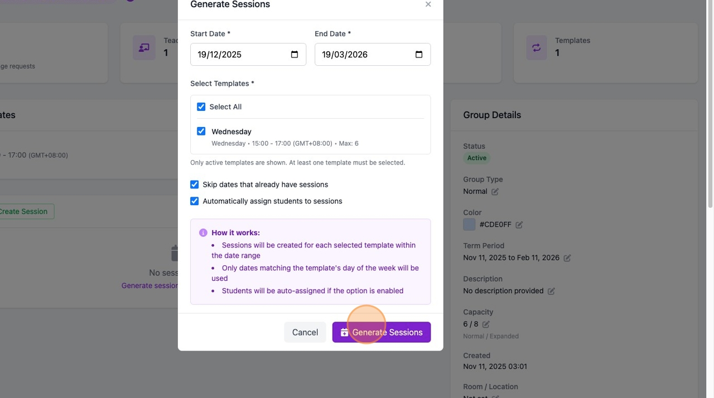

### Generation Options Explained

- **Skip dates that already have sessions**: Recommended to avoid duplicates
- **Automatically assign students to sessions**: When enabled, all students in the group will be assigned to every generated session

### Best Practices

1. **Generate for full term**: Set dates from term start to term end
2. **Select all active templates**: Unless you want to generate only specific days
3. **Keep "Skip existing" checked**: Prevents duplicate sessions
4. **Enable auto-assign**: Saves time enrolling students manually

---

## Managing Sessions

### Creating a Manual Session

For one-off sessions outside the template schedule:

1. Click **Create Session** button in the Sessions section

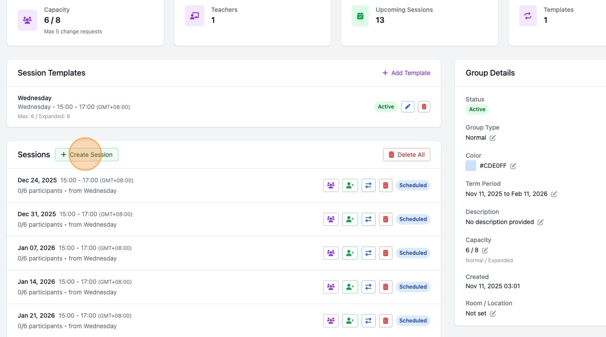

2. Fill in:
   - Date and start time
   - Duration (in minutes)
   - Max participants
   - Session title (optional)
   - Select students to assign

3. Click **Create Session**

### Session Actions

Each session in the list has action buttons:

| Icon | Action | Description |
|------|--------|-------------|
| 👥 (users) | Attendance | Open attendance management |
| ➕ (user-plus) | Add/Remove Students | Manage session enrollment |
| 🔄 (exchange) | Change Request | Create a session change request |
| 🗑️ (trash) | Delete | Delete this session |

### Deleting All Sessions

1. Click **Delete All** button in Sessions header

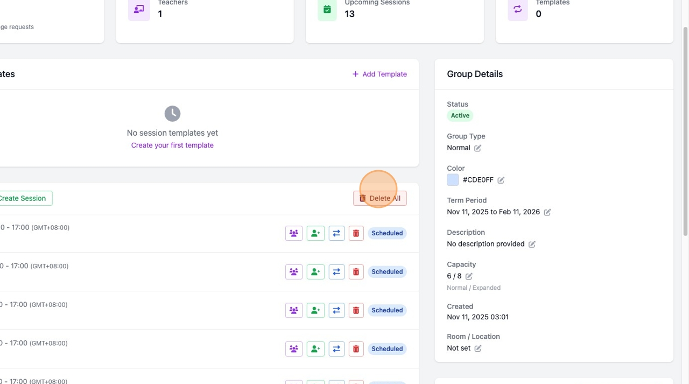

2. Confirm the action

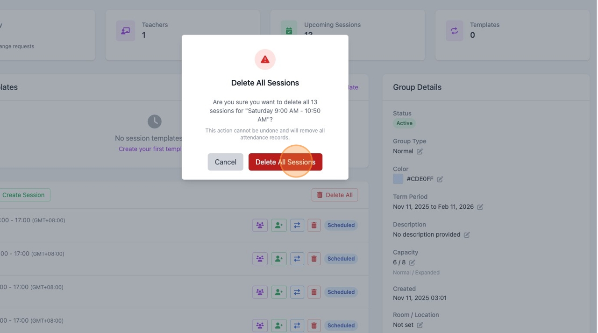

> **Warning:** This permanently deletes ALL sessions and their attendance records!

---

## Managing Members

### Assigning Teachers

1. Click **Assign Teachers** button

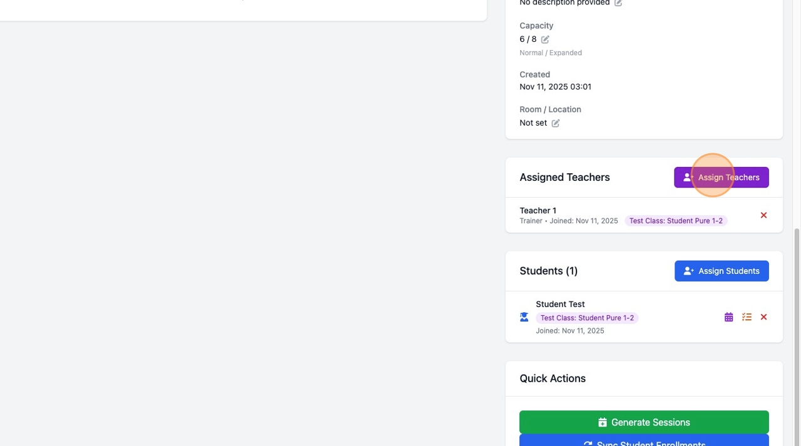

2. Check the teachers you want to add

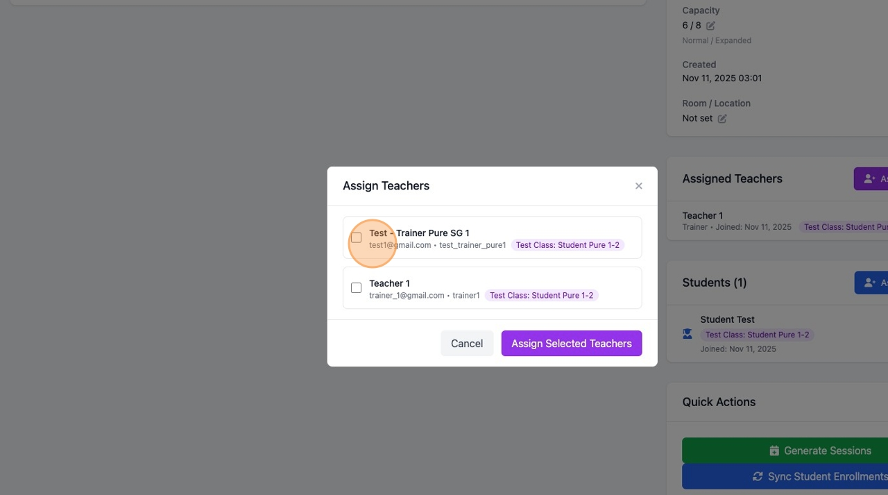

3. Click **Assign Selected Teachers**

### Removing Teachers

1. Find the teacher in the Assigned Teachers list
2. Click the **X** button

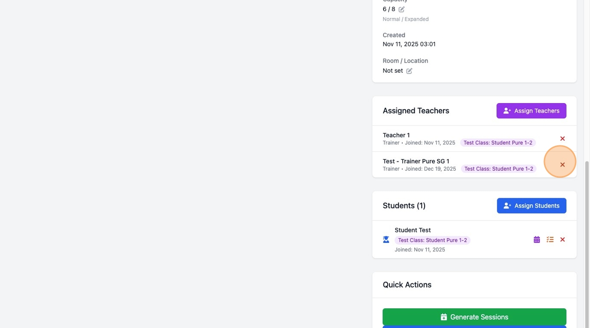

3. Confirm removal

### Assigning Students

1. Click **Assign Students** button

2. Check the students you want to add (shows students from associated classes)

3. Click **Assign Selected Students**

### Removing Students

1. Find the student in the Students list
2. Click the **X** button

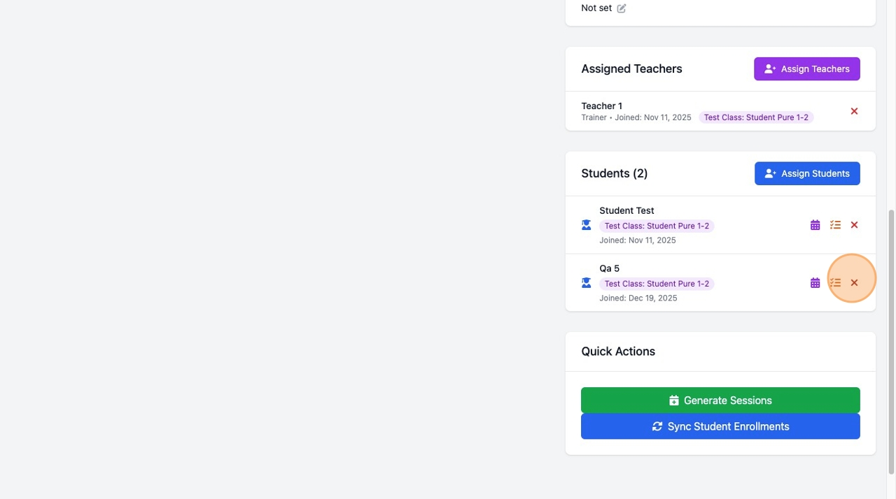

3. Confirm removal

---

## Quick Actions

### Sync Student Enrollments

If you added new students to the group and want them enrolled in existing future sessions:

1. Click **Sync Student Enrollments** in Quick Actions

2. Confirm the action
3. All group students will be added to all future sessions

---

## Publishing / Unpublishing

Control whether sessions are visible to parents in the Parent Booking Center (PBC):

| Status | Button | Effect |
|--------|--------|--------|
| Published | Yellow **Unpublish** | Sessions visible in PBC |
| Unpublished | Green **Publish** | Sessions hidden from PBC |

Use unpublish while setting up a new term, then publish when ready.

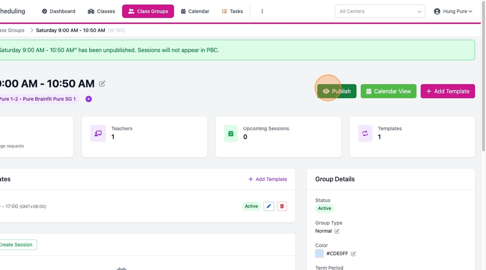

---

## Deleting a Class Group

> ⚠️ **CRITICAL WARNING** ⚠️
>
> Deleting a class group is a **permanent, destructive action** that:
> - Deletes the class group record
> - Deletes ALL session templates
> - Deletes ALL sessions
> - Deletes ALL attendance records
> - Deletes ALL membership records
>
> **This action CANNOT be undone!**

### Who Can Delete

Only **Super Admin** and **Master Licensee** roles can delete class groups.

### How to Delete

1. Go to **Class Groups** list
2. Find the group you want to delete
3. Click the **trash icon** in the Actions column
4. Read the warning carefully
5. Confirm deletion

### Before Deleting

Consider these alternatives:
- **Unpublish** the group instead (hides from PBC but preserves data)
- **Export data** if you need records for reporting
- **Change status to Inactive** to keep history

---

## Calendar View

For a visual overview of all sessions:

1. Click **Calendar View** button (green button at top)
2. View sessions in month/week/day format
3. Click any session to see details or take attendance

---

## Common Tasks Quick Reference

| Task | Where to Find |
|------|---------------|
| Edit group name | Click pencil icon next to name in header |
| Change capacity | Group Details > Capacity > pencil icon |
| Add session template | Add Template button or Session Templates section |
| Generate term sessions | Quick Actions > Generate Sessions |
| Add students to group | Students section > Assign Students |
| Add students to sessions | Sync Student Enrollments or individual session |
| View calendar | Calendar View button (top right) |
| Delete group | Class Groups list > trash icon |

---

## Troubleshooting

| Issue | Solution |
|-------|----------|
| Can't see edit buttons | You may have Trainer role (view-only) |
| Sessions not appearing | Check term dates and template day of week |
| Students not in sessions | Use "Sync Student Enrollments" |
| Can't delete group | Only Super Admin and Master Licensee can delete |
| Sessions showing in PBC before ready | Unpublish the group until ready |

---

*Last Updated: December 2025*
