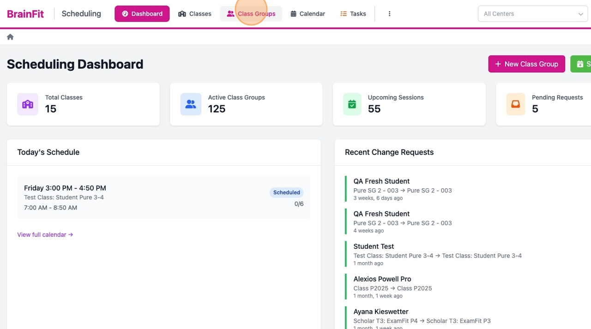
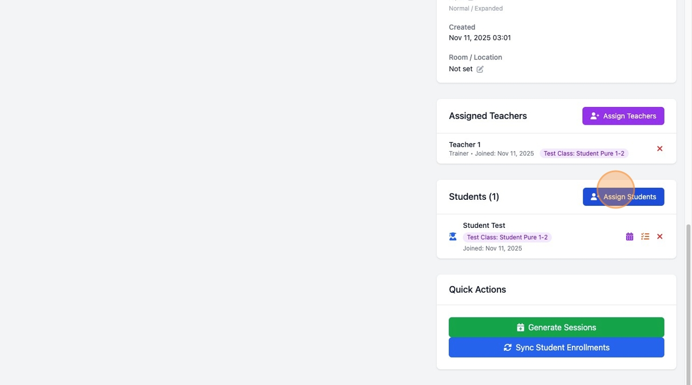
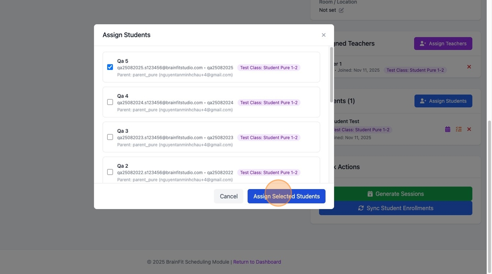
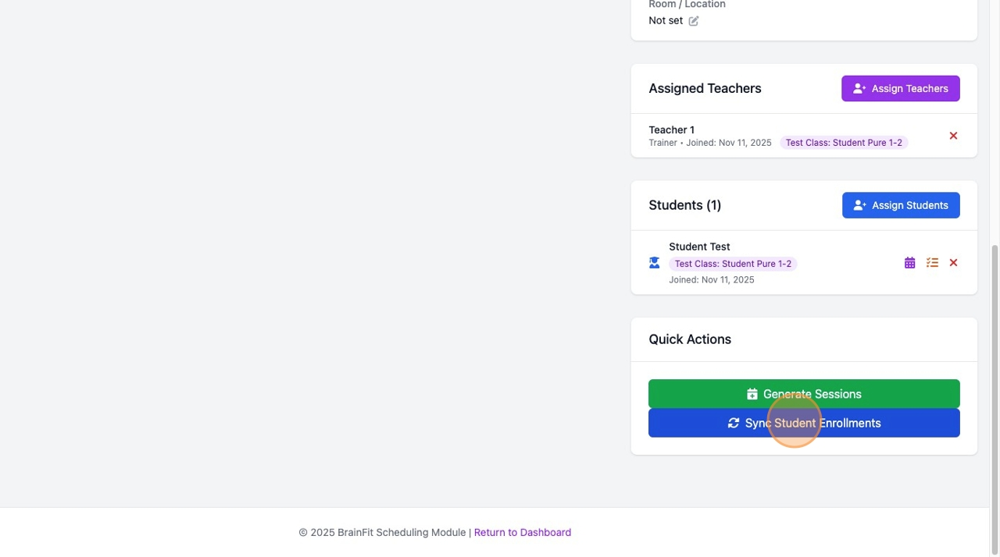
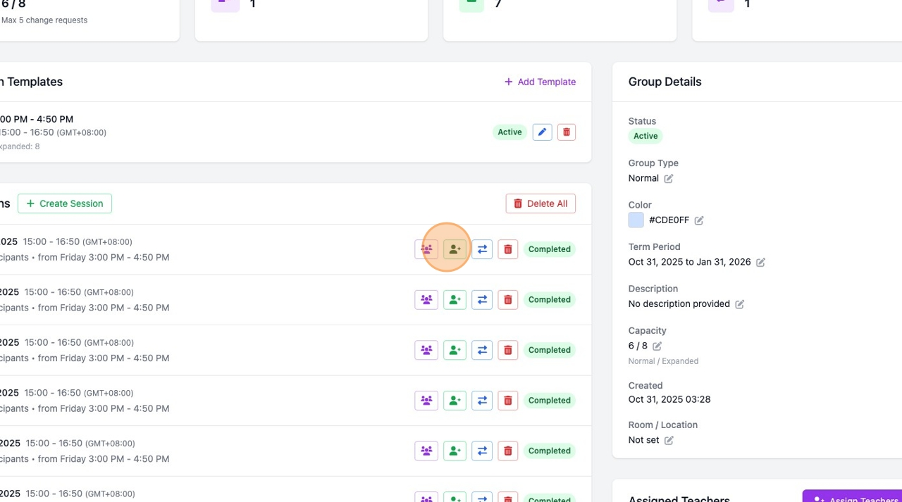
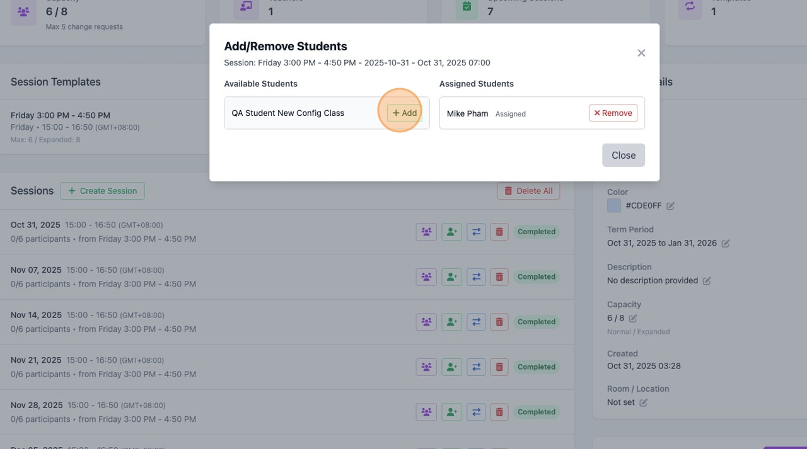

# Managing Students in Class Groups

This guide explains how to add and remove students from a class group, and how to sync student enrollments to sessions after making changes.

---

## Required Roles

| Action | Allowed Roles |
|--------|---------------|
| View students | All roles (including Trainers) |
| Add/remove students from group | Super Admin, Master Licensee, Center Admin |
| Sync student enrollments | Super Admin, Master Licensee, Center Admin |

> **Note:** Trainers have view-only access and cannot modify group membership.

---

## Understanding the Two Levels

There are **two levels** of student assignment in BrainFit Scheduling:

| Level | Description | Effect |
|-------|-------------|--------|
| **Group Membership** | Student is a member of the class group | Student appears in the group's student list |
| **Session Enrollment** | Student is assigned to specific sessions | Student appears in session attendance |

**Important:** Adding a student to a group does NOT automatically add them to existing sessions. You need to either:
1. Use **Sync Student Enrollments** to add them to all future sessions, OR
2. Manually add them to specific sessions

---

## Adding Students to a Class Group

### Step-by-Step

1. Navigate to the **Class Group Detail** page



2. Find the **Students** section in the right sidebar
3. Click the **Assign Students** button (blue button)

### In the Assign Students Modal

1. You'll see a list of available students from the associated class(es)



2. Each student shows:
   - Name
   - Email and username
   - Parent information (if available)
   - Source class (shown as a purple badge)

3. **Check the box** next to each student you want to add



4. Click **Assign Selected Students**

### After Adding Students

The students are now **group members** but are NOT yet in any sessions. To add them to sessions:

**Option A: Sync to all future sessions**
- Use the **Sync Student Enrollments** button (see below)




**Option B: Add to specific sessions only**
- Go to each session and use "Add/Remove Students" feature




---

## Removing Students from a Class Group

### Step-by-Step

1. Navigate to the **Class Group Detail** page
2. Find the student in the **Students** section
3. Click the **X button** (red) next to the student's name
4. Confirm the removal when prompted

### What Happens When You Remove a Student

- Student is removed from the **group membership**
- Student remains in any **existing session enrollments** (attendance records)
- To fully remove from sessions, you need to manually remove from each session

### Important Considerations

- Removing a student does NOT delete their attendance history
- If the student has session change requests, those remain in the system
- Consider the timing - removing mid-term affects reporting

---

## Syncing Student Enrollments to Sessions

The **Sync Student Enrollments** feature adds ALL current group members to ALL future sessions.

### When to Use Sync

| Scenario | Use Sync? |
|----------|-----------|
| Added new students, want them in all future sessions | Yes |
| Generated new sessions, students not enrolled | Yes |
| Want to ensure consistency across all sessions | Yes |
| Only want specific students in specific sessions | No (use manual method) |

### Step-by-Step

1. Navigate to the **Class Group Detail** page
2. Find the **Quick Actions** section (bottom of right sidebar)
3. Click **Sync Student Enrollments** (blue button)
4. Confirm when prompted: "This will enroll all assigned students in existing future sessions. Continue?"
5. Wait for the sync to complete

### What Sync Does

```
For each FUTURE session in the group:
  For each STUDENT in the group:
    If student NOT already in session:
      Add student to session with status "Assigned"
```

### What Sync Does NOT Do

- Does NOT remove students from sessions
- Does NOT affect past sessions (completed sessions)
- Does NOT change existing attendance statuses
- Does NOT add students who are not group members

---

## Managing Students in Individual Sessions

For more granular control, you can add/remove students from specific sessions.

### Accessing Session Student Management

1. In the **Sessions** section, find the session


2. Click the **Add/Remove Students** icon (➕ green user-plus icon)

### The Add/Remove Students Modal

The modal shows two columns:

| Left Column | Right Column |
|-------------|--------------|
| **Available Students** | **Assigned Students** |
| Group members NOT in this session | Students currently in this session |
| Click "Add" to assign | Click "Remove" to unassign |



### Adding a Student to a Session

1. Open the Add/Remove Students modal
2. Find the student in the **Available Students** column (left)
3. Click the **Add** button next to their name
4. Student moves to **Assigned Students** column

### Removing a Student from a Session

1. Open the Add/Remove Students modal
2. Find the student in the **Assigned Students** column (right)
3. Click the **Remove** button next to their name
4. Confirm removal
5. Student moves back to **Available Students** column

> **Note:** Removing a student from a session does NOT remove them from the group.

---

## Common Workflows

### Workflow 1: New Student Joins Mid-Term

1. **Add to group**: Assign Students > Select student > Assign
2. **Sync to sessions**: Quick Actions > Sync Student Enrollments
3. **Result**: Student is in all future sessions

### Workflow 2: Student Joins for Specific Sessions Only

1. **Add to group**: Assign Students > Select student > Assign
2. **Add to specific sessions**:
   - Go to each desired session
   - Click Add/Remove Students
   - Add the student
3. **Result**: Student is only in selected sessions

### Workflow 3: Student Leaves the Group

1. **Remove from group**: Click X next to student name > Confirm
2. **Optionally remove from sessions**:
   - If you want to keep attendance history: Do nothing
   - If you want to remove from future sessions: Remove from each session manually

### Workflow 4: New Sessions Generated, Students Missing

1. **Check**: Verify students are group members (in Students list)
2. **Sync**: Quick Actions > Sync Student Enrollments
3. **Result**: All group members added to new sessions

### Workflow 5: Transfer Student Between Groups

1. **In old group**: Remove student from group membership
2. **In new group**: Add student via Assign Students
3. **In new group**: Sync Student Enrollments (or add to specific sessions)

---

## Viewing Student Information

### Student Actions Available

In the Students section, each student has these icons:

| Icon | Action | Description |
|------|--------|-------------|
| 📅 Calendar | Session History | View all sessions this student attended |
| 📋 Tasks | Onboarding Tasks | View/manage onboarding progress |
| ❌ X | Remove | Remove student from group |

### Viewing Session History

1. Click the **calendar icon** next to a student's name
2. View their complete history:
   - All sessions assigned
   - Attendance status for each
   - Summary statistics

---

## Quick Reference

### Add Student to Group
```
Class Group Detail > Students section > Assign Students > Check student > Assign Selected Students
```

### Remove Student from Group
```
Class Group Detail > Students section > Click X next to student > Confirm
```

### Sync All Students to All Future Sessions
```
Class Group Detail > Quick Actions > Sync Student Enrollments > Confirm
```

### Add Student to Specific Session
```
Sessions section > Click ➕ icon > Available Students > Add
```

### Remove Student from Specific Session
```
Sessions section > Click ➕ icon > Assigned Students > Remove
```

---

## Troubleshooting

| Issue | Cause | Solution |
|-------|-------|----------|
| Student not showing in Assign modal | Student not in associated class(es) | Check if student is enrolled in BrainFit HQ class |
| Student in group but not in sessions | Not synced after adding | Use Sync Student Enrollments |
| Can't remove student | Trainer role | Only admins can modify membership |
| Sync not working | No future sessions | Generate sessions first, then sync |
| Student showing in old sessions after removal | By design | Removing from group doesn't affect existing enrollments |

---

## Best Practices

1. **Add students to group first** before generating sessions
2. **Use Sync** when you want all students in all sessions
3. **Use manual method** when students have different schedules
4. **Don't remove students unnecessarily** - it's often better to mark as inactive
5. **Check session enrollments** after adding new students to verify sync worked

---

*Last Updated: December 2025*
