# Adding Comments for Student in BrainFit ACP
This feature is for SA, ML, CA, Trainer

## Steps to Add a Comment  

1. **Navigate** to [BrainFit ACP](https://acp.brainfitstudio.com/acp).  
2. Click **"Students"**.  

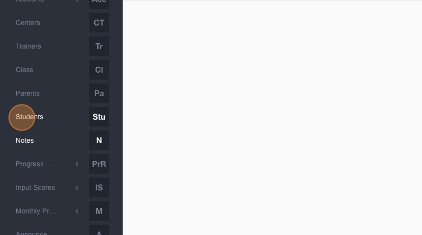

3. Type the **student's name**. 

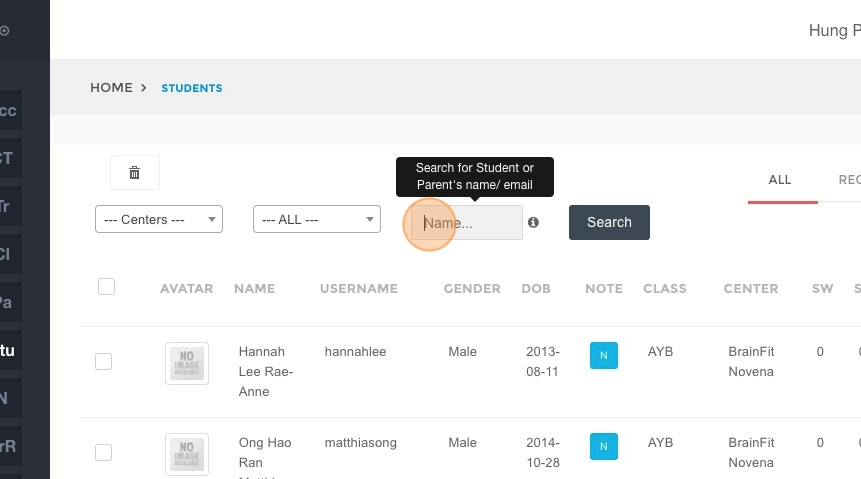 

4. Click **"Search"**.  

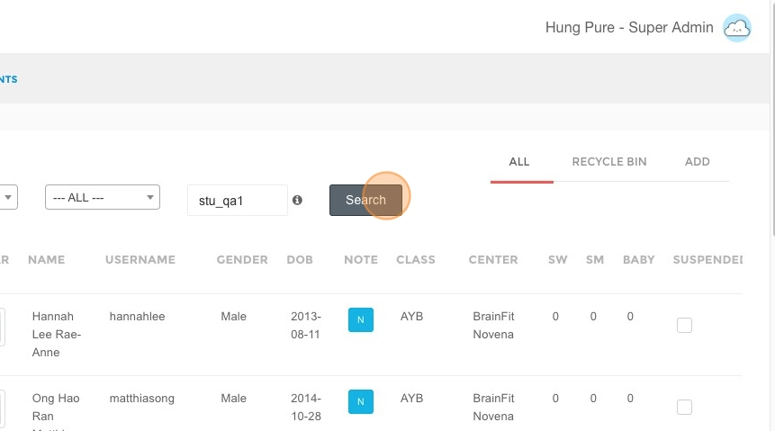

5. Select the **student's profile**.  

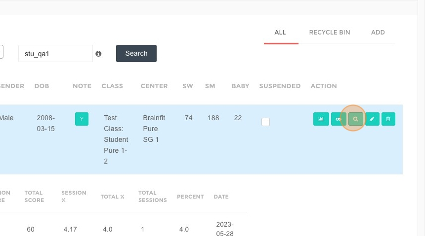

6. Click **"Add Comment"**.  

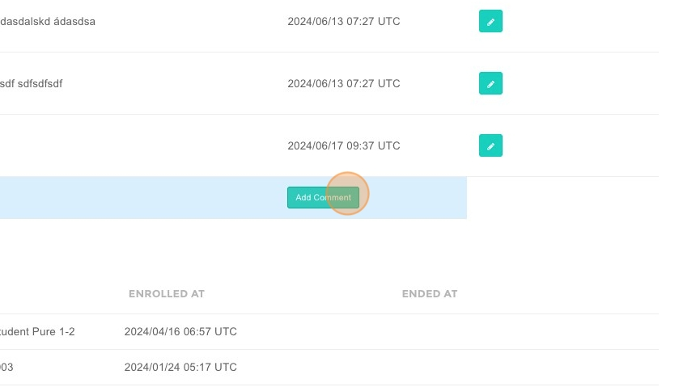

7. **Type the comment** in the provided field. 

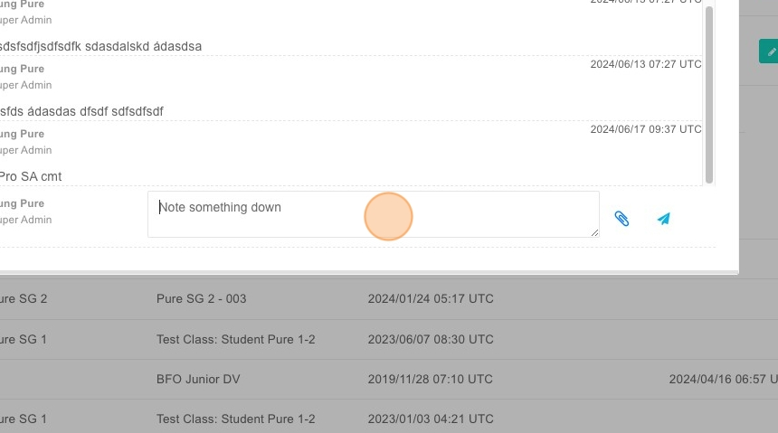

8. Click **"Choose File"** to attach a file. 

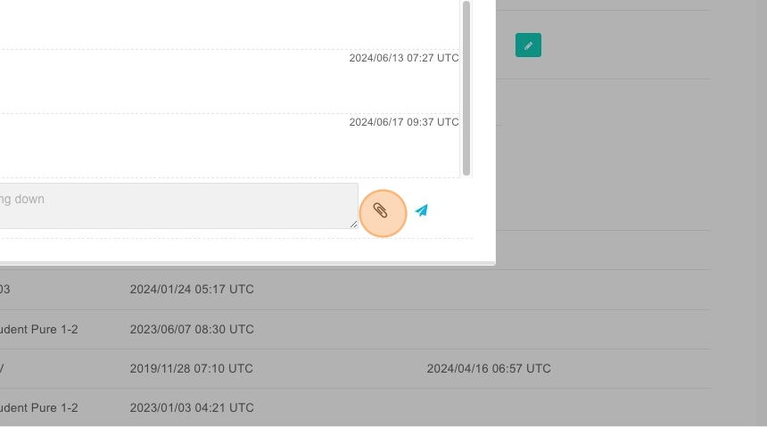

9. Click **"Submit"** to save the comment.  

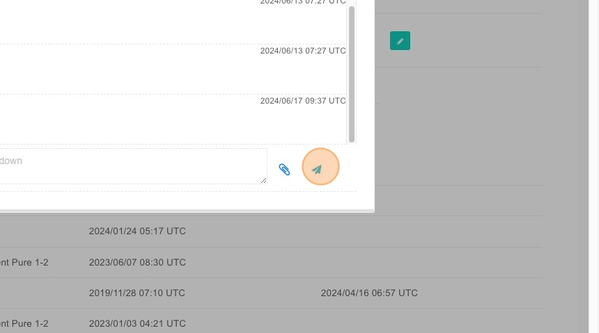

## Steps to View and Edit a Comment  

10. Click **"Notes"**.  

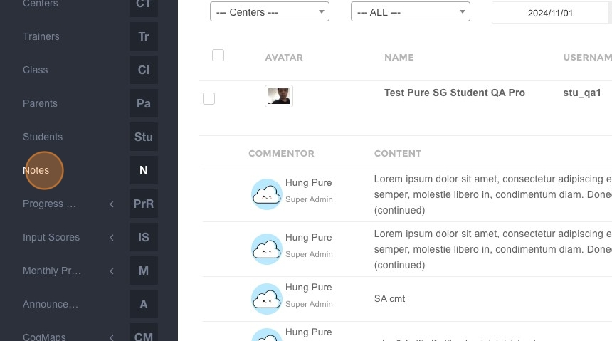

11. Type the **student's name**.  

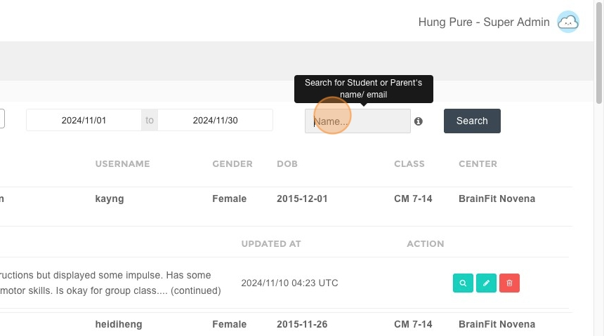

12. Click **"Search"**.  

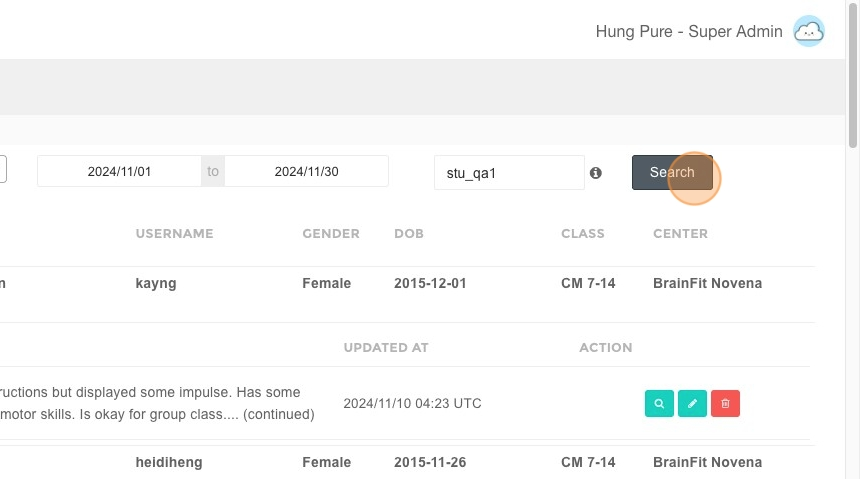

13. Click to **view the note**.  

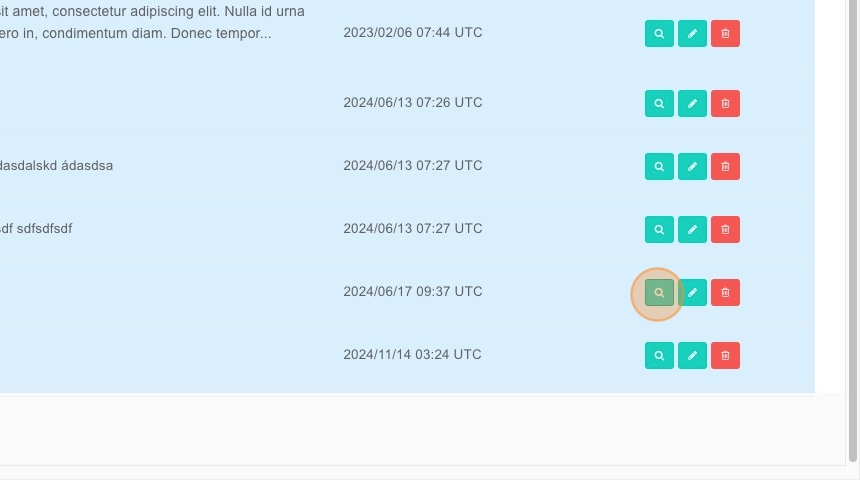

14. Click to **edit the note** if needed.  

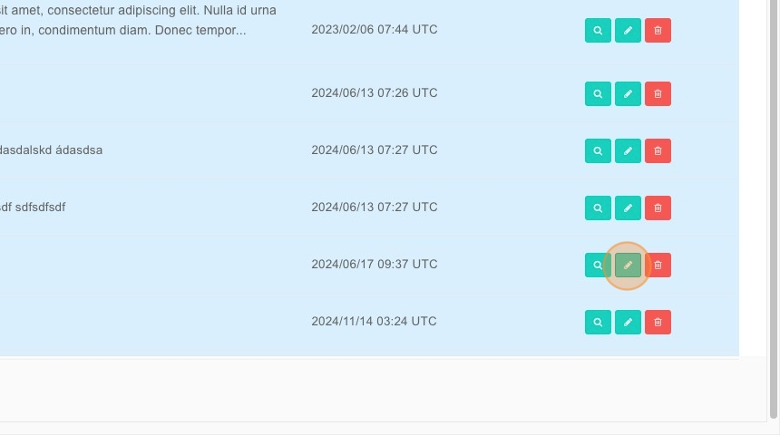
