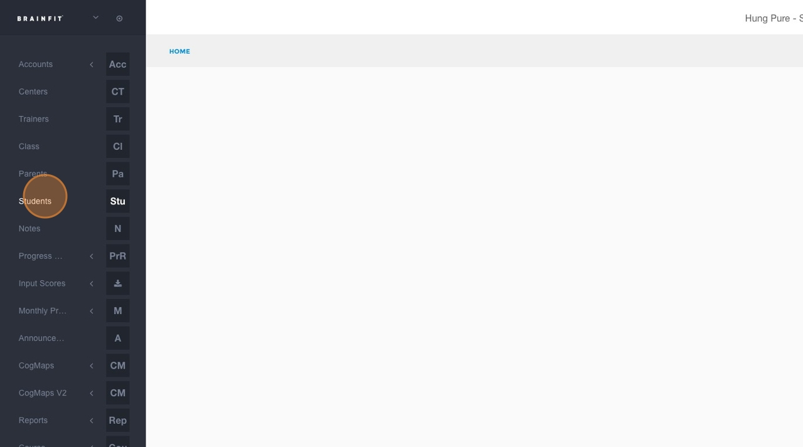
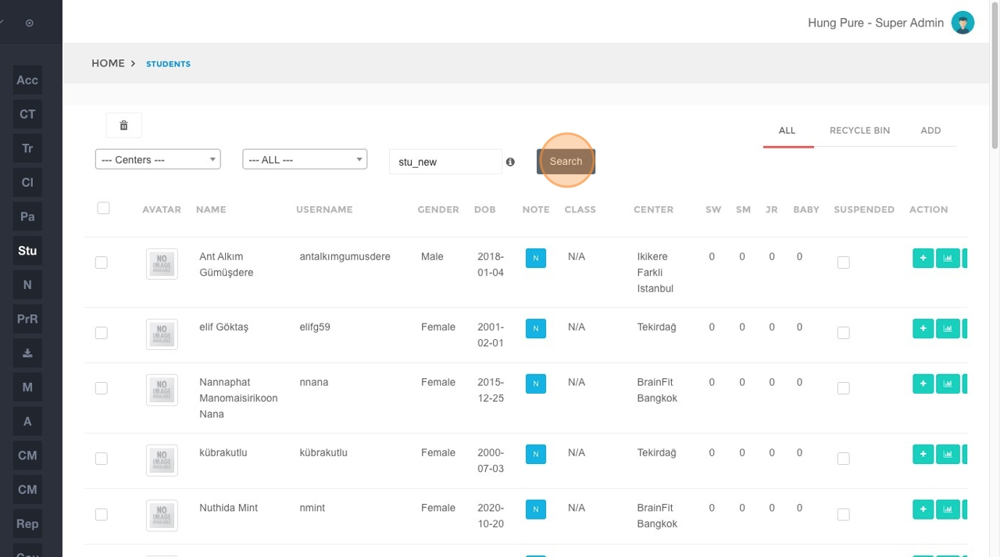
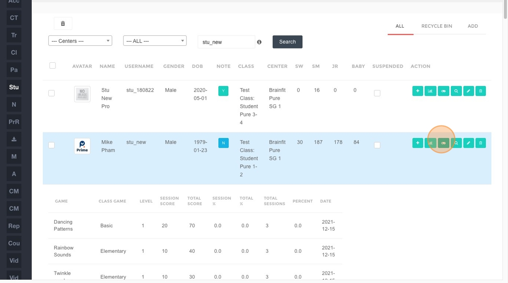
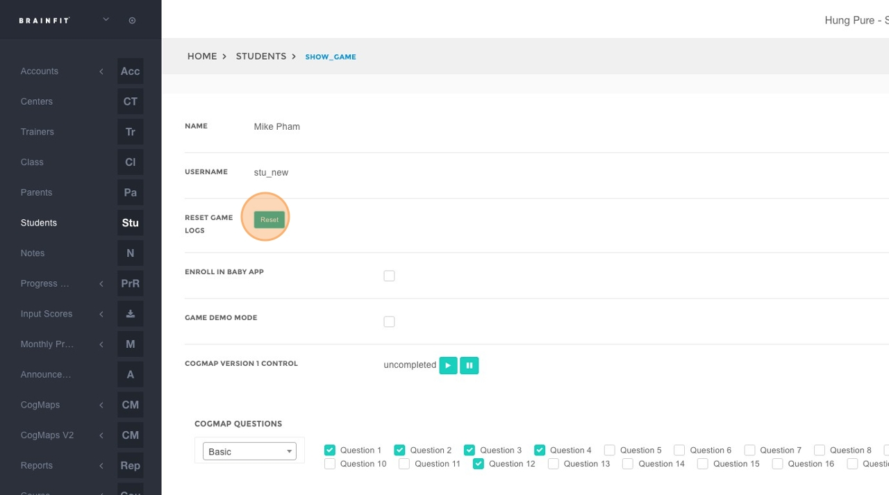
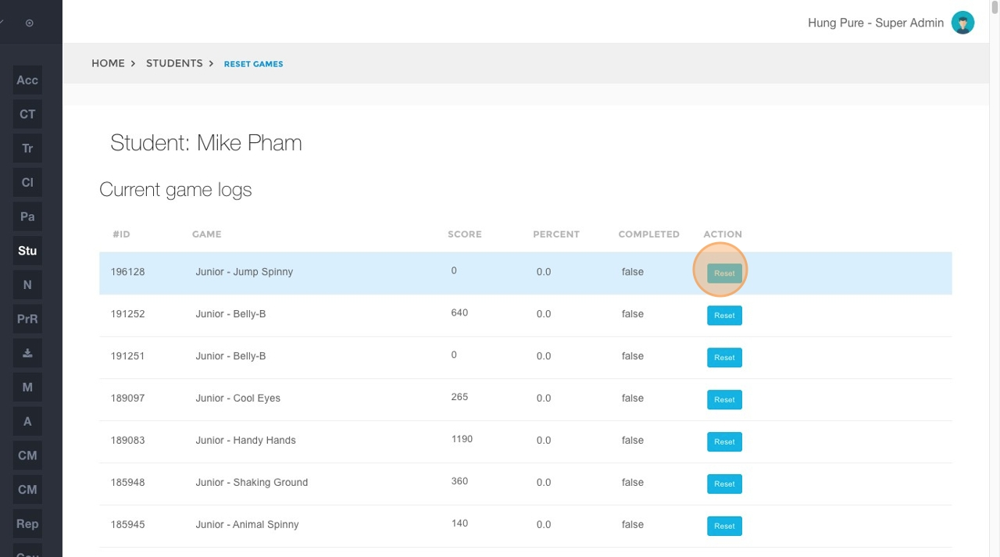

## Resetting a Student's Game Log
This feature is for SA, ML

1.  **Navigate** to[BrainFit ACP](https://acp.brainfitstudio.com/acp/).
2.  Click **Students** in the navigation menu.

3.  In the student search field, type **student's name**.
4.  Click the **Search** button.

5.  Click on the specific student's entry in the search results.

6.  Click the **Reset** button.

7.  Locate the specific game for which you want to reset the log and click the corresponding **Reset** button next to that game.

8. Click "OK" to confirm.