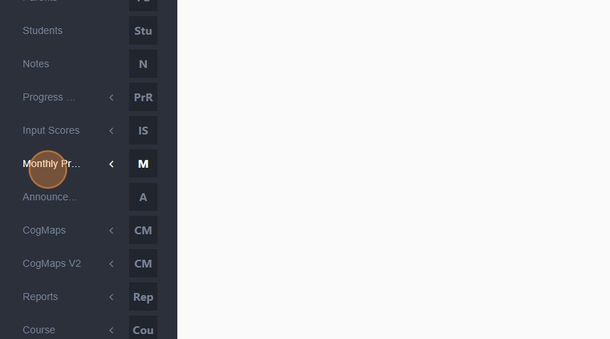
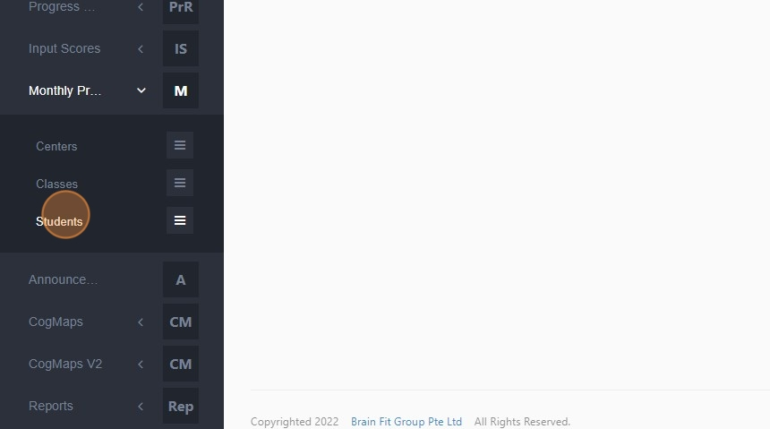
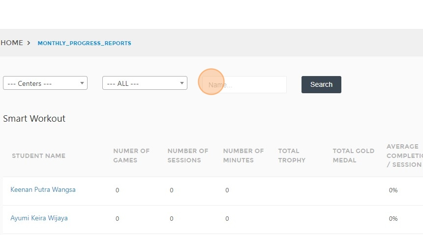
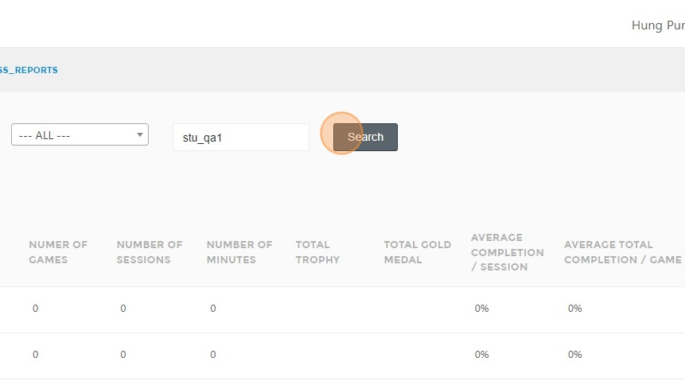
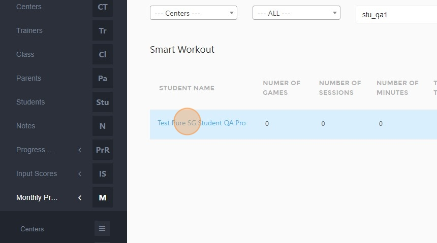
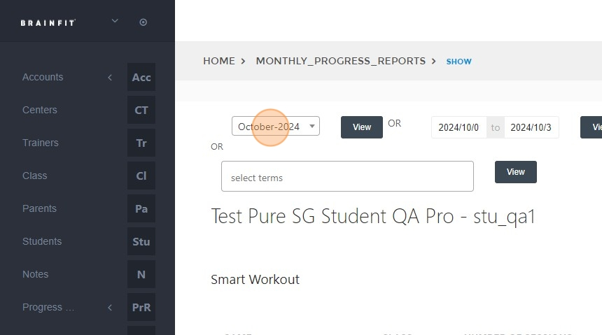
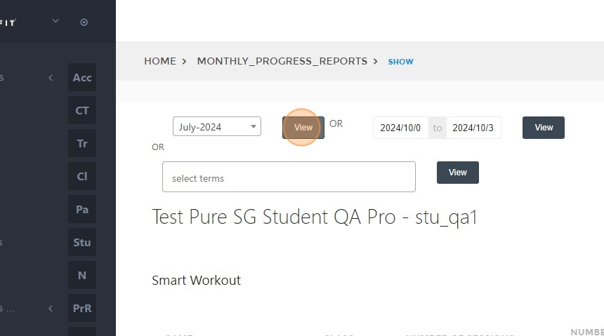
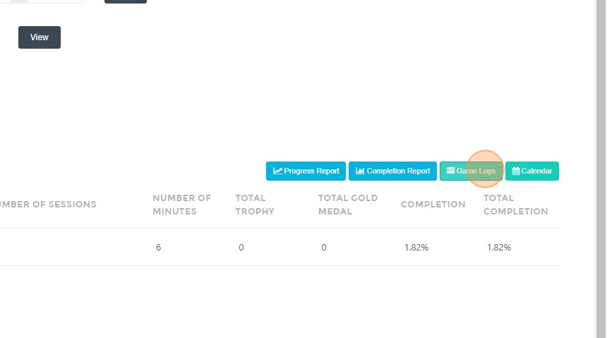
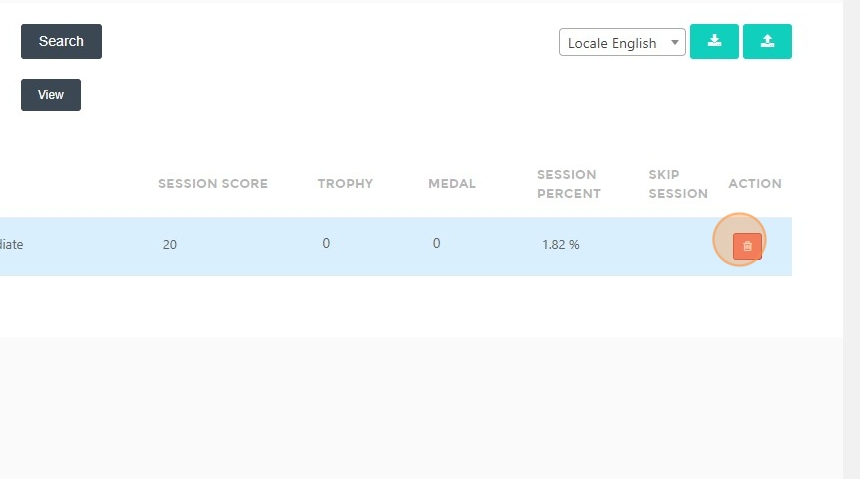

# Delete Session Score

## Steps to Delete a Session Score  

1. **Login** with an admin account.  
2. Click **"Monthly Progress Reports"**.  

3. Click **"Students"**.  

4. Type the **name of the student** whose session score you want to delete. 

5. Click **"Search"**.  

6. **Select the student** from the search results.  

7. **Select the time period**.  

8. Click **"View"**.  

9. Click **"Game Logs"**.  

10. Click the **"Delete"** button to remove the session score.  

