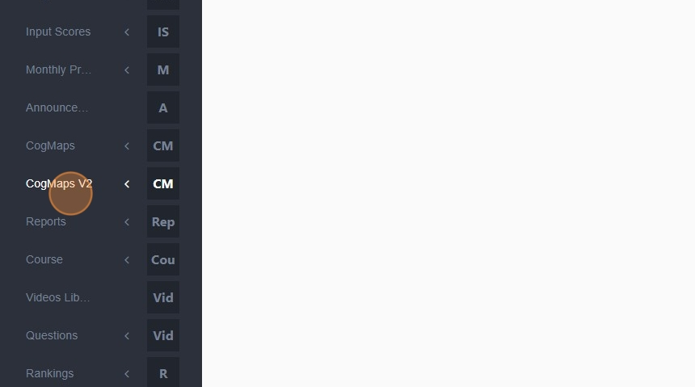
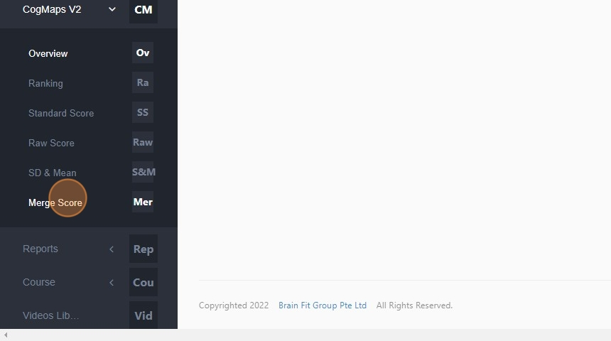
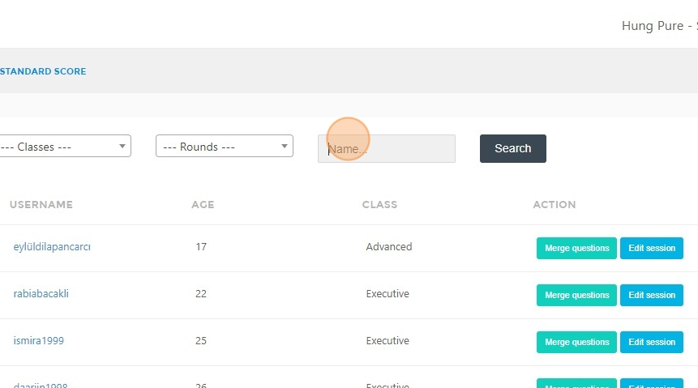
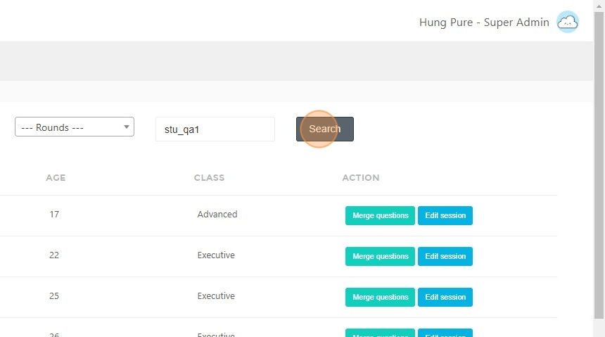
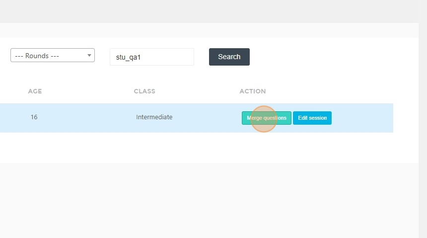
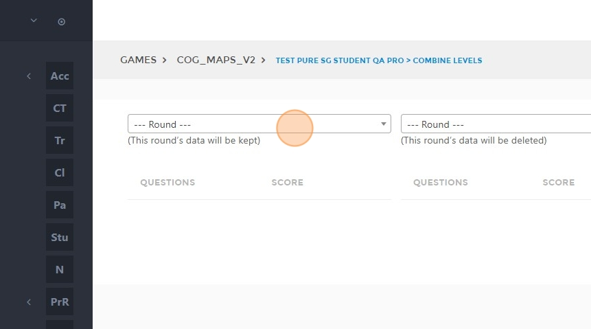
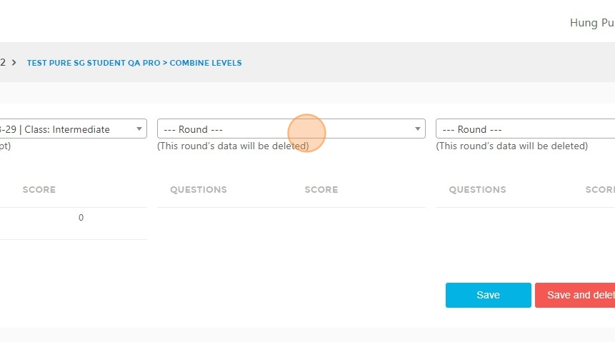
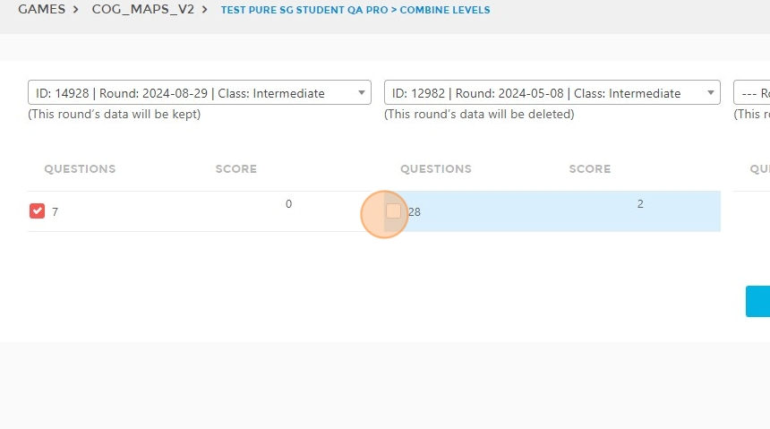
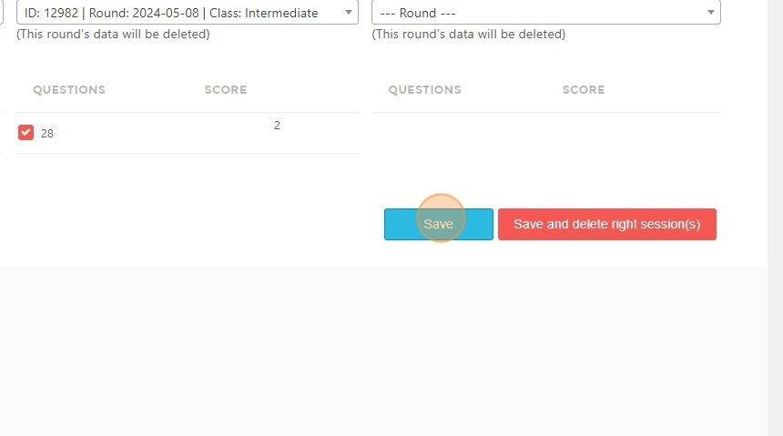
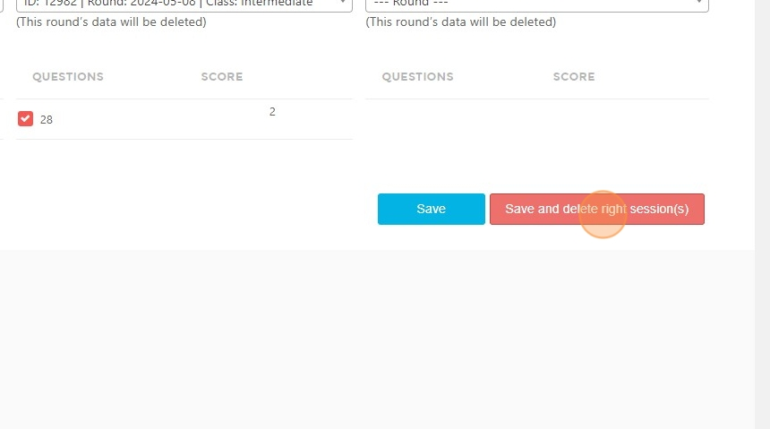

# Merge Score Guide

## Steps to Merge Scores

1. **Login** with an admin account.  
2. Click **"CogMaps V2"**.  

3. Click **"Merge Score"**.  

4. Type the **name of the student** whose score you want to merge. 

5. Click **"Search"**.  

6. Click **"Merge questions"**.  

7. Select the **round you want to keep** here.  

8. Select the **round with the replacement score**.  

9. **Tick** to select the questions with the score you want to keep.  
   - **Uncheck** the questions you do not want to keep.  

10. Click **"Save"** if you want to merge the score but still keep the session in **columns 2 and 3**.  

11. Click **"Save and delete right session(s)"** if you want to merge the scores and delete the selected sessions in **columns 2 and 3**.  

